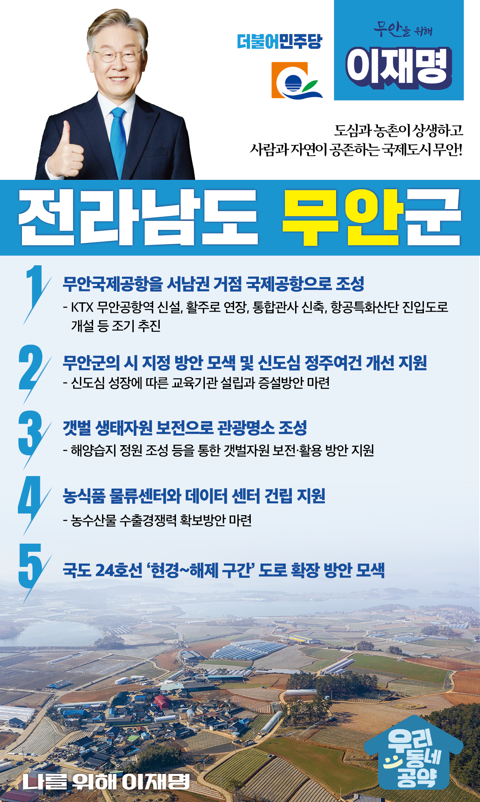

## 전남 지역 공약

# 무안군

### 도심과 농촌이 상생하고 사람과 자연이 공존하는 국제도시 무안!
> 2022-02-10

존경하는 무안군민 여러분!

 

누구나 살고 싶은 명실상부한 서남부 관문도시, 살기 좋은 농촌과 신도심이 함께 어우러진 무안은 이재명과 민주당이 꿈꾸는 미래입니다.

 

도시와 농촌이 함께 잘사는 대한민국의 미래를 무안에서 만들겠습니다. 

격조 높은 국제도시이자, 친환경 농어촌이 공존하는 무안을 만들겠습니다.

 

무안의 미래를 열어갈 무안 발전 5대 공약을 말씀드리겠습니다.

 

 

첫째, 무안국제공항을 서남권 거점 국제공항으로 만들겠습니다.

무안국제공항 사업과 관련하여 KTX 무안공항역 신설, 활주로 연장, 통합관사 신축, 항공특화산단 진입도로 개설 등 여러 사업이 진행 중입니다.

추진 중인 사업이 조기에 성공적으로 완료될 수 있도록 적극 지원하겠습니다. 

 

둘째, 무안군의 시 지정을 검토하고 신도심 정주여건 개선을 지원하겠습니다.

전국 도청소재지 중에서 무안과 홍성을 제외하고는 모두 시(市)입니다.

무안군이 무안시로 지정될 수 있도록 적극 검토하겠습니다. 

또한 신도심 성장에 따른 교육기관 설립과 증설방안을 마련하겠습니다. 

 

셋째, 갯벌 생태자원 보존으로 무안을 관광명소로 만들겠습니다.

무안군의 갯벌은 학술적으로도 그 가치와 중요성을 인정받고 있습니다. 

전국 최초로 습지 보호구역과 전남 갯벌도립공원으로 지정된 바 있습니다.

해양습지 정원 조성 등을 통해 소중한 갯벌자원을 보전·활용할 수 있도록 지원하겠습니다. 

 

넷째, 농식품 물류센터와 데이터 센터 건립을 지원하겠습니다. 

세계무역협정에 따라 수출 물류비 지원이 2023년에 종료됩니다. 

농수산물 수출 경쟁력 확보방안을 시급히 모색해야 합니다. 
무안군이 추진하고 있는 농식품 물류센터와 데이터 센터 건립을 지원하겠습니다. 

 

다섯째, 국도 24호선 도로 확장을 적극 검토하겠습니다.

 

무안지역 교통량이 급증하면서 안전 확보에 대한 요구가 높습니다. 

급증하는 관광수요 충족과 도로사고 예방을 위해 국도24호선 현경~해제 구간의 도로 확장 방안을 마련하겠습니다. 

 

 

존경하는 무안군민 여러분

 

이재명은 지킬 수 있는 것만 약속했고 약속했던 것은 지켜왔습니다.

살기 좋은 무안군의 미래를 위한 약속, 실력과 성과로 입증된 이재명이 반드시 실천하겠습니다.

 

무안군 앞으로, 발전 제대로!

무안군민을 위해, 이재명은 합니다!

						