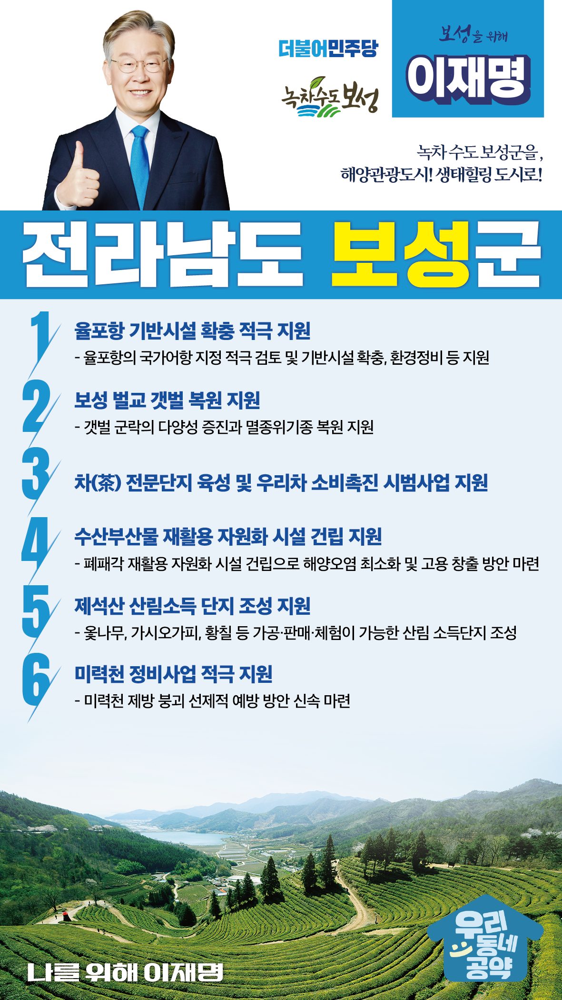

## 전남 지역 공약

# 보성군

### 녹차 수도 보성군을 해양관광도시! 생태힐링 도시로!
> 2022-02-10

존경하는 보성군민 여러분, 

 

우리나라 제일의 녹차, 꼬막, 키위 주산지로서 소비자와 관광객에게 높은 인지도를 보유한 보성군은 전남 중남부에 위치하여 해안도서지역과 내륙지역이 조화를 이루는 천혜의 입지여건을 자랑합니다.

특히, 보성 전통차 농업시스템의 국가중요농업유산 선정에 빛나는 다향(茶鄕)의 고장입니다.

 

지금 보성군은 코로나19 팬데믹 이전보다 더 활력 있는 경제, 더 풍요로운 삶을 만들기 위해 모든 분야에서 새로운 시작, 대전환을 추진중에 있습니다.

앞으로, 제대로, 나를 위해, 보성을 위한 6대 공약을 약속드립니다.

 

 

첫째, 율포항의 기반시설 확충을 적극 지원하겠습니다.

율포항은 1972년 지방 어항으로 지정되었지만, 어항 시설이 협소하여 시설개선이 필요합니다.

율포항의 국가어항 지정을 적극 검토하고 기반시설 확충과 환경정비를 통한 해상교통․관광 거점 어항이 될 수 있도록 지원하겠습니다.

 

 

둘째, 보성 벌교의 갯벌 복원을 지원하겠습니다. 

보성 벌교 갯벌은 해양보호구역과 람사르습지로 지정된 세계적인 자연유산입니다.

유네스코 세계유산 등재도 추진 중에 있습니다.

환경 변화에 대응하여 갯벌 군락의 다양성 증진과 멸종위기종 복원을 지원하겠습니다.

해양의 경제적 가치 보전과 해양 환경을 체계적으로 관리하겠습니다.

 

 

셋째, 보성군에서 시행하고 있는 차 전문단지 육성과 우리차 소비촉진지원 시범 사업을 지원하겠습니다.

커피문화 확산에 따라 장기간 침체된 차 산업 활성화가 필요합니다.

차 전문단지 육성, 우리차(茶) 생활 일상화, 식자재용 가루녹차 지원 등 우리차(茶) 소비 확대를 위한 사업에 대한 지원을 아끼지 않겠습니다.

 

 

넷째, 수산부산물 재활용 자원화 시설 건립을 지원하겠습니다.

매년 4,000톤 이상의 수산부산물이 방치되어 자원 낭비와 해양오염을 초래하고 있습니다.

보성에 폐패각 재활용 자원화 시설 건립을 적극 지원하겠습니다.

해양오염을 최소화하고 고용을 창출하여 지역경제 활성화에 기여하겠습니다.

 

 

다섯째, 제석산이 산림을 통해 소득을 얻는 산림소득 숲이 되도록 지원하겠습니다.

공유림과 사유림이 공존한 보성 제석산은 한국형 산림뉴딜 전략(K-포레스트) 추진이 적합한 곳입니다.

옻나무, 가시오가피, 황칠, 초피나무 등 산림소득숲 조성과 가공·판매·체험을 함께 할 수 있는 산림 소득단지가 되도록 적극 지원하겠습니다.

 

여섯째, 미력천 정비사업을 적극 지원하겠습니다. 

 

미력천은 집중호우로 인한 피해 복구가 이루어지지 않은 상태에서 상류부에 호안 유실이 발생했고, 제방 붕괴 위험이 있습니다.

빠른 유속을 견딜 수 있도록 미력천 정비사업의 조속한 추진을 지원하겠습니다.

 

 

보성군민 여러분! 

이재명은 지킬 수 있는 것만 약속했고 약속했던 것은 지켜왔습니다.

살기 좋은 보성 미래를 위한 약속, 실력과 성과로 입증된 이재명이 반드시 실천하겠습니다.

 

보성군민 앞으로! 발전 제대로!

보성군민을 위해, 이재명은 합니다! 

						