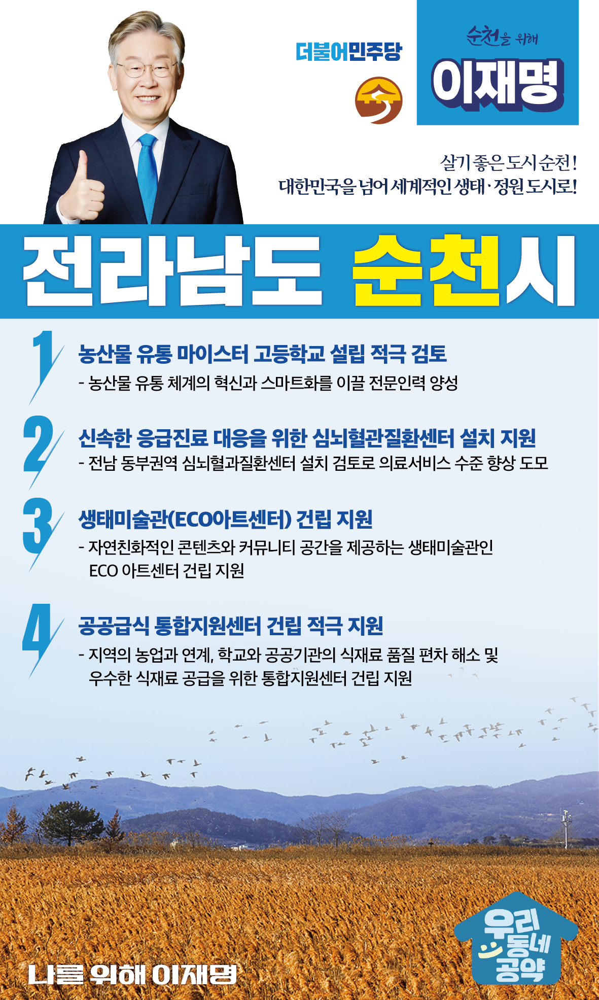

## 전남 지역 공약

# 순천시

### 살기 좋은 도시 순천! 대한민국을 넘어 세계적인 생태ㆍ정원 도시로!
> 2022-02-10

존경하는 순천시민 여러분,

 

우리 순천은 국가 정원이 자리 잡고 있는 생태도시이자 정원도시입니다. 

자연과 함께 어우러져 살며 치유하고 힐링하는 꿈꾸는 도시, 살고 싶은 도시입니다.

대한민국을 대표하는 순천만국가정원은 지난 2013년에 이어 2023년 순천만국제정원박람회를 준비하고 있습니다.

대한민국을 너머 세계적인 정원박람회, 미래로 나아가는 관광 도시, 자연친화 도시로 발돋움하고 있습니다. 

 

이러한 노력을 기울이고 있는 순천시를 위해 순천시 4대 공약을 약속드립니다. 

 

 

첫째, 농산물 유통 마이스터 고등학교 설립을 적극 검토하겠습니다.

농산물 유통 체계의 혁신과 스마트화를 이끌 전문인력을 양성하기 위해 농산물 유통 전문 마이스터 고등학교 설립을 적극 검토하겠습니다. 

이를 통해 순천시가 농업의 6차 산업화를 선도할 수 있도록 지원하겠습니다.

 

 

둘째, 신속한 응급진료 대응을 위한 심뇌혈관질환센터 설치를 지원하겠습니다.

전남 동부지역은 여천산단, 광양제철 등 대규모 산업시설이 밀집되어 있고, 전남 인구의 47%가 거주하고 있습니다. 

심뇌혈관질환의 골든타임을 지키기 위해서는 3시간 이내에 진료가 가능해야 합니다. 

전남 동부권역 심뇌혈과질환센터 설치를 검토하여 동부권 의료서비스의 수준을 향상시키겠습니다.

 

 

셋째, 순천시가 추진중인 생태미술관인 ECO아트센터 건립을 지원하겠습니다. 

순천을 방문하는 관광객들을 위해 자연친화적인 콘텐츠와 커뮤니티 공간을 제공하는 생태미술관인 ECO 아트센터 건립을 지원하겠습니다.

이를 통해 생태도시 순천의 이미지가 높아지고 지속적인 관광객들의 방문으로 지역경제가 활성화 되도록 돕겠습니다.

 

 

넷째, 공공급식 통합지원센터 건립을 적극 지원하겠습니다.

학교와 공공기관의 식재료 품질 편차를 해소하고 우수한 식재료의 공급이 필요합니다. 

공공급식 통합지원센터 건립을 통해 지역 농업과의 연계를 확대되고 지속 가능한 먹거리 공급체계가 구축되도록 지원하겠습니다. 

 

 

 

존경하는 순천시민 여러분!

 

이재명은 지킬 수 있는 것만 약속했고 약속했던 것은 지켜왔습니다.

살기좋은 순천시 미래를 위한 약속, 실력과 성과로 입증된 이재명이 반드시 실천하겠습니다.

 

순천 앞으로, 발전 제대로!

순천시민을 위해, 이재명은 합니다! 

						