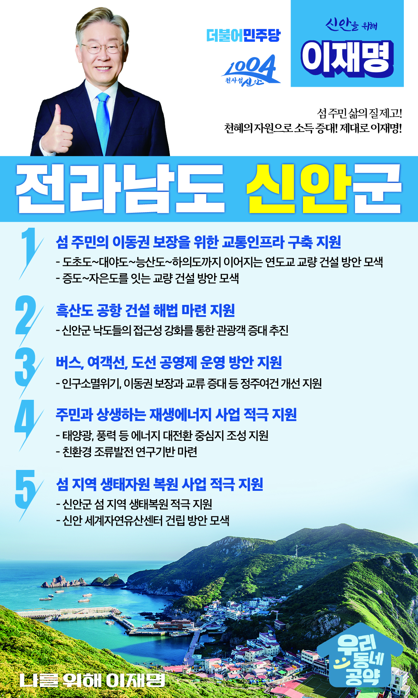

## 전남 지역 공약

# 신안군

### 섬 주민 삶의 질 제고, 천혜의 자원으로 소득 증대, 제대로 이재명!
> 2022-02-10

존경하는 신안군민 여러분, 

 

신안은 천혜의 환경과 자원을 가지고 있습니다. 기후 위기 극복을 위한 대전환의 시대에 신안이 가진 자연 환경적 특성을 활용해야 합니다. 신안군이 에너지대전환을 이끌어 나갈 수 있는 토대를 마련하겠습니다. 주민의 사회·경제적 정주 여건 개선을 위해서도 최선을 다하겠습니다. 

 

신안군의 미래를 선도할 이재명의 신안 발전 5대 공약을 말씀드리겠습니다.

 

첫째, 섬 주민의 이동권 보장을 위해 교통인프라 구축을 지원하겠습니다. 

섬 주민들은 교통이 불편하고 의료 응급상황 대처가 매우 어렵습니다. 도초도에서 대야도, 능산도, 하의도까지 이어지는 연도교와 증도에서 자은도를 잇는 교량 건설을 모색하여 섬주민의 이동권 보장을 위해 노력하겠습니다.

 

둘째, 추진이 정체된 흑산도 공항의 해법 마련을 지원하겠습니다. 

신안군의 낙도들은 내륙에서 50km 이상 떨어져 접근성이 낮습니다. 여행 경비와 물류비가 과하게 들어 관광객 유치에 큰 어려움을 겪고 있습니다. 추진이 정체된 흑산공항의 해법 마련을 지원하겠습니다. 

 

셋째, 신안군이 추진하는 버스, 여객선, 도선의 공영제 운영 방안을 지원하겠습니다.

인구감소로 민간버스업체와 여객선사의 경영난이 악화되어 불규칙한 배차, 결행, 운행 중단 등으로 주민 불편이 매우 큽니다. 신안군이 추진하는 버스와 여객선, 도선의 공영제 도입을 적극 지원하겠습니다. 

넷째, 주민과 상생하는 신재생에너지 사업을 적극 지원하겠습니다.

신안군에는 국내 최대 태양광과 풍력발전단지가 있습니다. 신안군이 에너지 대전환의 중심지로 성장하도록 지원하겠습니다. 더불어 지역주민과 상생하는 방안도 적극 추진하겠습니다. 친환경 조류발전 연구기반이 마련될 수 있도록 돕겠습니다. 

 

다섯째, 신안군 섬들의 생태복원 사업을 적극 지원하겠습니다.

전남 신안군에는 전국에서 가장 많은 1,000개의 섬이 있습니다. 신안군 섬 지역 자연생태자원 복원과 관광활성화를 적극 지원하겠습니다. 신안 세계자연유산센터 건립을 검토하겠습니다. 

 

 

존경하는 신안군민 여러분

 

이재명은 지킬 수 있는 것만 약속했고, 약속했던 것은 지켜왔습니다.

살기 좋은 신안군의 미래를 위한 약속, 실력과 성과로 입증된 이재명이 반드시 실천하겠습니다.

 

신안 앞으로, 발전 제대로!

신안군민을 위해, 이재명은 합니다! 

						