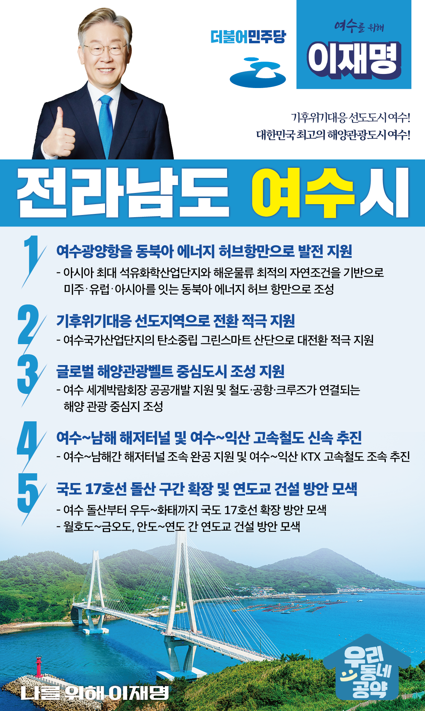

## 전남 지역 공약

# 여수시

### 기후위기대응 선도도시 여수! 대한민국 최고의 해양관광도시 여수!
> 2022-02-10

존경하는 여수시민 여러분,

 

여수는 365개의 보석 같은 섬을 간직한 ‘천혜의 도시’이며

이순신 장군의 얼이 서려 있는 ‘호국충절의 도시’입니다.

이러한 위대한 유산을 밑거름 삼아 여수는 국내 최대의 국가산업단지를 
미래 신성장산업에 기반한 탄소중립 산업단지로 전환하는 한편
아름다운 여수 밤바다로 상징되는 해양관광의 중심도시로 발돋움하고 있습니다. 

변화하는 여수를 위한 이재명의 다섯가지 약속을 말씀드리겠습니다.

 

 

첫째, 여수광양항을 동북아 에너지 허브항만이 되도록 지원하겠습니다.

여수는 대한민국 유일의 상업용 석유저장 터미널과 
아시아 최대 석유화학산업단지가 있습니다. 

남해와 여수 섬들에 둘러싸인 천혜의 자연조건과 깊은 수심으로 
해운물류의 최적 조건입니다. 

이를 기반으로 여수광양항을 미주‧유럽‧아시아를 잇는 
동북아 에너지 허브 항만으로 만들어 가겠습니다.

 

둘째, 여수시가 기후위기대응 선도지역이 되도록 적극 지원하겠습니다.

석유화학산업이 주력인 여수시는 탄소중립 전환이 시급합니다. 

여수시가 기후위기를 선도적으로 대응하는 도시가 되도록 돕겠습니다.    

여수국가산업단지의 일자리와 산업 경쟁력을 유지하면서도 
탄소중립 그린스마트 산단으로 전환할 수 있도록 적극 지원하겠습니다.

 

셋째, 여수 박람회장이 글로벌 해양관광 허브가 되도록 지원하겠습니다

여수박람회 개최 후 여수시는 대한민국을 대표하는 해양관광도시가 되었습니다. 

여수 세계박람회장이 공공개발 되도록 지원하겠습니다. 

이를 통해 여수시가 철도·공항·크루즈가 연결되는 
해양 관광의 중심지가 되도록 적극 지원하겠습니다. 

 

넷째, 여수~남해 해저터널과 여수~익산 고속철도를 신속하게 추진하겠습니다.

여수~남해 해저터널은 부산에서 여수를 거쳐 목포까지 이어지는 
남해안 해양관광을 획기전 변화시킬 것입니다. 

여수~남해간 해저터널의 조속한 완공을 적극 지원하겠습니다. 

이와 함께 여수에서 익산까지 KTX 고속철도를 조속히 추진하여 
여수를 더 편리하고 빠르게 찾을 수 있도록 하겠습니다.

 

다섯째, 국도 17호선 돌산 구간 확장과 연도교 건설을 검토하겠습니다. 

여수 해양관광 활성화를 위해 여수 돌산부터 우두~화태까지 국도 17호선 확장을 검토하겠습니다. 

섬 주민들의 이동권을 높일 수 있도록 월호도~금오도, 안도~연도 간 연도교 건설도 적극 검토하겠습니다. 

 

존경하는 여수시민 여러분!

 

이재명은 지킬 수 있는 것만 약속했고 약속했던 것은 지켜왔습니다.

살기 좋은 여수 미래를 위한 약속,
실력과 성과로 입증된 이재명이 반드시 실천하겠습니다.

 

여수 앞으로! 발전 제대로! 

여수시민을 위해, 이재명! 

						