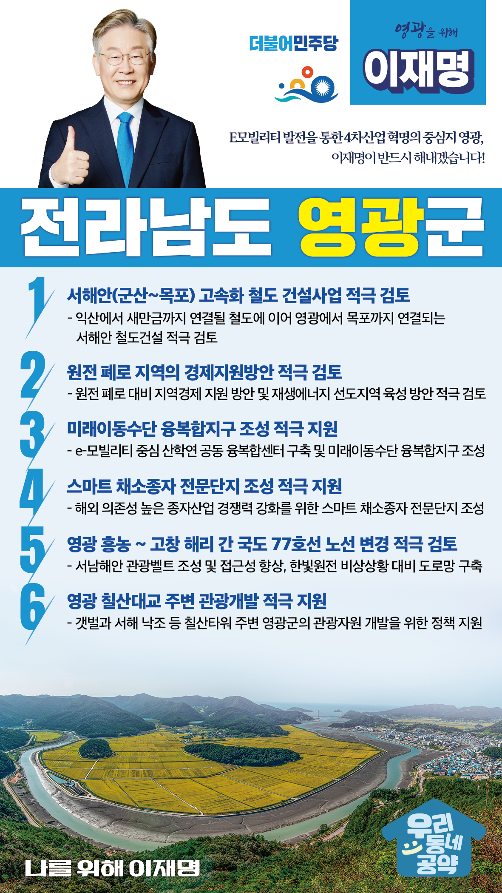

## 전남 지역 공약

# 영광군

### E모빌리티 발전을 통한 4차산업 혁명의 중심지 영광!
> 2022-02-10

존경하는 영광군민 여러분, 

 

영광군은 영광굴비로 대표되는 먹거리의 고장이자 바다와 평야, 산지가 골고루 분포되어 사람들의 인심이 넘치고 볼거리가 넘치는 전남 관광의 보물입니다. 

우리나라 생산량의 80%이상이 생산되는 영광굴비는 국민들에게 인기 높은 특산품이고 바닷바람을 맞으며 자라나는 청보리, 모싯잎송편. 상사화 풍광이 나무랄데가 없는 백수해안도로와 칠산대교등 영광군이 천혜의 자연환경과 모방할 수 없는 특산품으로 가득합니다. 

 

영광군 발전을 위한 2.0 전략이 필요합니다.  

이재명의 영광 발전을 위한 6대 공약을 말씀드리겠습니다.

 

 

첫째, 충청과 전라를 연결하는 ‘군산~목포 고속화 철도 건설사업’을 적극 검토하겠습니다.

익산에서 새만금까지 연결될 철도에 이어 영광에서 목포까지 연결되는 서해안 철도건설을 적극 검토하겠습니다. 

영광의 물류·관광의 기반을 조성하여 사람과 물류가 모여드는 서해안권 거점도시로 만들어가겠습니다. 

 

둘째, 원전 폐로 지역의 경제지원방안을 적극 검토하겠습니다.  

영광군은 오랫동안 원자력발전으로 지역발전이 제한되었습니다. 

얼마 남지 않은 원전 폐로를 대비해 지역경제 지원방안을 마련하겠습니다.

또한, 영광을 세계적인 재생에너지 모범 지역으로 육성하기 위해 국가적 차원에서 지원을 아끼지 않겠습니다. 

 

셋째, 미래이동수단 융복합지구 조성을 적극 지원하겠습니다.

영광군은 2019년 e-모빌리티 규제자유특구로 지정되었습니다. 

영광이 우리나라를 넘어 세계가 인정하는 ‘e-모빌리티 영광’이 되도록 적극 지원하겠습니다. 

e-모빌리티를 중심으로 산학연이 함께하는 융복합센터 구축을 지원하고 미래이동수단 융복합 지구로 발전할 수 있도록 돕겠습니다. 

 

넷째, 스마트 채소종자 전문단지 조성을 적극 지원하겠습니다.

종자산업 중 가장 중요한 채소종자는 인건비, 채종부지 등의 문제로 대부분 외국 종자에 의존하고 있습니다.  

국내 우수한 유전자원의 해외유출을 방지하고 종자산업의 경쟁력 강화가 필요합니다. 

영광군이 계획하는 ‘스마트 채소종자 전문단지’조성을 적극 지원하겠습니다. 

 

 

다섯째, 영광 홍농에서 고창 해리 간 국도 77호선 노선변경을 적극 검토하겠습니다.

서남해안 관광벨트 조성과 접근성 향상, 한빛원전의 비상상황 발생시 신속한 대피를 위한 도로망 구축이 시급합니다.

영광 홍농에서 고창 해리 간 국도 77호선 노선을 변경하고 확장을 적극 검토하여 영광군민의 신속하고 편리한 이동을 보장하겠습니다. 

 

여섯째, 영광 칠산대교 주변 관광개발을 적극 지원하겠습니다. 

갯벌과 서해 낙조 등 칠산타워 주변 천혜의 관광자원 개발이 필요합니다. 

영광군이 해양관광의 중심지로 발돋움 할 수 있도록 정책 지원을 아끼지 않겠습니다. 

 

 

존경하는 영광 군민 여러분!

이재명은 지킬 수 있는 것만 약속했고 약속했던 것은 지켜왔습니다.

살기 좋은 영광군 미래를 위한 약속, 실력과 성과로 입증된 이재명이 반드시 실천하겠습니다.

 

영광 앞으로, 발전 제대로!

영광군민을 위해, 이재명은 합니다!

						