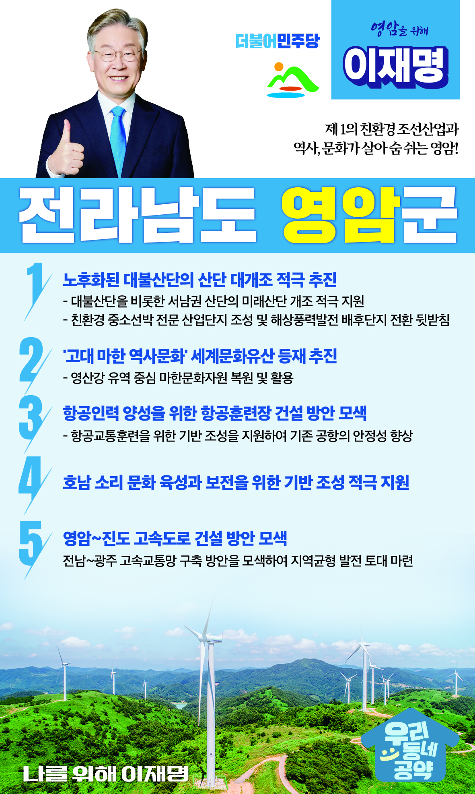

## 전남 지역 공약

# 영암군

### 제 1의 친환경 조선산업과 역사, 문화가 살아 숨 쉬는 영암!
> 2022-02-10

존경하는 영암군민 여러분, 

 

친환경 선박 산업, 친환경 농업, 

역사와 문화가 축적된 전통 소리가 어우러진 영암은 

오늘보다 내일이 더 밝은 지역입니다.  

 

영암군민 여러분께 지역의 내일을 여는 

이재명의 영암 발전 5대 공약을 말씀드리겠습니다.

 

첫째, 노후화된 대불산단의 산단 대개조를 적극 추진하겠습니다.

영암 대불산단은 서남권 경제의 핵심 거점인 국가산단입니다. 

하지만 조성 후 30년이 경과하여 노후화되면서 고용이 감소되고 투자가 위축되고 있습니다.

대불산단을 비롯한 서남권 산단이 미래산단으로 개조될 수 있도록 적극 지원하겠습니다. 

친환경 중소선박 전문 산업단지로 조성하고, 해상풍력발전 배후단지로 전환을 돕겠습니다.  

 

둘째, 고대 마한의 역사문화가 세계문화유산 등재를 추진하겠습니다. 

고대 마한 역사의 ‘유네스코 세계문화유산 등재’가 추진되고 있습니다.

호남의 역사를 간직한 영암을 비롯한 마한 문화권의 유산이  

세계문화유산으로 인정받을 수 있도록 최선을 다해 지원하겠습니다. 

고대 마한의 역사문화 복원을 적극 지원하겠습니다. 

 

셋째, 항공인력 양성을 위한 항공훈련장 건설을 모색하겠습니다.

국내에는 항공사 자격을 취득할 수 있는 훈련장이 3군데 뿐입니다. 

조종사 지망생이 해외에 나가지 않고 국내에서 교육받을 여건 마련이 필요합니다. 

도심항공 등 다양한 항공교통을 훈련할 수 있는 기반이 조성되도록 지원하겠습니다. 

 

넷째, 호남 문화와 소리 보전을 위한 기반 조성을 적극 지원하겠습니다. 

호남의 다양한 전통 소리 문화를 보전·관리하기 위한 기반이 구축되어야 합니다. 

소리융합과 관련된 연구기반 조성이 필요합니다.  

소리문화 산업을 육성하고, 소리 관련 각종 행사가 개최될 수 있도록 지원하겠습니다.  

 

다섯째, 영암~진도 고속도로 건설 방안을 모색하겠습니다.

전남·광주는 공동 생활권임에도 불구하고 고속교통망이 부족합니다.

진도항 수송 물동량의 원활한 처리와 관광객 교통 편의를 위해 교통망 확충이 필요합니다.

영암~진도고속도로 건설 방안을 모색하겠습니다. 

지역주민과 관광객의 접근성을 높이고 지역경제 활성화의 기반을 마련하겠습니다.

 

 

존경하는 영암군민 여러분

 

이재명은 지킬 수 있는 것만 약속했고 

약속했던 것은 지켜왔습니다.

살기 좋은 영암군의 미래를 위한 약속

실력과 성과로 입증된 이재명이 반드시 실천하겠습니다.

 

영암군 앞으로, 발전 제대로!

영암군민을 위해, 이재명은 합니다!  

						