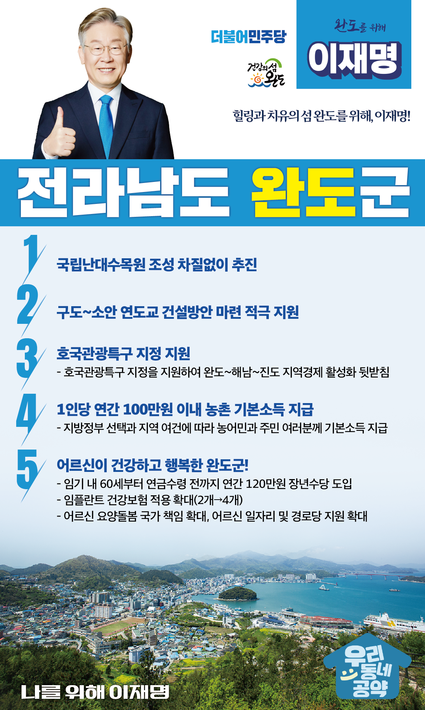

## 전남 지역 공약

# 완도군

### 힐링과 치유의 섬 완도를 위해, 이재명!
> 2022-02-10

존경하는 완도 군민 여러분,

     

완도군은 265개의 크고 작은 섬들이 군도로 이루어진 우리나라 6대 도서 중 하나로바다 생물 2,200여 종이 서식하는 생태계의 보고입니다.

청정한 해양자원을 이용해 몸과 마음을 치유하는해양치유산업의 발전 가능성이 높은 지역이기도 합니다.

치유의 섬!완도 발전을 위한 이재명의 5대 공약을 말씀드겠습니다.

     

첫째, 국립난대수목원 조성을 차질없이 추진하겠습니다.

2020년 말에 산림청이 국립난대수목원 대상지로 완도군을 확정하였습니다.

국립난대수목원 조성사업을 차질없이 추진하여 지역경제의 활력을 불어넣겠습니다.

     

둘째, 구도-소안 연도교의 건설방안 마련을 적극 지원하겠습니다.

완도군민의 20%가 넘게 거주하는 노화-소안-보길 지역은 해상교통만이 유일한 이동수단입니다.

이로 인해 지역 주민분들은 교육, 의료, 식수 등 기본 인프라조차 적절히 지원받지 못합니다.

지난 2017년에 노화-구도간 소안1교는 완성되었지만,소안-구도간 연도교 건설은 진행되지 못하고 있습니다.

이 연도교의 조속한 건설방안 마련을 적극 지원하겠습니다.

     

셋째, 완도의 호국관광 특구 지정을 지원하겠습니다.

해남·완도·진도는 이순신 장군의 명량대첩, 장보고의 청해진 등 호국의 역사를 갖고 있습니다.

하지만, 문화관광 개발이 미흡하고 홍보가 부족하여 관광자원을 활용하지 못하고 있습니다.

‘완도-해남-진도’의 지역경제 활성화를 위해 호국관광특구 지정을 지원하겠습니다.

     

넷째, 농어촌에 거주하는 농어민과 주민 여러분께 기본소득을 지급하겠습니다.

지방정부의 선택과 지역의 여건에 따라1인당 연간 100만원 이내의 농어촌 기본소득을 지급하겠습니다.

농어촌 기본소득 지급으로 농어촌과 도시 간 소득격차를 줄이고농어촌 소멸을 막겠습니다.

     

다섯째, 어르신들이 행복한 완도를 만들겠습니다.

60세부터 공적연금이 지급되기 전까지 연간 120만 원의 장년수당을 임기 내에 도입하겠습니다.

이를 통해 소득 공백으로 인한 장년층의 부담을 다소나마 덜어드리겠습니다.

또한 임플란트 건강보험 적용 개수를 현재 2개에서 4개로 확대하고,어르신 요양돌봄, 일자리 지원, 경로당 지원을 확대하겠습니다.

     

존경하는 완도군민 여러분!

이재명은 지킬 수 있는 것만 약속했고 약속했던 것은 지켜왔습니다.

살기 좋은 완도 미래를 위한 약속,실력과 성과로 입증된 이재명이 반드시 실천하겠습니다.

     

완도 앞으로! 발전 제대로!

완도군민을 위해, 이재명!

						