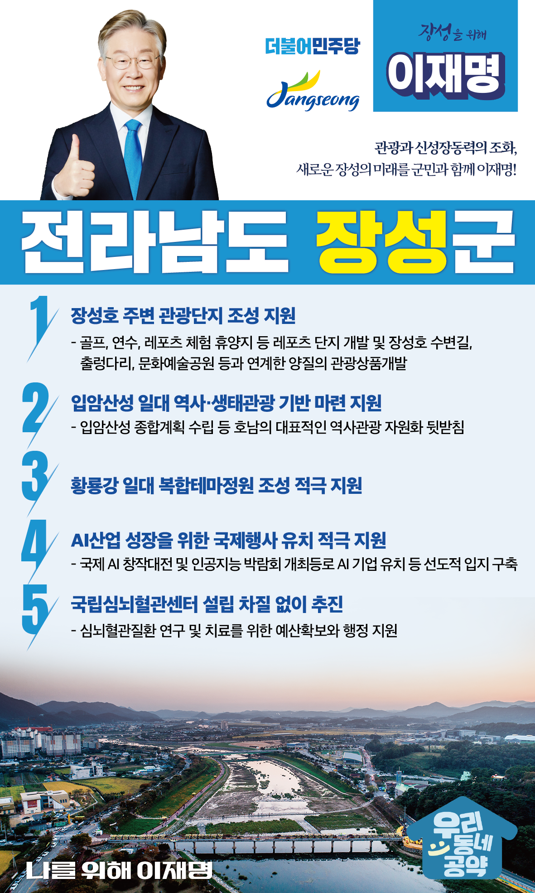

## 전남 지역 공약

# 장성군

### 관광과 신성장동력의 조화, 새로운 장성의 미래를 군민과 함께 이재명이 만들어가겠습니다!
> 2022-02-10

존경하는 전남 장성군민 여러분, 

 

장성은 천년의 역사와 선비정신이 여전히 살아 숨쉬는 고장입니다. 

‘문불여장성’이란 말이 있듯 우리나라에서 학문으로는 장성만한 곳이 없고 학문과 선비의 고장답게 필암, 소산, 봉암등 서원과 사우가 많은 고장입니다. 

 

또한 옐로우시티 장성이라는 슬로건처럼 황룡강을 중심으로 노란색 꽃과 나무가 가득하고 물과 사람이 공존하는 자연친화적 고장이 바로 장성입니다. 

장성이 가진 브랜드를 더욱 알리고 관광자원화 시켜 자연과 산업이 공존하는 복합도시로 도약하기 위한 저 이재명의 장성군 지역발전 5대 공약을 말씀드리겠습니다.

 

 

첫째, 장성호 주변 관광단지 조성을 지원하겠습니다.

매년 20여만 명의 관광객이 찾는 장성호 주변의 관광자원 개발이 필요합니다. 

장성호 관광단지 조성을 지원하여 장성의 지역경제에 활력을 불어넣겠습니다. 

 

 

둘째, 입암산성 일대의 역사·생태관광 기반 마련을 지원하겠습니다.

입암산성은 장성과 정읍의 경계에 위치한 호남 지방의 대표적인 산성입니다.  

입암산성의 역사적·생태적 가치를 살려 호남의 대표적인 역사관광 자원이 되도록 적극 뒷받침하겠습니다.

 

 

셋째, 황룡강 일대의 복합테마정원 조성을 적극 지원하겠습니다.

황룡강은 독창적인 자연과 역사를 지닌 지방정원으로 조성되고 있습니다. 

황룡강 일대를 복합테마정원으로 조성하여 광주시민 등 많은 관광객이 찾는 휴식처가 되도록 적극 지원하겠습니다. 

 

 

넷째, 장성군의 AI산업 성장을 위한 국제행사 유치를 적극 지원하겠습니다. 

장성 첨단3지구와 광주과학기술원 등 장성과 광주의 인프라를 활용하여 국제행사가 유치될 수 있도록 지원하겠습니다.

장성군에 위치한 광주연구개발특구가 AI산업의 중심지로 성장할 수 있도록 지원하겠습니다.

 

 

다섯째, 국립심뇌혈관센터 설립을 차질 없이 추진하겠습니다.

장성군민의 오랜 숙원이던 국립심뇌혈관센터 사업이 확정되었습니다.

장성군이 심뇌혈관질환 연구와 치료의 중심지가 될 수 있도록 예산확보와 행정지원에 최선을 다하겠습니다.

 

 

 

존경하는 장성군민 여러분!

 

이재명은 지킬 수 있는 것만 약속했고 약속했던 것은 지켜왔습니다.

살기 좋은 장성 미래를 위한 약속, 실력과 성과로 입증된 이재명이 반드시 실천하겠습니다.

 

장성 앞으로! 발전 제대로! 

장성군민을 위해, 이재명! 

						