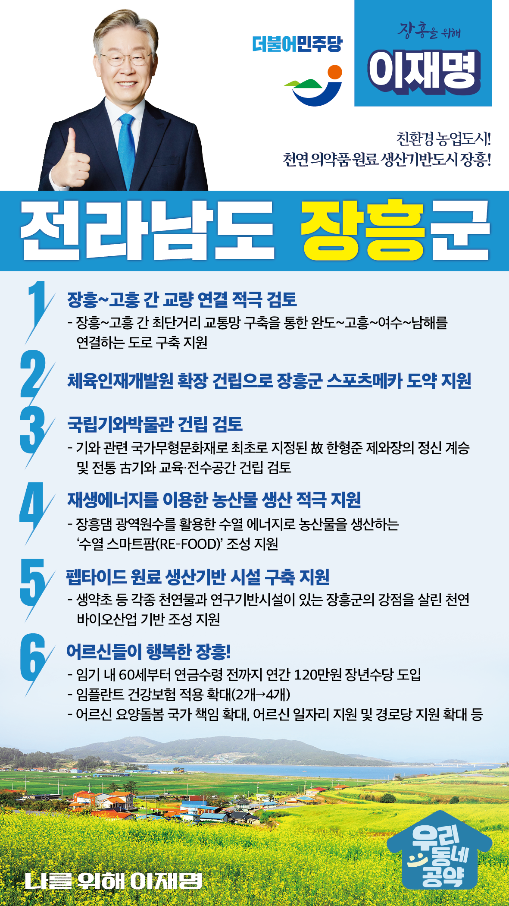

## 전남 지역 공약

# 장흥군

### 친환경 농업도시! 천연 의약품 원료 생산기반도시 장흥!
> 2022-02-10

존경하는 장흥군민 여러분, 

 

장흥군은 전남 중남부권의 중심도시로 맑은 물과 푸른 숲의 천혜의 자연환경을 가진 곳이자 예로부터 많은 문인과 의인을 배출한 문림의향의 고장이기도 합니다.

 

앞으로 장흥의 장점을 더욱 강화해나가며, 장흥군의 4메카 4시티 전략 추진을 통한 지역발전을 더욱 앞당길 수 있도록 다음과 같은 장흥군 6대 공약을 약속드립니다.

 

 

첫째, 장흥~고흥 간 교량 연결을 적극 검토하겠습니다. 

안양 수문~득량도~고흥 구간은 긴 거리를 우회해야 해서 불편이 큽니다. 

장흥~고흥 간 최단거리 교통망 구축으로 지역간 이동과 물류비용을 절감할 필요가 있습니다.  

완도~고흥~여수~남해 연결도로가 구축될 수 있도록 돕겠습니다. 

 

 

둘째, 체육인재개발원의 확장으로 장흥이 스포츠메카로 도약하도록 지원하겠습니다.

장흥군은 체육인재개발원 건립 사업을 유치하여 건립 공사 중입니다. 

이에 더해 여러 체육시설이 추가로 확충될 수 있도록 적극 지원하겠습니다.

 

 

셋째, 문림의향 정신이 살아 숨쉬는 전통의 도시 장흥에 국립기와박물관 건립을 검토하겠습니다. 

국가무형문화재 기와 최초 지정자 故 한형준 제와장이 활동한 장흥 전통문화 재연의 기반을 조성하고, 전통 古기와의 역사성에 바탕을 둔 교육 및 전수공간인 국립기와박물관 장흥 건립을 검토하겠습니다.

 

넷째, 재생에너지를 이용한 농산물 생산을 적극 지원하겠습니다. 

장흥댐 광역원수는 재생가능한 수열 에너지원으로 활용할 수 있습니다. 

이를 활용한 농산물 생산체제인 수열 스마트팜(RE–FOOD)이 조성되도록 지원하겠습니다. 

깨끗한 먹거리 브랜드를 개발하고, 저탄소 농업기술의 보급 확대에 기여하겠습니다. 

 

 

다섯째, 장흥군이 계획하는 펩타이드 원료 생산기반 시설 구축을 지원하겠습니다. 

생약초 등 각종 천연물과 연구기반시설이 있는 장흥군의 강점을 살려야 합니다.  

현재 화장품과 의약품 원료로 각광받고 있는 아미노산 결합체인 펩타이드 원료 생산 기반시설 구축을 지원하겠습니다. 

장흥의 천연 바이오산업 도약의 기반을 마련하겠습니다.

 

 

여섯째, 어르신들이 행복한 장흥을 만들겠습니다.

퇴직연령인 60세부터 공적연금이 지급되기 전까지 연간 120만원의 장년수당을 임기 내에 도입하겠습니다. 

또한, 임플란트 건강보험 적용을 현재 2개에서 4개로 확대, 어르신 요양돌봄 국가 책임 확대, 어르신 일자리 지원과 경로당 지원을 확대해 장흥군 어르신들의 걱정을 덜어드리겠습니다.  

 

 

존경하는 장흥군민 여러분!

이재명은 지킬 수 있는 것만 약속했고 약속했던 것은 지켜왔습니다.

살기 좋은 장흥 미래를 위한 약속, 실력과 성과로 입증된 이재명이 반드시 실천하겠습니다.

 

장흥 앞으로! 발전 제대로! 

장흥군민을 위해, 이재명! 