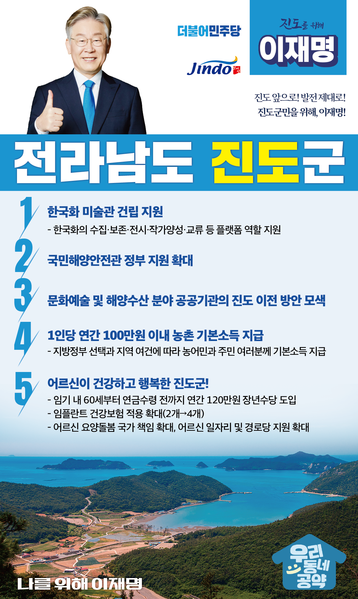

## 전남 지역 공약

# 진도군

### 진도 앞으로! 발전 제대로! 진도군민을 위해, 이재명!
> 2022-02-10

존경하는 진도 군민 여러분,

진도는 다도해의 아름다운 절경과 전통의 문화예술을 고스란히 간직한 고장으로

발길 닿는 곳마다 저마다의 마음을 사로잡는 아름다운 보배섬입니다.

진도의 다양한 발전 잠재력을 살리기 위한 5대 지역공약을 말씀드리겠습니다.

첫째, 진도에 한국화 미술관이 건립되도록 지원하겠습니다.

진도는 전국 최초로 ‘민속문화예술 특구’로 지정되었습니다.

또한 진도군의 운림산방은 한국화의 성지로 알려져 있습니다.

허백련, 손재형 선생을 비롯한 200여 명의 특선작가를 배출한 한국화의 요람입니다.

이와 연계한 한국화 미술관을 건립하여 한국화의 수집·보존·전시·작가양성·교류 등

플랫폼 역할을 할 수 있도록 지원하겠습니다.

 

둘째, 개관 예정인 국민해양안전관의 원활한 운영을 지원하겠습니다.

세월호참사 희생자들의 추모와 해상안전사고 예방 교육을 위해 오는 4월에 국민해양안전관이 개관할 예정입니다. 국민해양안전관에 대한 정부 지원을 확대해 해양안전 체험과 교육이 원활히 이루어질 수 있도록 하겠습니다.

 

셋째, 문화예술 및 해양수산 분야 공공기관의 진도 이전을 검토하겠습니다.

지난 1차 공공기관 이전에 이어 2차 공공기관의 지방 이전을 차질 없이 추진하겠습니다.

‘민속문화예술 특구’이자 도서지역인 진도군의 특성에 부합하는

문화예술·해양수산 관련 공공기관 이전을 검토하겠습니다.

 

넷째, 농어촌에 거주하는 농어민과 주민 여러분께 기본소득을 지급하겠습니다.

지방정부의 선택과 지역의 여건에 따라

1인당 연 100만원 이내의 농어촌 기본소득을 지급하겠습니다.

농어촌 기본소득 지급으로 농어촌과 도시 간 소득격차를 줄이고

농어촌 소멸을 막겠습니다.

 

다섯째, 어르신들이 행복한 진도를 만들겠습니다.

60세부터 공적연금이 지급되기 전까지 연간 120만 원의 장년수당을 임기 내에 도입하겠습니다.

이를 통해 소득 공백으로 인한 장년층의 부담을 다소나마 덜어드리겠습니다.

또한 임플란트 건강보험 적용 개수를 현재 2개에서 4개로 확대하고,

어르신 요양돌봄, 일자리 지원, 경로당 지원을 확대하겠습니다. 

 

존경하는 진도군민 여러분!

이재명은 지킬 수 있는 것만 약속했고 약속했던 것은 지켜왔습니다.

살기 좋은 진도 미래를 위한 약속,

실력과 성과로 입증된 이재명이 반드시 실천하겠습니다.

 

진도 앞으로! 발전 제대로! 

진도군민을 위해, 이재명! 

						