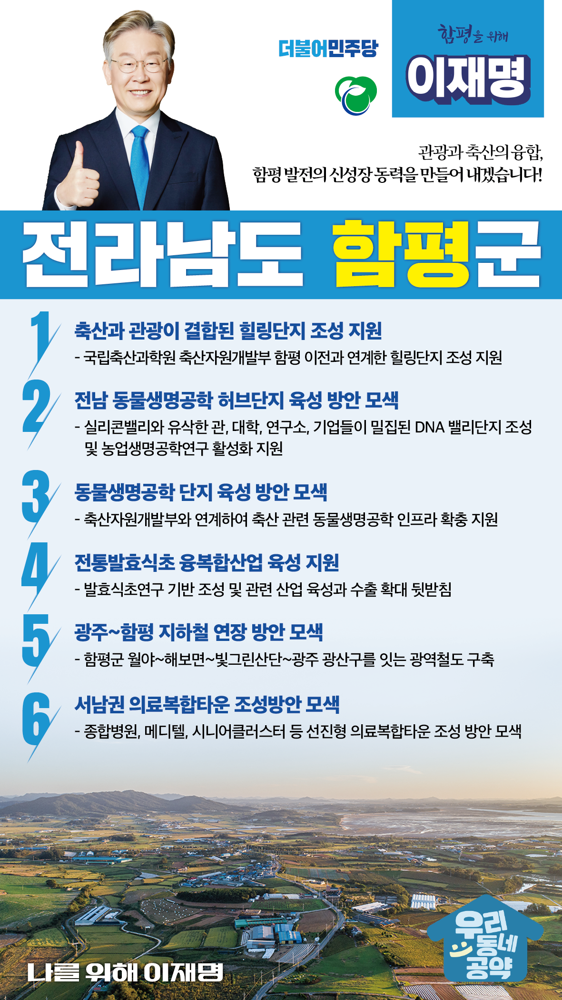

## 전남 지역 공약

# 함평군

### 관광과 축산의 융합, 함평 발전의 신성장동력 이재명이 만들어 내겠습니다! 
> 2022-02-10

존경하는 전남 함평군민 여러분, 

 

천지함평은 최고 품질을 자랑하는 한우로 대표되는 축산업의 중심지이자 가을빛이 가득한 국화와 나비가 어우러진 천혜의 자연생태를 품고 있는 고장입니다. 

또한 불의에 항거하는 기개와 의지를 가진 항일 의병들이 일어섰던 역사의 고장이기도 합니다. 

 

함평군의 브래드 가치를 높이고 더욱 살기 좋은 곳으로 도약하기 위한 이재명의 함평 발전 5대 공약을 말씀드리겠습니다.

 

 

첫째, 축산과 관광이 결합된 힐링단지 조성을 지원하겠습니다. 

국립축산과학원 축산자원개발부가 함평으로 이전할 계획입니다.

이와 연계해 함평군에 축산과 관광이 결합된 힐링 단지가 조성될 수 있도록 지원하겠습니다.

축산업을 6차 산업화하고 광활한 초지가 어우러진 관광시설이 조성되도록 하겠습니다.

이를 통해 함평군이 대한민국 축산의 허브로 굳게 자리 잡을 수 있도록 뒷받침하겠습니다.

 

 

둘째, 전남 동물생명공학 허브단지로의 육성방안을 모색하겠습니다.

실리콘밸리와 유사한 관, 대학, 연구소, 기업들이 밀집된 DNA 밸리단지 조성과 농업생명공학연구가 활성화 될 수 있는 방안을 찾겠습니다.

 

 

셋째, 함평에 동물생명공학 단지를 육성하는 방안을 모색하겠습니다.

축산자원개발부와 연계해 축산 관련 동물생명공학 인프라가 확충되도록 지원하겠습니다.

함평의 농업생명공학이 발전되도록 지원을 아끼지 않겠습니다,.

 

 

넷째, 전통발효식초 융복합산업 육성을 지원하겠습니다.

전남의 대표적인 발효식품의 자연발효기법을 계승하고 세계화가 필요합니다.

이를 위해 발효식초연구 기반을 조성하고 관련 산업 육성과 수출을 확대해 우리 전통식품문화 국제화를 적극적으로 지원하겠습니다.

 

 

다섯째, 광주~함평 지하철 연장 방안을 모색하겠습니다.

함평군 월야, 해보면과 빛그린산단, 광주광역시 광산구를 잇는 광역철도 구축 방안을 검토하겠습니다. 

이를 통해 광주 서부권과 함평군의 경제 활성화와 지역 경쟁력 제고 방안을 모색하겠습니다.

 

 

여섯째, 서남권 의료복합타운 조성방안을 검토하겠습니다.

의료환경이 열악한 전남 서남권 주민의 삶의 질 향상과 의료서비스 개선이 필요합니다. 

함평군에 종합병원, 메디텔, 시니어클러스터 등이 어우러진 선진형 의료 복합타운 조성을 위한 방안을 검토하겠습니다.

 

 

존경하는 함평군민 여러분!

 

이재명은 지킬 수 있는 것만 약속했고 약속했던 것은 지켜왔습니다.

살기 좋은 함평군 미래를 위한 약속, 실력과 성과로 입증된 이재명이 반드시 실천하겠습니다.

 

함평 앞으로! 발전 제대로! 

함평군민을 위해, 이재명! 

						