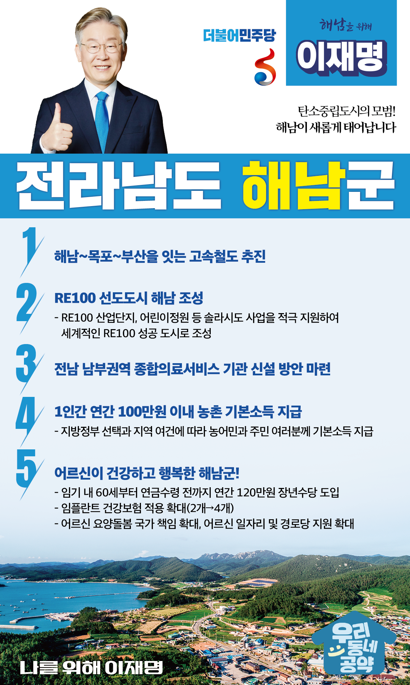

## 전남 지역 공약

# 해남군

### 탄소중립도시의 모범! 해남이 새롭게 태어납니다! 
> 2022-02-10

존경하는 해남 군민 여러분,

     

해남은 우리나라 최남단에 위치한 문예와 충절의 고장으로이순신 장군의 명량대첩으로도 널리 알려져 있습니다.

살기좋은 해남을 위한 5대 지역공약을 말씀드리겠습니다.

     

첫째, 해남에서 목포, 부산까지 고속철도 연결을 추진하겠습니다.

해남과 목포를 잇는 남해선(경전선) 건설이 진행되고 있습니다.

장차 해남에서 목포와 순천, 부산까지 고속철도가 연결될 수 있도록 추진하겠습니다.

고속철도망에서 소외되어온 전남 중·남부지역의 변화를 만들어가겠습니다.

     

둘째, 솔라시도 사업을 지원하여 해남을 RE100 선도도시로 만들겠습니다.

전라남도, 한국관광공사 등이 해남에 솔라시도 사업을 추진하고 있습니다.

이는 RE100 산단과 어린이정원 등을 조성하여해남을 국내 최초 탄소중립도시를 만들기 위한 프로젝트입니다.

솔라시도 사업을 적극 지원하여해남을 세계적인 RE100 도시의 성공사례로 만들어가겠습니다.

     

셋째, 전남 남부권역에 종합의료복지를 제공한 기관 신설방안을 마련하겠습니다.

전남은 전국 17개 광역자치단체 중 유일하게 의과대학이 없는 지역입니다.

인구 1천 명당 의사는 서울의 절반 수준입니다.

위급환자들은 상급종합병원을 찾아 광주까지 가야합니다.

육지는 물론 도서 지역도 보편적 의료서비스가 제공되어야 합니다.

전남 남부권에 종합의료서비스를 받을 수 있는 의료기관 신설방안을 조속히 마련하겠습니다.

     

넷째, 농어촌에 거주하는 농어민과 주민 여러분께 기본소득을 지급하겠습니다.

지방정부의 선택과 지역의 여건에 따라1인당 연간 100만원 이내의 농어촌 기본소득을 지급하겠습니다.

농어촌 기본소득 지급으로 농어촌과 도시 간 소득격차를 줄이고농어촌 소멸을 막겠습니다.

     

다섯째, 어르신들이 행복한 해남을 만들겠습니다.

60세부터 공적연금이 지급되기 전까지 연간 120만 원의 장년수당을 임기 내에 도입하겠습니다.

이를 통해 소득 공백으로 인한 장년층의 부담을 다소나마 덜어드리겠습니다.

또한 임플란트 건강보험 적용 개수를 현재 2개에서 4개로 확대하고,어르신 요양돌봄, 일자리 지원, 경로당 지원을 확대하겠습니다.

     

존경하는 해남군민 여러분!

이재명은 지킬 수 있는 것만 약속했고약속했던 것은 지켜왔습니다.

살기 좋은 해남의 미래를 위한 약속,실력과 성과로 입증된 이재명이 반드시 실천하겠습니다.

     

해남 앞으로! 발전 제대로!

해남군민을 위해, 이재명!

						