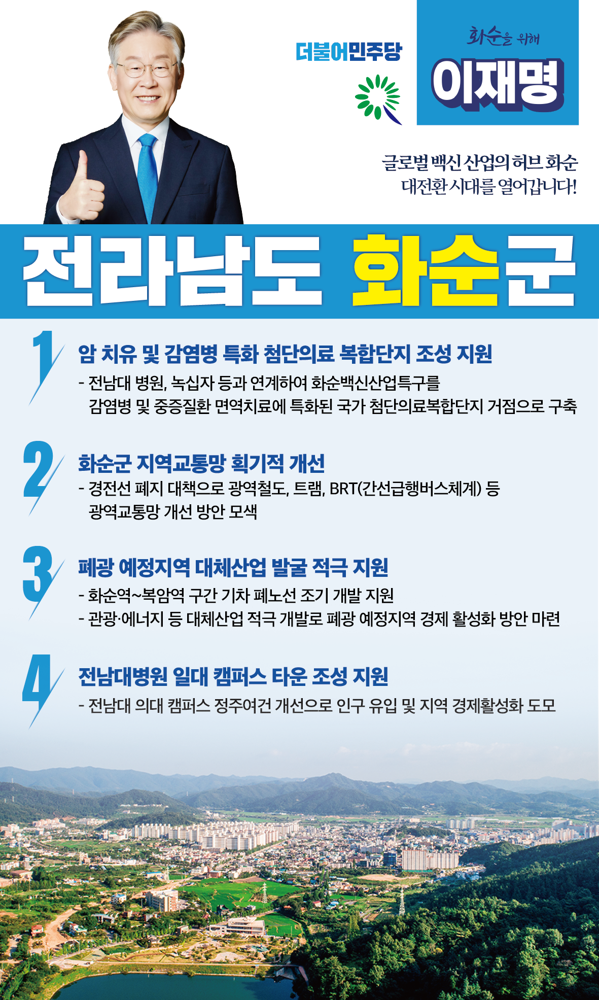

## 전남 지역 공약

# 화순군

### 글로벌 백신 산업의 허브 화순, 대전환 시대를 열어갑니다!  
> 2022-02-10

사랑하는 화순군민 여러분, 

 

우리 화순은 청정 자연과 역사, 문화유산이 함께 숨 쉬고, 대한민국 바이오산업을 이끌어가고 있는 ‘힐링과 치유의 고장’입니다.

 

특히, 코로나19라는 전세계적 위기 앞에서, 화순은 백신과 면역 산업을 육성하는 대전환의 기회를 만들고 있습니다. 

위기를 기회로 승화시키는 화순 군민 여러분의 지혜와 저력이 빛을 발하고 있습니다.

 

이제, 화순이 글로벌 백신 산업의 중심이 되도록 이재명이 화순 4대 공약을 여러분께 말씀드립니다. 

 

 

첫째, 화순에 ‘암 치유 및 감염병 특화 첨단의료 복합단지’가 조성되도록 지원하겠습니다.

전남대학교와 녹십자가 협업하여 화순에 국내 유일하게 면역치료를 위한 임상·생산·인증에 이르는 전주기 인프라가 구축되어 있습니다.  

화순백신산업특구가 ‘첨단의료복합단지’로 지정되도록 적극 검토하겠습니다. 

감염병과 면역치료에 특화된 거점 지역으로서의 입지를 살려 화순이 암 치유와 힐링의 고장으로 재탄생하도록 지원하겠습니다.

 

 

둘째, 화순군 지역교통망을 획기적으로 개선하겠습니다. 

경전선 고속화로 화순 지역에는 정차하지 않아 화순 군민들의 교통 불편이 우려됩니다.   

경전선 폐지로 화순군 지역공동화가 발생하지 않도록 광역교통망 개선을 적극 지원하겠습니다. 

광역철도, 트램, BRT(간선급행버스체계) 등 다각적 대안을 검토해 최적의 방안을 마련하겠습니다.

 

 

셋째, 화순군의 폐광 예정지역에 대체산업 발굴을 적극 지원하겠습니다. 

철로 폐선구간을 활용하여 첨단의료 복합단지와 연계한 관광자원을 개발하겠습니다. 

화순역~복암역 구간 기차 폐노선(광덕교차로~동면사무소)의 조기 개발을 지원하여, 스마트 모빌리티 길과 공원이 조성되도록 지원하겠습니다.  

중장기적으로는 폐광 예정지역의 경제 활성화를 위해 관광·에너지 등 대체산업을 적극 개발·육성하고 정부 지원도 강화하겠습니다.

 

 

넷째, 화순 전남대병원 일대에 캠퍼스타운 조성을 지원하겠습니다.

화순 전남대 의대 캠퍼스의 정주여건을 개선해 인구를 유입시키고 지역 경제를 활성화해야 합니다.  

전남대 의대 주변 시설과 부지를 활용해 연구지원 시설 구축과 상권 활성화를 위한 종합캠퍼스타운 조성을 적극 지원하겠습니다. 

 

 

화순군민 여러분! 

 

제가 가장 잘하는 게 실력! 실적! 실천! 입니다. 

화순 발전, 이재명이 제대로 추진하겠습니다.  

 

앞으로, 제대로, 바꾸겠습니다!

화순을 위한 이재명!! 이재명이 앞으로 제대로 하겠습니다.