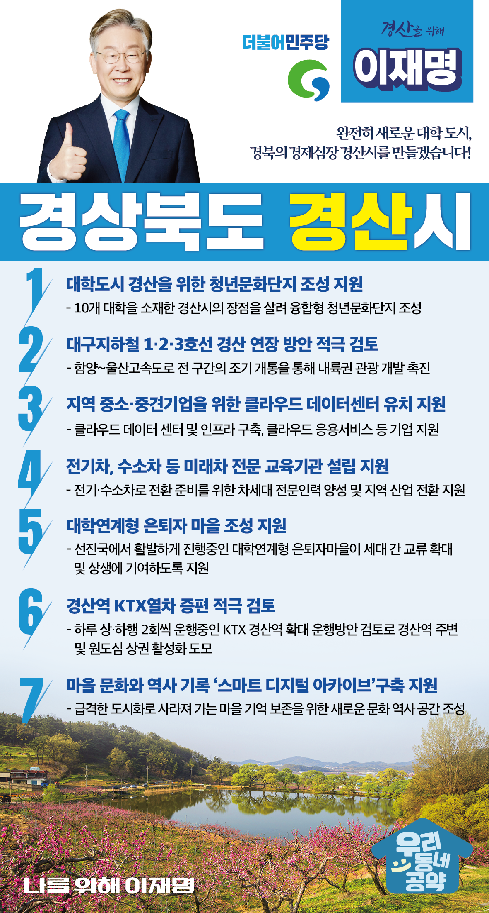

## 경북 지역 공약

# 경산시

### 완전히 새로운 대학 도시, 경북의 경제심장 경산시를 만들겠습니다!
> 2022-02-10

존경하는 경산시민 여러분,

 

경산은 경북의 산업중심지입니다. 

10여개의 지역 대학이 인접한 많은 연구기관과 산학연 클러스터를 구축, 신성장 산업의 중심지로 도약할 수 있는 기반을 보유하고 있습니다. 

 

그러나 전환의 시대에 접어들면서 경산도 변화의 파도에 직면하고 있습니다. 

소규모 영세 부품업체가 다수를 차지하는 경산 산업은 친환경차로의 전환이 부담입니다.

학령인구의 감소로 지역 대학은 존립을 위협받고 있습니다.

 

또한 대구 수성구와 인접하여 직장, 교육, 여가 활동 등 대구 의존도가 심화되고 원도심지역 및 읍면지역의 생활환경은 악화되고 있습니다.

 

이제 경산은 바뀌어야 합니다. 이를 위한 저 이재명의 경산발전 7대 지역공약을 말씀드리겠습니다.

 

첫째, 대학도시 경산에 청년문화단지 조성에 지원을 아끼지 않겠습니다.

경산은 10개 대학이 소재한 대표적인 대학도시입니다.  

청년들의 창의적인 아이디어와 상상력이 발휘될 수 있는 공간이 필요합니다. 

경산시가 추진하는 융합형 청년문화단지 조성사업을 적극 지원하겠습니다.

 

둘째, 대구지하철 1·2·3호선이 경산에서 모두 연결하는 방안을 적극 검토하겠습니다.

대구 경북의 지역균형발전을 도모하고, 경북 남부지역 경제를 활성화하기 위해 대구지하철 연결이 필요합니다. 

대구지하철의 추가연장을 적극 검토하겠습니다.  

 

셋째, 지역 중소·중견기업을 위한 클라우드 데이터센터 유치를 지원하겠습니다.

경기 악화로 경북 지역의 중소·중견 기업이 어려움을 겪고 있습니다. 

디지털 뉴딜의 기술적 발판을 만들기 위해 경산이 클라우드 데이터센터를 유치할 수 있도록 지원하겠습니다. 

 

넷째, 경산에 전기차, 수소차 등 미래차 전문 교육기관 설립을 지원하겠습니다.

자동차산업의 내연기관에서 전기·수소차로 전환을 준비하기 위해 차세대 전문인력을 양성하고 지역 산업의 전환을 지원하겠습니다.  

경산에 미래차 전문 교육기관이 들어설 수 있도록 적극 돕겠습니다. 

다섯째, 대학연계형 은퇴자 마을 조성을 지원하겠습니다.

이미 선진국에서 활발하게 진행중인 대학연계형 은퇴자마을은 청년주거와 노인돌봄을 동시에 해결할 수 있는 발전적 방안입니다.

고령화사회에 세대 간 교류를 확대하고 상생할 수 있는 토대가 마련되도록 지원하겠습니다.

 

여섯째, 경산역 KTX열차 증편을 적극 검토하겠습니다.

경산역에서 하루 상·하행 2회씩 KTX 열차가 운행 중입니다. 

KTX 열차 증편을 적극 검토하여 경산역 주변과 원도심 상권은 살리고 시민의 교통 편의를 높이는 방안을 찾겠습니다.

 

일곱째, 마을의 문화와 역사를 기록하는 ‘스마트 디지털 아카이브’구축을 지원하겠습니다.

급격한 도시화로 인해 사라져 가는 마을 주민의 기억을 보존할 필요가 높습니다. 

스마트디지털 아카이브를 구축하여 새로운 문화 역사 공간이 만들어질 수 있도록 돕겠습니다.  

 

 

존경하는 경산시민 여러분!

이재명은 지킬 수 있는 것만 약속했고 약속했던 것은 지켜왔습니다.

살기 좋은 경산시 미래를 위한 약속, 실력과 성과로 입증된 이재명이 반드시 실천하겠습니다.

 

경산시 앞으로! 발전 제대로! 

경산시민을 위해, 이재명!  

						