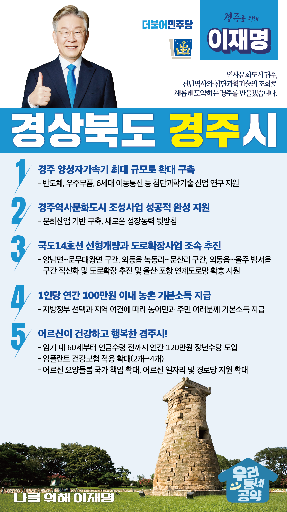

## 경북 지역 공약

# 경주시

### 천년역사와 첨단과학기술의 조화로 새롭게 도약하는 경주를 만들겠습니다!
> 2022-02-10

존경하는 경주시민 여러분,

     

경주는 신라의 수도로 한국문화의 원류를 이룬 상징성을 지닌 도시이며,지붕 없는 박물관으로 불리는 문화유적 도시입니다.

지속가능한 경주, 살기 좋은 경주를 위해 새로운 활력을 불어넣겠습니다.

이를 위한5대 지역공약을 말씀드리겠습니다.

     

첫째, 양성자가속기 규모를 확대하여 실질적인 연구와 산업화에 기여하겠습니다.

양성자가속기는 반도체, 우주부품, 6세대 이동통신과 같은첨단과학기술 산업분야 연구에서 세계와 경쟁하기 위한 핵심 인프라입니다.

현재 100메가전자볼트인 경주 양성자가속기를 가능한 최대 규모로 확대하여 구축하겠습니다.

     

둘째, 경주역사문화도시 조성사업의 성공을 적극 지원하겠습니다.

경주역사문화도시 조성사업은 특별법 제정에도 불구하고 지지부진합니다.

경주역사문화도시 조성을 성공적으로 완성하여 문화산업 기반을 구축하고경주의 성장동력이 될 수 있도록 지원하겠습니다.

     

셋째, 국도14호선 선형개량과 도로확장사업을 조속 추진하겠습니다.

국도14호선은 도로폭이 좁고 급경사·급커브로 사고위험이 높은 도로입니다.

양남면~문무대왕면 구간, 외동읍 녹동리~문산리 구간, 외동읍~울주 범서읍 구간의선형을 직선화하고 도로확장을 조속히 추진하겠습니다.

또한 울산·포항과 연계도로망을 확충하여 경주의 관광과 산업의 경쟁력을 높이겠습니다.

     

넷째, 농어촌에 거주하는 농어민과 주민 여러분께 기본소득을 지급하겠습니다.

지방정부의 선택과 지역의 여건에 따라1인당 연간 100만원 이내의 농어촌 기본소득을 지급하겠습니다.

농어촌 기본소득 지급으로 농어촌과 도시 간 소득격차를 줄이고농어촌 소멸을 막겠습니다.

     

다섯째, 어르신이 건강하고 행복한 경주시를 만들겠습니다.

퇴직시기인 60세부터 공적연금이 지급되기 전까지연간 120만원의 장년수당을 임기 내에 도입하겠습니다.

또한 임플란트 건강보험 적용 개수를 현재 2개에서 4개로 확대하고,어르신 요양 돌봄지원, 일자리 지원, 경로당 지원을 확대해 어르신들이 행복한 세상을 만들겠습니다.

     

존경하는 경주시민 여러분

이재명은 지킬 수 있는 것만 약속했고 약속했던 것은 지켜왔습니다.

살기 좋은 경주시 미래를 위한 약속,실력과 성과로 입증된 이재명이 반드시 실천하겠습니다.

     

경주 앞으로! 발전 제대로!

경주시민을 위해 이재명은 합니다.