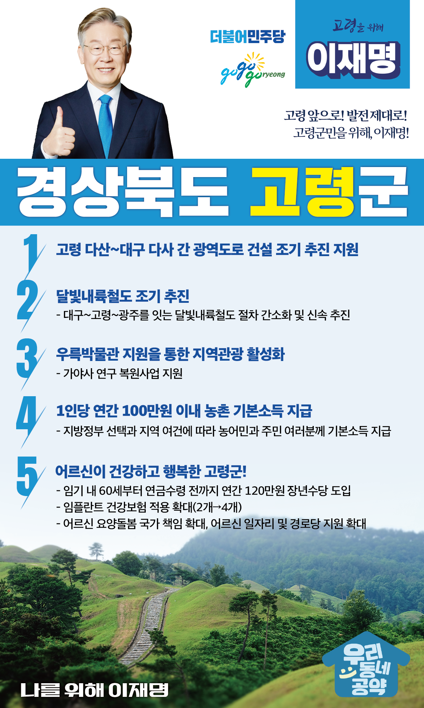

## 경북 지역 공약

# 고령군

### 고령 앞으로! 발전 제대로! 고령군민을 위해, 이재명!
> 2022-02-10

존경하는 고령군민 여러분,

 

고령은 가야시대 대가야의 중심지로 가야문화의 위대한 유산을 보유한 유서 깊은 고장입니다. 또한 고령생태숲과 중화유원지 등 훌륭한 관광자원을 가지고 있습니다. 

 

그러나 고령은 인구가 계속 줄면서 소멸위기에 빠져있습니다. 찬란한 고령의 역사를 다시 세우기 위해 교통불편 해소, 관광산업 육성, 어르신 복지 등을 통해 사람이 찾아오는, 그래서 활력이 있는 곳으로 만들어야 합니다. 

 

아이부터 어르신까지 살기 좋은 고령을 위해 이재명이 5대 고령 공약을 약속드립니다. 

 

첫째, 고령 다산~대구 다사 간 광역도로 건설이 조기에 추진되도록 돕겠습니다. 

고령군 다산면은 대구 달성군과 인접해 있지만 도로망이 부족하고 대구시와 갈등으로 교통불편을 겪어 왔습니다. 1km 남짓한 거리를 12km나 우회하고 있습니다. 고령 다사면과 대구 다사읍 간 광역도로 건설을 조기에 추진해 고령군민들의 이동권을 보장하고, 지역경제 활성화를 뒷받침하겠습니다. 

 

둘째, 달빛내륙철도가 조속히 추진하겠습니다. 

고령군은 그간 철도망으로부터 소외된 지역이었습니다. 도로망에 이어 철도망 구축도 챙기겠습니다. 대구에서 고령을 거쳐 광주를 잇는 달빛내륙철도가 조기에 착공하도록 적극적으로 돕겠습니다. 고령이 경북 남부 교통의 핵심지역으로 재탄생할 것입니다.

 

셋째, 우륵박물관 지원을 통해 지역관광을 활성화하겠습니다.

우륵박물관은 대가야박물관과 함께 고령군을 대표하는 박물관입니다. 우륵박물관이 영호남의 벽을 허물 수 있는 가야사 연구와 복원사업을 할 수 있도록 돕겠습니다. 우륵박물관이 대한민국의 대표적 박물관이 되도록 적극 지원하겠습니다. 

 

넷째, 농어촌에 거주하는 농어민과 주민 여러분께 기본소득을 지급하겠습니다.

지방정부의 선택과 지역의 여건에 따라 1인당 연간 100만원 이내의 농어촌 기본소득을 지급하겠습니다. 농어촌 기본소득 지급으로 농어촌과 도시 간 소득격차를 줄이고 농어촌 소멸을 막겠습니다. 어르신을 위한 고령군을 만들겠습니다.

 

다섯째, 어르신이 건강한 고령군을 만들겠습니다.

소득 공백에 놓인 60대 초반을 대상으로 연간 120만원의 장년수당을 지급하겠습니다. 임기 내에 65세 이상 어르신에 대한 임플란트 건강보험 적용 개수도 현행 2개에서 4개까지 확대하겠습니다. 고령군 어르신들의 건강한 노후를 뒷받침하겠습니다.

 

 

존경하는 고령군민 여러분!

 

이재명은 지킬 수 있는 것만 약속했고, 약속했던 것은 지켜왔습니다.

살기 좋은 고령 미래를 위한 약속, 실력과 성과로 입증된 이재명이 반드시 실천하겠습니다.

 

고령 앞으로! 발전 제대로! 

고령군민을 위해, 이재명! 