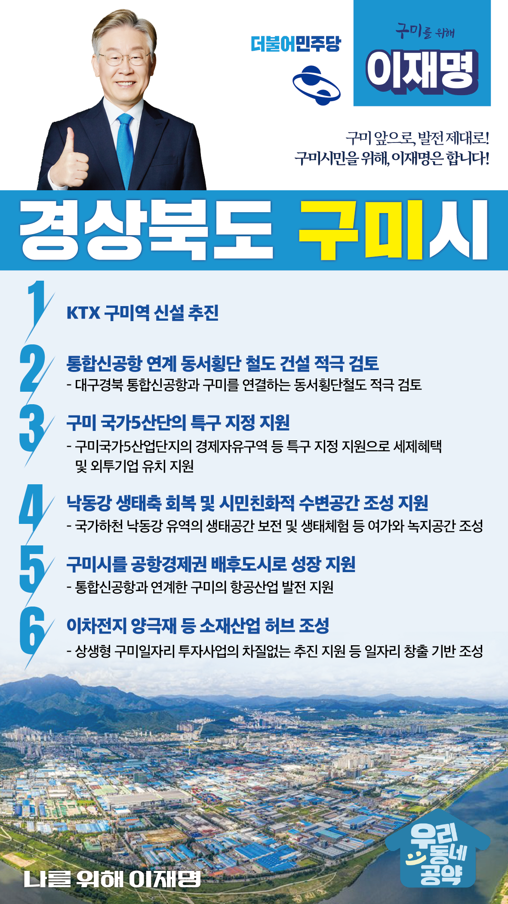

## 경북 지역 공약

# 구미시

### 고령 앞으로! 발전 제대로! 고령군민을 위해, 이재명!
> 2022-02-10

존경하는 구미시민 여러분,

 

구미시는 20세기 한국의 수출을 책임진 대표적인 산업도시이며 경북의 경제를 주도하는 명실상부한 경북 서남부권의 행정, 경제 중심도시입니다. 구미는 5개의 국가산단에 전자통신 등 첨단산업 분야 약 9만여명의 근로자가 근무하며 평균연령 39.7세로 젊고 활력 넘치는 도시입니다. 또한 이차전지 클러스터, 첨단방위산업, 스마트제조 등 첨단산업의 전초기지로서 미래산업을 주도하는 도시로 도약을 준비하고 있습니다.

 

그러나 더 살기 좋은 구미시를 위해서는 전환적 성장과 혁신적 도약이 필요합니다.

저 이재명이 시민 여러분과 함께 구미시에 새로운 활력을 불어넣겠습니다.

 

이를 위한 구미시 6대 공약을 말씀드리겠습니다.

 

첫째, KTX 구미역 신설을 추진하겠습니다.

구미시민들과 기업들은 KTX역이 멀어 지난 10년간 많은 불편을 겪어 왔습니다. 

KTX 구미역 신설을 통해 교통편의를 높이고 기업경쟁력을 강화하여 침체된 국가산단의 재도약 불씨를 마련하겠습니다.

 

둘째, 통합신공항 연계 동서횡단 철도 건설을 적극 검토하겠습니다.

대구경북 통합신공항 건설이 구미지역경제의 시너지가 되도록 공항과 구미를 연결하는 동서횡단철도를 적극 검토하겠습니다. 

통합신공항의 성공과 구미 교통망 확충의 동시 실현을 적극 지원하겠습니다.

 

셋째, 구미국가 5산단의 특구 지정을 지원해 구미경제를 활성화시키겠습니다.  

구미국가5산업단지가 경제자유구역 등 특구로 지정되도록 지원하겠습니다.  

이를 통해 세제혜택을 부여하고 외투기업을 유치하여 저조한 분양이 마무리되도록 돕겠습니다. 

통합 신공항과 연계해 기업 활동의 촉진제 역할을 할 수 있도록 뒷받침하겠습니다.

 

넷째, 낙동강 생태축 회복하고 시민친화적 수변공간 조성을 지원하겠습니다.

국가하천인 낙동강 유역의 생태공간을 보전하고 생태체험 등 여가와 녹지공간 조성을 적극 지원하겠습니다.  

또한 낙동강 수질을 개선하여 맑은 물을 공급하고 자연과 인간이 조화롭게 공존하도록 하겠습니다.

 

다섯째, 구미가 공항경제권 배후도시로 성장할 수 있도록 돕겠습니다. 

통합신공항과 연계해 구미의 항공 산업이 발전하도록 지원하겠습니다. 

이를 통해 도시기능을 개선하고 구미의 신성장 미래 먹거리로 만들 수 있도록 뒷받침하겠습니다.

 

여섯째, 구미를 이차전지 양극재 등 소재산업 허브로 만들겠습니다.

구미에 대한민국 미래 주요 먹거리인 이차전지·소재산업이 뿌리내릴 수 있게 하겠습니다.

‘상생형 구미일자리 투자사업’이 차질없이 진행되도록 적극 지원하여 일자리 창출의 기반을 닦겠습니다.

 

 

존경하는 구미시민 여러분!

이재명은 지킬 수 있는 것만 약속했고 약속했던 것은 지켜왔습니다.

살기 좋은 구미시 미래를 위한 약속, 실력과 성과로 입증된 이재명이 반드시 실천하겠습니다.

 

구미 앞으로, 발전 제대로!

구미시민을 위해, 이재명은 합니다! 

						