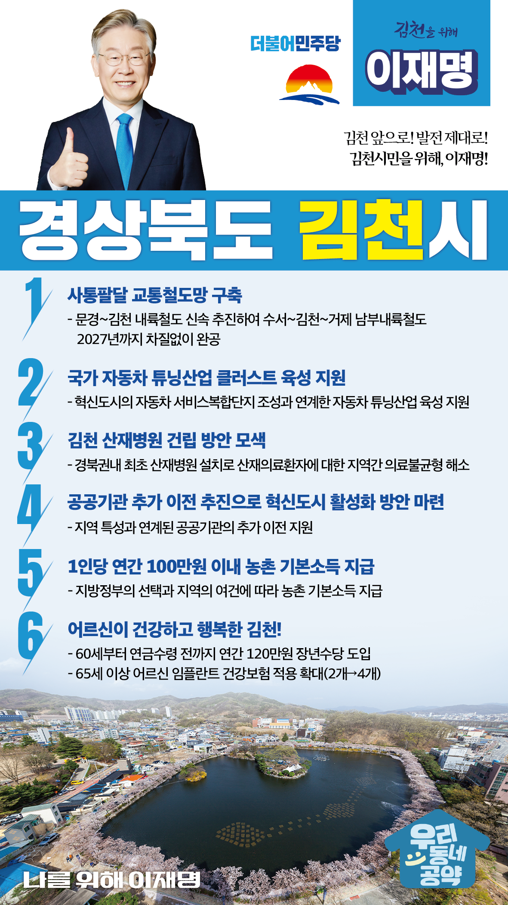

## 경북 지역 공약

# 김천시

### 김천 앞으로! 발전 제대로! 김천시민을 위해, 이재명!
> 2022-02-10

존경하는 김천시민 여러분,

 

예로부터 김천은 황악산, 대덕산, 금오산으로 3개의 산으로 둘러쌓여 있어 물 맑고 공기 좋은 삼산이수의 도시입니다.

경상도, 충청도, 전라도가 만나는 교통의 요충지이며 물류 유통의 집결지이기도 합니다.

 

그러나 고령화와 인구소멸 위기 등 해결해야 할 과제도 남아있습니다.

아이부터 어르신까지 살기 좋은 김천을 위한 6대 지역공약을 말씀드리겠습니다.

 

첫째, 김천을 중심으로 동서남북을 잇는 사통팔달 고속철도망을 구축하겠습니다.

‘문경~김천 내륙철도 사업’이 신속히 추진되도록 지원하겠습니다.

또한 수서와 김천, 거제를 잇는 ‘남북내륙철도사업’을 2027년까지 차질 없이 완공하여 김천의 사통팔달 교통망을 구축하겠습니다.

 

둘째, 자동차 튜닝산업을 김천의 성장동력으로 육성·지원하겠습니다. 

김천 혁신도시의 자동차 서비스복합단지 조성과 연계한 자동차 튜닝산업 육성을 지원하겠습니다.

이를 통해 기업을 유치하고 일자리를 창출해 김천과 경북 서부권 경제활성화를 뒷받침하겠습니다.

 

셋째, 김천 산재병원 건립을 적극 검토하겠습니다.

경북 서북부지역의 산업시설 증가에 따라 산업재해가 증가하고 있습니다.

이에 따라 산재병원을 유치하여 전문적인 산업재해 치료가 필요합니다. 

김천에 산재병원 건립하는 방안을 검토하여 산재 피해 근로자의 신속한 치료를 지원하겠습니다. 

 

넷째, 공공기관 추가 이전을 추진하겠습니다. 

국가균형발전과 수도권 인구 집중 해소를 위해 공공기관의 추가 이전이 필요합니다.

공공기관 이전을 통해 김천경제와 혁신도시 활성화를 모색하겠습니다. 

 

다섯째, 농촌에 거주하는 농민과 주민 여러분께 기본소득을 지급하겠습니다.

지방정부의 선택과 지역의 여건에 따라 1인당 연간 100만원 이내의 농촌 기본속득을 지급하겠습니다.

농촌 기본소득 지급으로 농어촌과 도시 간 소득격차를 줄이고 농촌 소멸을 막겠습니다.

 

여섯째, 어르신이 건강하고 행복한 김천을 만들겠습니다.

소득 공백에 놓인 60대 초반을 대상으로 연간 120만원의 장년수당을 지급하겠습니다.

임기 내에 65세 이상 어르신에 대한 임플란트 건강보험 적용 개수도 현행 2개에서 4개까지 확대하겠습니다.

김천시 어르신들의 건강하고 행복한 노후를 뒷받침하겠습니다. 

 

 

존경하는 김천시민 여러분!

 

이재명은 지킬 수 있는 것만 약속했고 약속했던 것은 지켜왔습니다.

살기 좋은 김천 미래를 위한 약속, 실력과 성과로 입증된 이재명이 반드시 실천하겠습니다.

 

김천 앞으로! 발전 제대로! 

김천시민을 위해, 이재명!  