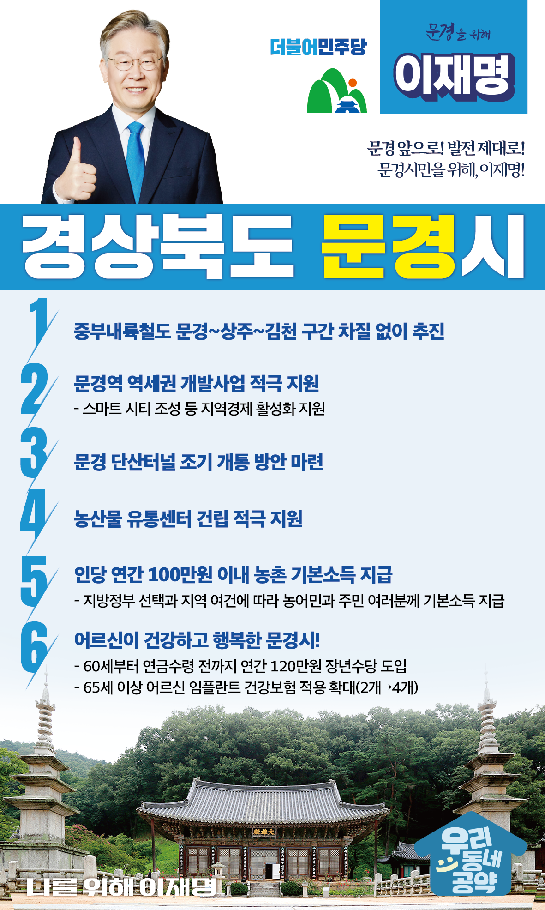

## 경북 지역 공약

# 문경시

### 문경 앞으로! 발전 제대로! 문경시민을 위해, 이재명!
> 2022-02-10

존경하는 문경시민 여러분,

 

문경시는 백두대간이 동서로 뻗어있어 생태와 전통문화가 살아 숨 쉬는 지역입니다.

특히 낙동강의 발원지이며 문경새재를 중심으로 한 문화관광의 도시이기도 합니다.

 

탄광과 농업이 지역경제의 한 축을 담당했으나 현재는 고령화와 지속적인 청년인구 유출로 지역소멸 우려의 목소리가 높은 상황입니다.

 

저 이재명과 민주당이 문경시민 여러분과 함께 문경에 새로운 활력을 불어넣겠습니다.

아이부터 어르신까지 살기 좋은 문경을 위한 6대 지역공약을 말씀드리겠습니다.

 

첫째, 중부내륙철도 문경~김천 구간을 조속히 이어 남부내륙철도와 연결하겠습니다. 

문경~김천 구간은 중부내륙철도와 남부내륙철도를 잇는 미연결 구간입니다.

해당 구간의 철도망 구축으로 서울에서 문경을 거쳐 거제까지 이어지는 급행철도가 차질없이 추진될 수 있도록 하겠습니다.

 

둘째, 문경역 역세권 개발사업이 차질 없이 진행되도록 적극 지원하겠습니다. 

문경역은 내년에 개통 예정인 중부내륙철도의 종착지입니다.  

문경역 주변 개발사업이 차질 없이 진행될 수 있도록 적극 지원하겠습니다.

스마트 시티 조성과 주변 관광자원 연계를 통해 지역경제가 활성화 할 수 있도록 적극 뒷받침하겠습니다. 

 

셋째, 문경 단산터널이 조기에 개통되도록 돕겠습니다. 

단산터널은 문경읍과 산북면의 접근성을 획기적으로 높이는 사업이지만 사업추진의 난항을 겪고 있습니다. 

단산터널이 조속히 개통될 수 있는 지원방안을 찾아 주민 불편 해소와 지역 간 교류가 원활히 이뤄지도록 노력하겠습니다. 

 

넷째, 문경시 농산물유통센터 건립을 적극 지원하겠습니다.

농민은 제 값을 받고 판매하며, 소비자는 합리적 가격에 구매할 수 있어야 합니다.

문경시 농산물 유통센터 건립을 지원하여 농산물 수급과 가격 안정화를 돕겠습니다. 

 

다섯째, 농촌에 거주하는 농민과 주민 여러분께 기본소득을 지급하겠습니다.

지방정부의 선택과 지역의 여건에 따라 1인당 연간 100만원 이내의 농촌 기본소득을 지급하겠습니다.

농촌 기본소득 지급으로 농촌과 도시 간 소득격차를 줄이고, 안정적 생활을 지원하겠습니다. 

 

여섯째, 어르신이 건강하고 행복한 문경을 만들겠습니다.

소득 공백에 놓인 60대 초반을 대상으로 연간 120만원의 장년수당을 지급하겠습니다.

또한 임플란트 건강보험 적용 개수를 현재 2개에서 4개로 확대하고 어르신 요양에 대한 국가 책임을 확대하고 어르신 일자리 지원과 경로당 지원 확대로 어르신들이 행복한 문경을 만들겠습니다.

 

 

존경하는 문경시민 여러분!

이재명은 지킬 수 있는 것만 약속했고 약속했던 것은 지켜왔습니다.

살기 좋은 문경 미래를 위한 약속, 실력과 성과로 입증된 이재명이 반드시 실천하겠습니다.

 

문경 앞으로! 발전 제대로! 

문경시민을 위해, 이재명!  

						