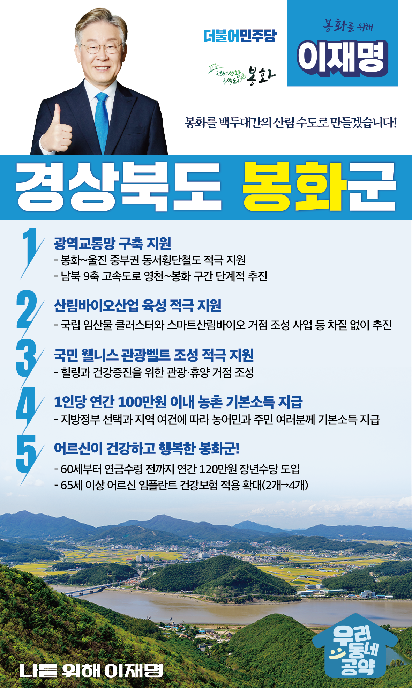

## 경북 지역 공약

# 봉화군

### 봉화를 백두대간의 산림 수도로 만들겠습니다!
> 2022-02-10

존경하는 봉화군민 여러분,

 

봉화군은 백두대간을 따라 춘양목이 자라는 청정지역으로 주민들의 긍지가 높은 지역이지만, 기본 인프라와 일자리 부족으로 매년 인구가 줄어들고 있습니다.

 

봉화군의 지속가능한 발전과 인간과 자연이 공존하는 봉화를 위한 5대 지역공약을 말씀드리겠습니다.

 

첫째, 동서남북으로 이어지는 봉화군 광역교통망 구축을 지원하겠습니다. 

동서 균형발전의 상징이자 봉화를 거쳐 울진으로 이어지는 ‘중부권 동서횡단철도’사업을 적극 지원하겠습니다.

‘남북 9축 고속도로’ 영천~봉화 구간을 단계적으로 추진하겠습니다.

교통오지라는 오명에서 벗어나 사통팔달 봉화가 되도록 돕겠습니다. 

 

둘째, 봉화의 산림바이오산업 발전을 적극 지원하겠습니다. 

봉화군에 국립 임산물 클러스터와 스마트산림바이오 거점 조성 등 백두대간권 국가균형발전 사업이 추진 중입니다.

봉화의 미래 먹거리가 될 산림바이오산업 육성을 적극 지원하여 일자리 창출과 지역경제 활성화를 뒷받침하겠습니다. 

 

셋째, 국민 웰니스 관광벨트 조성사업을 적극 지원하겠습니다.

지난해 봉화군은 웰니스 관광 클러스터 공모사업에 선정되었습니다. 

웰니스 관광벨트 조성사업을 적극 뒷받침하여 봉화군이 힐링과 건강증진을 위한 관광·휴양의 거점이 되도록 하겠습니다.

 

넷째, 농어촌에 거주하는 농어민과 주민 여러분께 기본소득을 지급하겠습니다.

지방정부의 선택과 지역의 여건에 따라 1인당 100만원 이내의 농어촌 기본소득을 지급하겠습니다.

농어촌 기본소득 지급으로 농어촌과 도시 간 소득격차를 줄이고 안정적인 생활을 지원하겠습니다.

 

다섯째, 어르신이 건강하고 행복한 봉화를 만들겠습니다.

소득 공백에 놓인 60대 초반을 대상으로 연간 120만원의 장년수당을 지급하겠습니다.

또한 65세 이상 어르신에 대한 임플란트 건강보험 적용 개수도 현행 2개에서 4개까지 확대하겠습니다.

봉화군 어르신들의 건강하고 행복한 노후를 뒷받침하겠습니다. 

 

 

존경하는 봉화군민 여러분!

 

이재명은 지킬 수 있는 것만 약속했고 약속했던 것은 지켜왔습니다.

살기 좋은 봉화 미래를 위한 약속, 실력과 성과로 입증된 이재명이 반드시 실천하겠습니다.

 

 

봉화 앞으로! 발전 제대로! 

봉화군민을 위해, 이재명!  

						