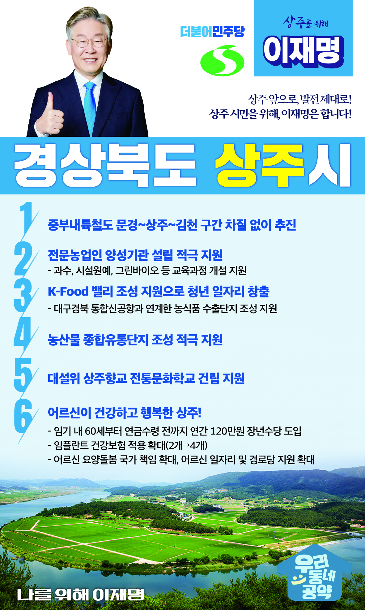

## 경북 지역 공약

# 상주시

### 상주 앞으로! 발전 제대로! 상주시민을 위해, 이재명!
> 2022-02-10

존경하는 상주시민 여러분,

 

상주시는 농축산물 생산액이 1조5천억에 달해 ‘대한민국 농업수도’로 불리는 곳입니다. 특히 낙동강과 속리산을 비롯한 자연환경이 잘 살아있고, 유구한 역사와 전통을 자랑하는 고장입니다.

 

그러나 상주시도 급격한 고령화와 청년인구의 타지역 유출로 지금은 지역소멸을 걱정하는 처지에 놓여 있습니다. 그럼에도 불구하고 상주는 잘 보존된 자연환경과 네 개의 고속도로가 지나는 사통팔달의 교통요지에 있어 성장 잠재력이 높은 곳입니다.

 

청년들이 돌아오는 상주를 만들기 위해서는 전환적 성장과 혁신적 도약이 필요합니다. 저 이재명이 상주시민 여러분과 함께 천년고도 상주에 새로운 활력을 불어넣겠습니다. 이를 위한 상주시 6대 공약을 말씀드리겠습니다.

 

첫째, 중부내륙철도 문경~상주~김천 구간을 조속히 이어 남부내륙철도와 연결하겠습니다. 

문경~상주~김천 구간은 중부내륙철도와 남부내륙철도를 잇는 미연결 구간입니다. 해당 구간의 철도망 구축으로 서울에서 상주를 거쳐 거제까지 이어지는 급행철도가 차질없이 추진될 수 있도록 하겠습니다.

 

둘째, 전문농업인 양성기관 설립을 적극 지원하겠습니다.

과수, 시설원예, 그린바이오 등 영남지역 농업 특성에 맞는 교육과정 개설이 필요합니다. 농업인 양성기관의 새로운 모범이 될 수 있도록 전문농업인 양성기관 설립을 적극 지원하겠습니다.

 

셋째, 경북이 계획하는 상주 K-Food 밸리 조성을 지원하겠습니다.

K-푸드에 대한 전 세계인들의 관심이 높아지고 있습니다. 대구경북 통합신공항과 연계한 농식품 가공 수출단지 조성과 식품기업 유치를 지원하겠습니다. 상주로 청년이 돌아올 수 있는 일자리를 만들겠습니다. 

 

넷째, 상주에 농산물 종합유통단지가 조성되도록 적극 지원하겠습니다.

농산물종합유통단지 조성은 상주의 오랜 숙원입니다. 지역의 풍부한 농업생산기반과 교통망을 활용한 농산물종합유통단지 조성으로 상주농업 발전을 뒷받침하겠습니다.

 

다섯째, 대설위 상주향교 전통문화학교 건립을 지원하겠습니다.

상주는 조선시대 경상도 관찰사가 있었던 지역으로 경주향교와 함께 대설위 향교 고을이었습니다. 상주향교 부지에 전통문화학교를 설립하여 유교전통문화가 전승 발전될 수 있도록 지원하겠습니다.

 

여섯째, 어르신이 건강하고 행복한 상주를 만들겠습니다.

소득 공백에 놓인 60대 초반을 대상으로 연간 120만원의 장년수당을 지급하겠습니다. 또한 65세 이상 어르신에 대한 임플란트 건강보험 적용 개수도 현행 2개에서 4개까지 확대하겠습니다. 상주시 어르신들의 건강하고 행복한 노후를 뒷받침하겠습니다. 

 

 

 

존경하는 상주시민 여러분!

이재명은 지킬 수 있는 것만 약속했고 약속했던 것은 지켜왔습니다.

살기 좋은 상주 미래를 위한 약속, 실력과 성과로 입증된 이재명이 반드시 실천하겠습니다.

 

상주 앞으로! 발전 제대로! 

상주시민을 위해, 이재명! 

						