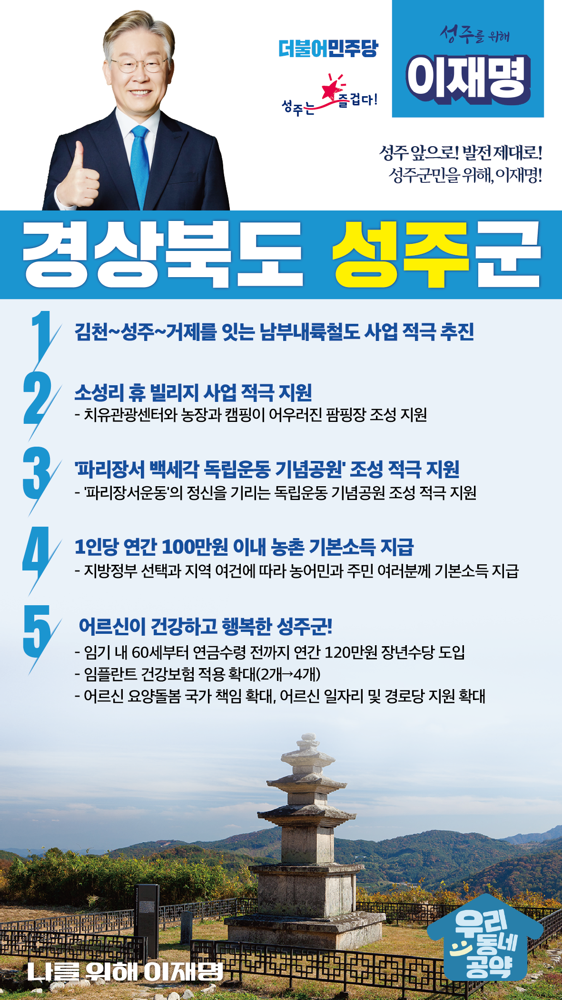

## 경북 지역 공약

# 성주군

### 성주 앞으로! 발전 제대로! 성주군민을 위해, 이재명!
> 2022-02-10

존경하는 성주군민 여러분,

 

성주군은 예로부터 가야산 포천계곡 등 산수가 깨끗하고 천혜의 환경을 가진 곳으로 유명한 곳입니다. 성주참외 등 질 좋은 농산물로도 잘 알려져 있습니다.

 

그러나 청년들이 빠져나가고 노령화가 시작되면서 54,000명에 이르던 인구는 어느덧 42,000명까지 줄어들어 지역소멸위기에 빠진 상황입니다.

 

사드 배치로 인해 지역적 갈등도 커졌습니다. 이제 성주군은 변해야 합니다. 새로운 변화와 도약으로 아이부터 어르신까지 모두 다 같이 잘살 수 있는 성주를 만들어야 합니다.

 

살기 좋은 성주군을 위한 이재명의 5대 공약을 말씀드리겠습니다.

 

첫째, 성주군을 남부내륙철도 사업을 적극 추진하겠습니다. 

그간 성주는 전국 철도망에서 소외되어 왔습니다. 김천에서 성주를 거쳐 거제까지 이어지는 ‘남부내륙철도’를 신속하고 차질 없이 추진하겠습니다. 성주군을 거쳐 동서남북으로 이어지는 고속철도망 구축으로 교통 여건을 개선하고 지역경제 활성화를 뒷받침하겠습니다.  

 

둘째, 소성리 휴(休) 빌리지 사업 추진을 적극 지원하겠습니다.

성주는 축복받은 자연환경으로 치유산업 육성에 적합한 지역입니다. 치유관광센터와 농장과 캠핑이 어우러진 팜핑장 운영으로 노년층과 청년층 모두 찾는 성주가 되도록 하겠습니다. 소성리 휴(休)빌리지 조성을 적극 지원하겠습니다. 

 

셋째, ‘파리장서 백세각 독립운동 기념공원’ 조성을 적극 지원하겠습니다.

성주는 1919년에 유림과 민족대표들이 ‘파리장서운동’을 일으켜 우리나라 독립운동에 큰 획을 그은 고장입니다. 성주 독립운동 정신을 기리는 독립운동 기념공원 조성을 적극 지원하겠습니다.

 

넷째, 농촌에 거주하는 농민과 주민 여러분께 기본소득을 지급하겠습니다.

지방정부의 선택과 지역의 여건에 따라 1인당 연간 100만원 이내의 농촌 기본소득을 지급하겠습니다. 농촌 기본소득 지급으로 농어촌과 도시 간 소득격차를 줄이고 농촌 소멸을 막겠습니다.

 

다섯째, 어르신이 건강하고 행복한 성주군을 만들겠습니다.

소득 공백에 놓인 60대 초반을 대상으로 연간 120만원의 장년수당을 지급하겠습니다. 임기 내에 65세 이상 어르신에 대한 임플란트 건강보험 적용 개수도 현행 2개에서 4개까지 확대하겠습니다. 성주군 어르신들의 건강하고 행복한 노후를 뒷받침하겠습니다.

 

존경하는 성주군민 여러분!

 

이재명은 지킬 수 있는 것만 약속했고, 약속했던 것은 지켜왔습니다.

살기 좋은 성주 미래를 위한 약속, 실력과 성과로 입증된 이재명이 반드시 실천하겠습니다.

 

성주 앞으로! 발전 제대로! 

성주군민을 위해, 이재명! 

						