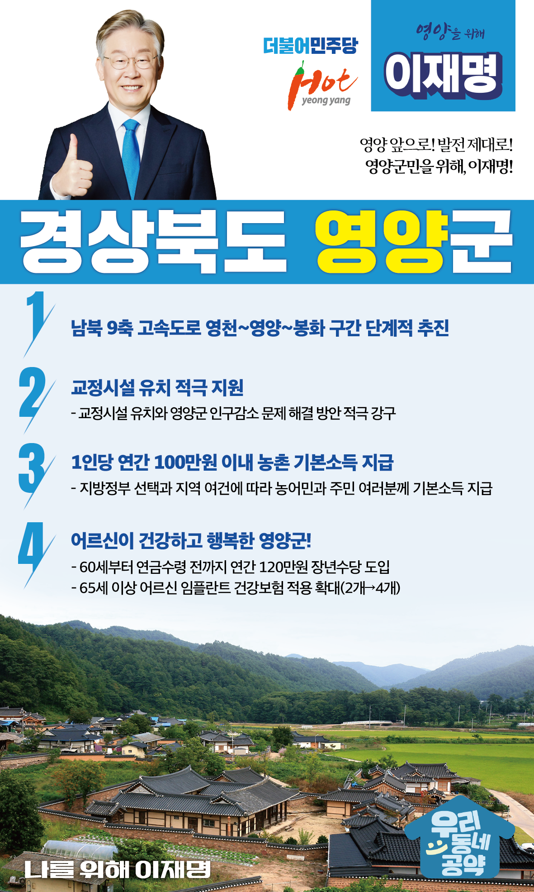

## 경북 지역 공약

# 영양군

### 영양 앞으로! 발전 제대로! 영양군민을 위해, 이재명!
> 2022-02-10

존경하는 경북 영양군민 여러분,

 

예로부터 영양은 청정 자연이 보존된 수려한 경관과 자연내음이 가득한 지역으로 유명합니다.

깨끗한 생태환경과 자연이 빚어내는 건강한 먹거리는 영양의 자랑입니다.

 

그러나 고령화와 인구 유출 문제 등 해결해야 할 과제도 남아있습니다.

아이부터 어른까지 살기 좋은 영양을 위한 4대 지역공약을 말씀드리겠습니다.

 

첫째, 영양군의 고속도로 시대를 열겠습니다.

영천에서 영양을 거쳐 봉화로 이어지는 ‘남북 9축 고속도로’ 구간을 단계적으로 추진하겠습니다.

영양군의 교통망을 개선하여 영양의 가치를 높이고 경제가 활성화되도록 뒷받침하겠습니다.

 

둘째, 교정시설 유치를 적극 지원하겠습니다. 

영양군은 인구감소 문제 해결방안 중의 하나로 교정시설의 유치를 추진 중입니다.

교정시설 유치와 영양군의 인구감소 문제 해결을 위한 지원방안을 적극 강구하겠습니다.

 

셋째, 농촌에 거주하는 농민과 주민 여러분께 기본소득을 지급하겠습니다.

지방정부의 선택과 지역의 여건에 따라 1인당 연간 100만원 이내로 농촌 기본소득을 지급하겠습니다.

농촌 기본소득 지급으로 농촌과 도시 간 소득격차를 줄이고 농촌 소멸을 막겠습니다.

 

넷째, 어르신이 건강하고 행복한 영양을 만들겠습니다.

소득 공백에 놓인 60대 초반을 대상으로 연간 120만원의 장년수당을 지급하겠습니다.

또한 65세 이상 어르신에 대한 임플란트 건강보험 적용 개수도 현행 2개에서 4개까지 확대하겠습니다.

영양군 어르신들의 건강하고 행복한 노후를 뒷받침하겠습니다. 

 

 

 

존경하는 영양군민 여러분!

이재명은 지킬 수 있는 것만 약속했고 약속했던 것은 지켜왔습니다.

살기 좋은 영양 미래를 위한 약속, 실력과 성과로 입증된 이재명이 반드시 실천하겠습니다.

 

영양 앞으로! 발전 제대로! 

영양군민을 위해, 이재명! 

						