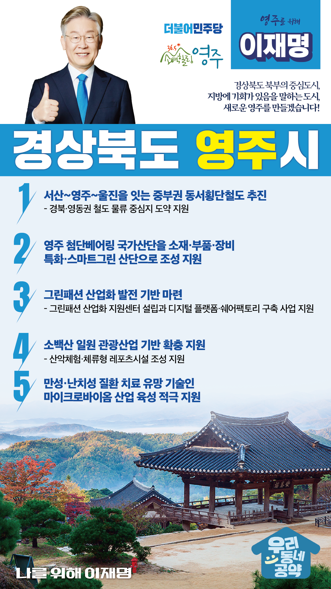

## 경북 지역 공약

# 영주시

### 경상북도 북부의 중심도시, 지방에 기회가 있음을 말하는 도시, 새로운 영주!
> 2022-02-10

존경하는 영주시민 여러분,

우리 영주시는 1914년 영천군, 풍기군, 순흥부 통합으로 탄생한 도시입니다. 

그러나 지금은 인구 감소로 인해 지방 소멸의 흐름 속에서 허우적거리고 있습니다.

 

그러나 다행히도 영주시는 다른 중소 도시들은 갖기 힘든 코레일 경북본부와 노벨리스코리아, KT&G, SK머티리얼스와 같은 산업기반, 

부석사나 소수서원 같은 문화유산, 소백산과 같은 자연 자원과 더불어 한국폴리텍대학이나 동양대학교 그리고 경북전문대학교를 보유하고 있습니다. 

 

영주시는 풍부한 유․무형의 자원들을 기반으로 예전의 영광을 회복할 수 있습니다. 

영주의 미래를 위한 5대 지역공약을 말씀드리겠습니다.

 

첫째, 영주를 경유하는 중부권 동서횡단철도를 적극 추진하겠습니다.  

충남 서산에서 시작해 영주와 봉화를 거쳐 울진에 이르는 중부권 동서횡단철도 건설을 조속히 추진하겠습니다. 

동서횡단철도가 건설되면 영주가 경북·영동권 철도 물류 중심지로 도약할 수 있도록 적극 지원하겠습니다. 

 

둘째, 영주 첨단베어링 국가산단이 소부장 특화·스마트그린 산단이 되도록 지원하겠습니다.

베어링 산업은 국가 제조업 경쟁력을 좌우하는 뿌리산업입니다.

영주 첨단베어링 국가산단이 소·부·장 특화단지, 스마트그린산단으로 조성되도록 적극 지원하겠습니다. 

영주를 베어링 소재 부품의 국산화와 실증 지원을 위한 거점으로 육성하겠습니다.

 

셋째, 영주시에 그린패션 산업화 발전 기반 구축을 지원하겠습니다. 

영주시의 그린패션 산업화 지원센터 설립과 그린패션 디지털 플랫폼·쉐어팩토리 구축 사업을 지원하겠습니다. 

섬유산업의 환경친화적 전환과 디지털 기술 접목을 통해 그린패션 전문인력을 양성하고, 지역 일자리를 창출하겠습니다. 

 

넷째, 영주시의 관광산업 기반 확충을 지원하겠습니다.  

영주에는 소백산, 부석사, 소수서원 등 자연·역사관광자원이 풍부합니다. 

KTX 열차 개통으로 영주 관광은 새로운 시대를 맞이하게 되었습니다. 

소백산 일원에 산악체험·체류형 레포츠시설 조성을 지원하여 영주의 관광자원을 넓히겠습니다. 

 

다섯째, 영주시의 마이크로바이옴 산업 육성을 돕겠습니다. 

‘마이크로바이옴’은 암과 같은 만성·난치성 질환 치료를 위한 미래 유망기술입니다. 

영주시의 마이크로바이옴 산업 육성계획을 적극 지원하겠습니다.

민간투자 유치와 일자리 창출로 지역경제 성장 가능성을 열겠습니다. 

 

 

 

존경하는 영주시민 여러분!

이재명은 지킬 수 있는 것만 약속했고 약속했던 것은 지켜왔습니다.

살기 좋은 영주 미래를 위한 약속, 실력과 성과로 입증된 이재명이 반드시 실천하겠습니다.

 

영주 앞으로! 발전 제대로!

영주시민을 위해, 이재명은 합니다.   

						