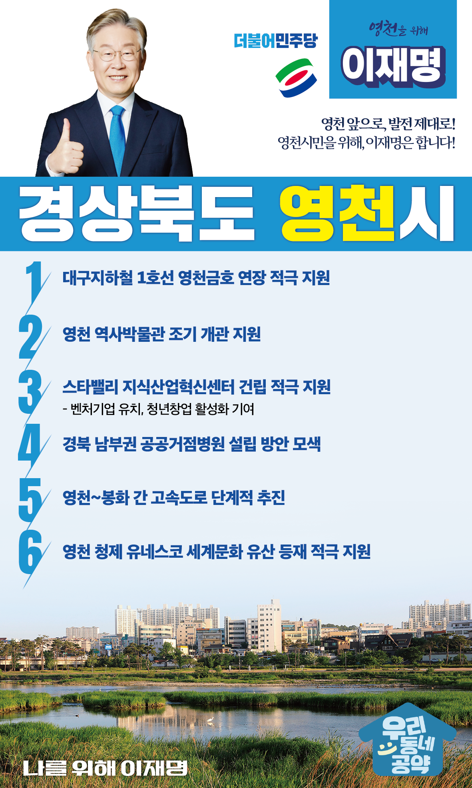

## 경북 지역 공약

# 영천시

### 영천 앞으로! 발전 제대로! 영천시민을 위해, 이재명! 
> 2022-02-10

존경하는 영주시민 여러분,존경하는 경북 영천시민 여러분,

 

영천시는 포은 정몽주 선생, 최무선 장군, 노계 박일로 선생 등 시대의 충신들이 태어난 호국 충절의 고장이며, 임진왜란, 6·25 전쟁에서 위기의 대한민국을 지킨 최후의 보루였습니다.

 

최고 품질의 복숭아, 포도, 살구 등 과일과 마늘, 양파가 많이 생산되는 농업 도시이면서 철도와 고속도로 등 교통 중심지로 자동차 부품 단지가 들어선 산업단지이기도 합니다.

 

그러나 전환의 시대에 접어들면서 영천시는 위축되고 있습니다. 

더 살기 좋은 영천시를 위해서는 전환적 성장과 혁신적 도약이 필요합니다.

저 이재명이 시민 여러분과 함께 영천시에 새로운 활력을 불어넣겠습니다.

이를 위한 영천시 6대 지역공약을 말씀드리겠습니다.

 

 

첫째, 대구지하철 1호선의 영천금호 연장을 적극 지원하겠습니다.

영천시의 30년 숙원사업인 대구지하철 1호선 영천금호 연장이 조기에 추진되도록 뒷받침하겠습니다. 

이를 통해 대구와의 접근성을 획기적으로 높이고, 지역 통학생들의 편의를 높이고 관광객 증대에 기여하겠습니다.

 

둘째, 영천 역사박물관이 조기에 개관하도록 지원하겠습니다. 

영천의 자랑스러운 문화유산을 한눈에 볼 수 있도록 영천 역사박물관이 조기에 개관되도록 적극 지원하겠습니다. 

아울러 영천 문화유산의 관광자원 개발과 지역민의 자부심을 높이겠습니다.

 

셋째, 영천 스타밸리 지식산업혁신센터가 차질 없이 건립되도록 적극 지원하겠습니다.

전통 제조업 중심인 영천의 산업구조를 스마트 기술과 친환경 고부가가치 산업으로 재편해야합니다. 

지식산업 혁신센터가 차질 없이 건립되도록 지원하여 벤처기업 유치, 청년창업 활성화와 지역 일자리 창출에 기여하겠습니다.

 

넷째, 경북 남부권 공공거점병원 설립을 적극 검토하겠습니다.

어르신들의 심혈관 질환과 만성질환 관리를 위해 골든타임 확보가 중요합니다. 

경북 남부권 공공거점병원 설립으로 공공의료서비스가 강화될 수 있는 방안을 모색하겠습니다. 

다섯째, 영천-봉화 간 고속도로를 단계적으로 추진하겠습니다.

경북 영천과 강원도 양구를 연결하는 남북 9축 고속도로를 단계적으로 추진하겠습니다.

이를 통해 남북 협력시대를 준비하고 낙후된 경북 동북 지역의 균형발전을 촉진하겠습니다.

 

여섯째, 영천 청제의 유네스코 세계문화 유산 등재를 적극 지원하겠습니다.

청제비는 우리나라에서 가장 오래된 수리시설 건립 기념비이며, 청제는 신라시대 제방의 원형을 유지하고 있는 역사적 가치가 높은 유적입니다.

영천 청제를 김제 벽골제 등과 함께 유네스코 세계문화유산에 등재되도록 적극 지원하겠습니다.

 

 

존경하는 영천시민 여러분!

이재명은 지킬 수 있는 것만 약속했고 약속했던 것은 지켜왔습니다.

살기 좋은 영천 미래를 위한 약속, 실력과 성과로 입증된 이재명이 반드시 실천하겠습니다.

 

영천 앞으로! 발전 제대로!

영천시민을 위해, 이재명!  

						