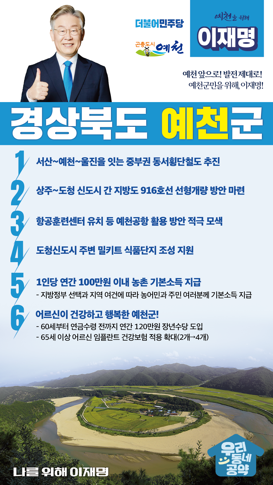

## 경북 지역 공약

# 예천군

### 예천 앞으로! 발전 제대로! 예천군민을 위해, 이재명!
> 2022-02-10

존경하는 예천군민 여러분,

 

예로부터 우리 예천은 충효의 고장으로 지난 2016년 경북의 균형발전을 위해 경북도청이 대구에서 예천과 안동으로 이전하여 백년의 새 역사를 만들었습니다. 

 

그러나 5년이 지난 현재 도청 신도시로 이전하기로 했던 유관기관들은 당초 계획과는 달리 타지역으로 분산 배치되었고, 2·3단계 신도시 조성은 목표 대비 절반에도 못 미치고 있습니다.

 

더 살기 좋은 예천군을 위해 전환적 성장과 혁신적 도약이 필요합니다.

저 이재명이 군민 여러분과 함께 예천군에 새로운 활력을 불어넣겠습니다.

 

이를 위한 예천군 6대 공약을 말씀드리겠습니다.

 

 

첫째, 예천을 경유하는 중부권 동서횡단철도를 추진하겠습니다. 

충남 서산에서 예천을 거쳐 울진으로 이어지는 중부권 동서횡단철도가 완성되면 서해안 신산업벨트와 동해안 관광지구가 연결되어 경북 발전의 새로운 동력이 될 것입니다.

사통팔달 예천을 만들고 동서 균형발전도 이뤄내겠습니다.

 

둘째, 상주~도청 신도시 간 지방도 916호선 선형개량 사업을 돕겠습니다.

지방도 916호선은 상주시 인근과 도청 신도시를 연결하는 최단 거리 도로입니다.

그러나 도로 선형이 불량하고 대형차량을 비롯한 통행량 증가에 따라 사고 위험이 커지고 있습니다.

도로 선형 개량을 위한 방안 마련을 지원하겠습니다. 

 

셋째, 예천공항 활용과 발전방안을 적극 모색하겠습니다.

예천 공항은 2005년 민항이 폐지되고 공군 비행장으로만 사용 중입니다.

항공훈련센터 유치 등 예천공항을 활용하는 방안을 적극 검토하겠습니다. 

 

넷째, 도청신도시 주변 밀키트 식품단지 조성을 지원하겠습니다.

밀키트 식품이 국내 및 해외시장에서 많은 관심을 받고 있습니다. 

통합신공항 이전에 따른 접근성을 활용하고, 예천군의 미래 신성장 산업 기반 마련을 위해 예천군이 계획하는 밀키트 식품단지 조성을 지원하겠습니다.

 

다섯째, 농촌에 거주하는 농민과 주민 여러분께 기본소득을 지급하겠습니다.

 

지방정부의 선택과 지역의 여건에 따라 1인당 연간 100만원 이내의 농촌 기본소득을 지급하겠습니다.

농촌 기본소득 지급으로 농촌과 도시 간 소득격차를 줄이고, 안정적 생활을 지원하겠습니다. 

 

여섯째, 어르신이 건강하고 행복한 예천을 만들겠습니다. 

 

소득 공백에 놓인 60대 초반을 대상으로 연간 120만원의 장년수당을 지급하겠습니다.

또한 임플란트 건강보험 적용 개수를 현재 2개에서 4개로 확대하고 어르신 요양에 대한 국가 책임을 확대하고 어르신 일자리 지원과 경로당 지원 확대로 어르신들이 행복한 예천을 만들겠습니다.

 

 

존경하는 예천군민 여러분!

이재명은 지킬 수 있는 것만 약속했고 약속했던 것은 지켜왔습니다.

살기 좋은 예천 미래를 위한 약속,

실력과 성과로 입증된 이재명이 반드시 실천하겠습니다.

 

예천 앞으로! 발전 제대로! 

예천군민을 위해, 이재명!  

						