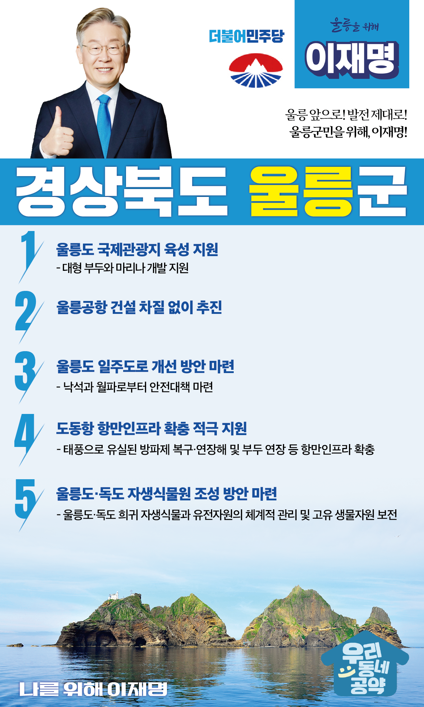

## 경북 지역 공약

# 울릉군

### 울릉 앞으로! 발전 제대로!  울릉군민을 위해, 이재명!
> 2022-02-10

존경하는 울릉군민 여러분,

 

대한민국 최동단 울릉도는 가장 작지만 특별한 기초자치단체입니다. 경제의 중심은 어업에서 관광산업으로 전환되었습니다. 관광객이 언제든지 쉽게 찾아올 수 있는 울릉도와 독도로 만드는 일이 울릉 발전의 해답입니다.

 

저, 이재명이 반드시 앞당기겠습니다. 이를 실현할 5대 지역공약을 말씀드리겠습니다.

 

첫째, 울릉도가 국제관광지로 거듭날 수 있도록 기반시설 조성을 지원하겠습니다. 

울릉도가 국제관광지로 거듭나기 위해 대형 부두와 마리나 개발 필요성이 있습니다. 울릉공항과 해양 인프라가 시너지 효과를 내어 울릉도를 국제관광지로 육성하겠습니다.

 

둘째, 울릉공항 건설을 차질없이 추진하겠습니다.

울릉도 주민의 40년 숙원인 울릉공항이 드디어 착공했습니다. 울릉도가 한단계 더 발전하는 계기가 될 울릉공항이 조기에 완공되도록 면밀히 살피겠습니다. 울릉도 주민들의 삶의 질을 높이고 서울까지 1시간, 주말관광 시대를 열겠습니다.

 

셋째, 울릉도 일주도로의 개선 방안이 마련되도록 지원하겠습니다.

울릉도 일주도로가 완전 개통되었지만 낙석과 월파로 도로 통제가 빈번하고 사고 발생 가능성이 높습니다. 울릉 주민들의 안전한 도로 이용을 위해 일주도로 개선을 지원하겠습니다. 

 

넷째, 도동항 항만인프라 확충을 적극 지원하겠습니다.

울릉도의 관문인 도동항에 신규 대형여객선이 취항할 수 있도록 태풍으로 유실된 방파제 복구·연장과 부두 연장 등 항만인프라 확충을 적극 지원하겠습니다.

 

다섯째, 울릉도·독도 자생식물원 조성 방안을 마련하겠습니다.

기후위기에 따라 생물다양성 보전의 중요성이 더욱 커지고 있습니다. 울릉도·독도의 희귀 자생식물과 유전자원의 체계적 관리로 우리나라 고유 생물자원을 보전하겠습니다. 

 

 

존경하는 울릉군민 여러분!

이재명은 지킬 수 있는 것만 약속했고 약속했던 것은 지켜왔습니다.

살기 좋은 울릉 미래를 위한 약속, 실력과 성과로 입증된 이재명이 반드시 실천하겠습니다.

 

울릉 앞으로! 발전 제대로! 

울릉군민을 위해, 이재명! 

						