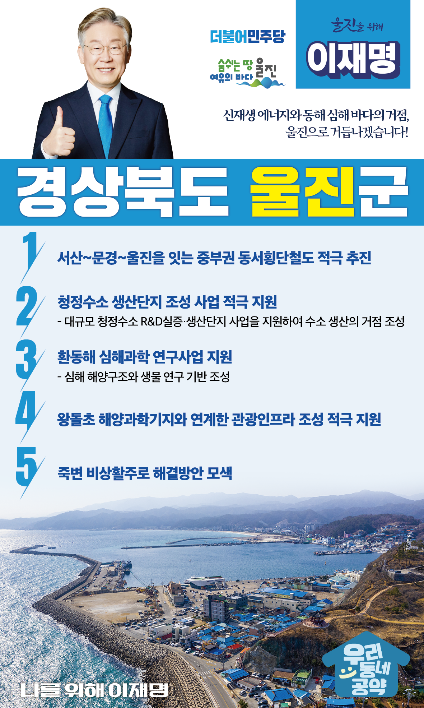

## 경북 지역 공약

# 울진군

### 신재생 에너지와 동해 심해 바다의 거점, 울진으로 거듭나겠습니다!
> 2022-02-10

존경하는 울진군민 여러분,

 

우리 울진군은 남북이 150여 리에 이르는 만큼 천혜의 자연환경인 동해를 품고 있습니다.

풍부한 자연환경을 활용하여 미래의 먹거리와 새로운 성장동력을 발굴할 수 있는 가능성이 잠재된 지역입니다.

 

울진에 대한 새로운 설계로 주거와 일자리, 그리고 자연이 조화로운 살기 좋은 울진을 위한 5대 지역공약을 말씀드리겠습니다.

 

 

첫째, 중부권 동서횡단철도를 적극 추진하겠습니다. 

 

충남 서산에서 문경을 거쳐 울진까지 이어지는 ‘중부권 동서횡단철도’ 건설을 조속히 추진하겠습니다. 

광역철도망 구축을 통해 울진군의 철도 접근성을 높이고 동서 균형발전을 위해 적극 지원하겠습니다.

 

둘째, 울진군의 청정수소 생산단지 조성 사업을 적극 지원하겠습니다. 

수소는 기후위기 극복과 탄소중립을 위한 핵심 에너지원입니다. 

울진군은 대규모 청정수소 R&D실증․생산단지 조성을 계획하고 있습니다. 

울진이 수소 생산의 거점이 되도록 지원하겠습니다. 

일자리 창출과 울진 지역경제가 활성화되도록 돕겠습니다. 

 

셋째, 울진군의 환동해 심해과학 연구사업 계획을 지원하겠습니다.

동해바다는 무한한 잠재력을 가진 자연자원입니다. 

동해의 잠재력을 활용하기 위해서는 환동해 심해 해양구조과 생물을 연구할 수 있는 기반이 필요합니다. 

울진군의 계획인 심해연구 기반 조성을 적극 지원하겠습니다. 

 

넷째, 왕돌초 해양과학기지와 연계한 관광인프라 조성을 적극 지원하겠습니다.  

후포항 동쪽 연안에 위치한 왕돌초에 동해 첨단 해양과학기지 구축사업이 추진되고 있습니다. 

생태적 가치가 높은 왕돌초와 해양과학기지를 연계하여 울진만의 특색 있는 해양관광 인프라가 구축되도록 돕겠습니다.  

 

다섯째, 죽변 비상활주로 문제 해결 방안을 모색하겠습니다.  

 

원전 인근에 위치한 죽변 비상활주로로 주민들의 불안이 큽니다. 

또한 주민들의 재산권이 제한되고 지역발전의 장애물로 작용하고 있습니다. 

주민 불안 해소와 지역발전을 위해 죽변 비상활주로 문제의 원만한 해결 방안을 적극 검토하겠습니다. 

 

 

 

존경하는 울진군민 여러분!

 

이재명은 지킬 수 있는 것만 약속했고 약속했던 것은 지켜왔습니다.

살기 좋은 울진 미래를 위한 약속, 실력과 성과로 입증된 이재명이 반드시 실천하겠습니다.

 

울진 앞으로! 발전 제대로! 

울진군민을 위해, 이재명!  

						