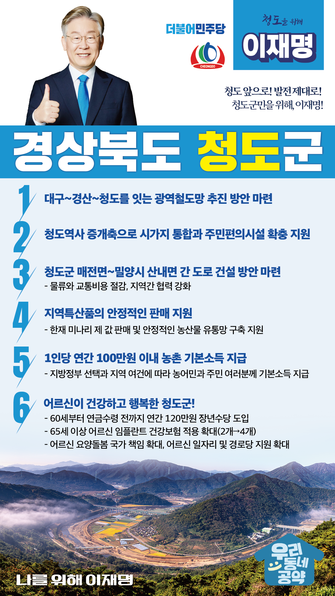

## 경북 지역 공약

# 청도군

### 청도 앞으로! 발전 제대로! 청도군민을 위해, 이재명!
> 2022-02-10

아름다운 생명고을! 청도 군민 여러분!

     

청도는 봄철 미나리, 여름철 복숭아, 가을철 우렁이쌀, 겨울철 반건시와감말랭이가 철철이 생산되어 건강한 먹거리로 사랑을 받고 있으며,운문사, 와인터널, 온천, 소싸움장, 비슬산 탐방로 등 관광지가 즐비한축제와 문화 관광지입니다.

더 살기 좋은 청도군을 위해서는 전환적 성장과 혁신적 도약이 필요합니다.저 이재명이 군민 여러분과 함께 청도군에 새로운 활력을 불어넣겠습니다.

이를 위한청도군 6대 지역공약을 말씀 드리겠습니다

     

첫째, 경산~청도 광역철도망 추진 방안 마련을 적극 지원하겠습니다.

서울-부산 구간 KTX의 완전 개통으로 기존 경부선 철도에 여유선로가 생겼습니다.이를 활용하여 대구~경산~청도를 광역철도로 연결할 수 있습니다.청도의 광역교통망 확충방안 마련을 적극 지원하겠습니다.

     

둘째, 청도역사 증개축으로 시가지 통합과 주민편의시설 확충을 지원하겠습니다.

청도역은 철도 이용객을 위한 주차장이 없어 매우 불편합니다.또한 청도역과 철로로 인해 고수7리는 시가지와 단절되어 발전에서 소외되었습니다.청도역사 증개축으로 시가지를 통합하고 주차장 등 주민편의시설을 확충하여청도역사가 재탄생되도록 지원하겠습니다.

     

셋째, 청도군 매전면~밀양시 산내면 간 도로 건설 방안 마련을 지원하겠습니다.

청도군 매전면에서 밀양시 산내면을 가기 위해서는 멀리 돌아가야 합니다.물류와 교통비용 절감하고 지역간 협력을 강화하기 위해이 구간을 연결하는 도로 건설 방안 마련을 적극 지원하겠습니다.

     

넷째, 청도의 지역특산품이 적정가에 안정적으로 판매되도록 지원하겠습니다.

한겨울에 먹는 청도 한재 미나리는 청도의 대표 농산물입니다.이처럼 농민들이 정성을 다해 생산한 농산물들이 제 값을 받고,소비자들은 건강한 먹거리를 즐기실 수 있도록 농산물 유통망 구축을 지원하겠습니다.

     

다섯째, 농촌에 거주하는 농민과 주민 여러분께 기본소득을 지급하겠습니다.

지방정부의 선택과 지역의 여건에 따라1인당 연간 100만원 이내의 농촌 기본소득을 지급하겠습니다.농촌 기본소득 지급으로 농촌과 도시 간 소득격차를 줄이고농촌 소멸을 막겠습니다.

     

여섯째, 어르신이 건강하고 행복한 청도를 만들겠습니다.

소득 공백에 놓인 60대 초반을 대상으로연간 120만원의 장년수당을 지급하겠습니다.또한 65세 이상 어르신에 대한 임플란트 건강보험적용 개수도 현행 2개에서 4개까지 확대하겠습니다.청도군 어르신들의 건강하고 행복한 노후를 뒷받침하겠습니다.

     

존경하는 청도군민 여러분!

     

이재명은 지킬 수 있는 것만 약속했고 약속했던 것은 지켜왔습니다.

살기 좋은 청도 미래를 위한 약속,실력과 성과로 입증된 이재명이 반드시 실천하겠습니다.

     

청도 앞으로! 발전 제대로!

청도군민을 위해, 이재명!

						