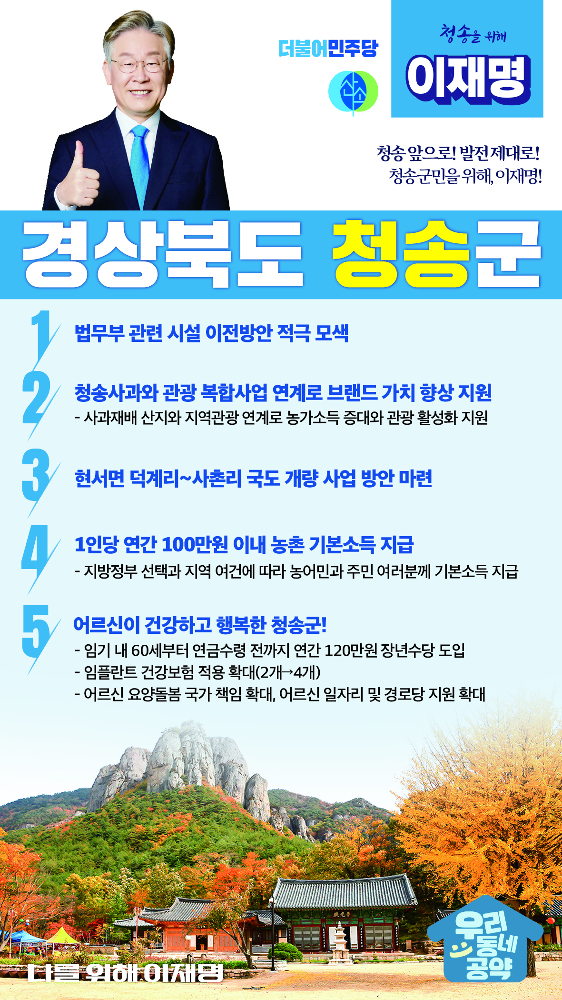

## 경북 지역 공약

# 청송군

### 청송 앞으로! 발전 제대로! 청송군민을 위해, 이재명!
> 2022-02-10

존경하는 경북 청송군민 여러분,

 

청송은 자연과 지질, 전통과 문화가 있는 곳으로 청송 유네스코 세계지질공원과 주왕산국립공원, 김주영 작가의 소설 객주로 유명한 곳입니다.

 

전 지역이 산으로 둘러싸여 수려한 자연환경과 분지 고유의 기후로 인하여 청송사과와 고추로 널리 알려져 있습니다.

 

한때는 인구 8만으로 주왕산 관광과 더불어 경북 북부지역의 교통·상업의 요충지였지만 관광지 쇠락과 함께 인구소멸이 심각한 문제로 떠올랐습니다. 더 살기 좋은 청송을 위하여 저 이재명이 청송군민 여러분들께 새로운 활력을 불어넣겠습니다.

 

이를 위해 청송군 5대 공약을 말씀드리겠습니다.

 

첫째, 청송에 법무부 관련시설의 이전방안을 검토하겠습니다.

청송은 오랜 세월 동안 청송교도소가 지역을 대표하는 이미지로 자리잡았습니다. 청송군의 지역 이미지 제고를 위해 법무부 관련 시설의 청송 이전방안을 적극 검토하겠습니다.

 

둘째, 청송사과의 브랜드 가치를 높이는 농업·관광 복합사업을 지원하겠습니다.

청송은 대표적인 사과의 산지입니다. 청송만의 사과재배 산지와 주왕산, 주산지 등 지역관광을 연계해야 합니다. 청송의 농가소득 증대와 관광활성화를 이룰 수 있도록 지원하겠습니다. 

 

셋째, 청송 현서 덕계~사촌 국도 개량 사업 방안을 마련하겠습니다. 

청송은 지형상 도로 사정이 열악하여 교통이 불편한 지역입니다. 지역 주민의 교통편의를 높이고 낙후한 청송 지역의 발전을 위해 현서면 덕계리와 사촌리를 잇는 국도 개량사업 추진을 적극 검토하겠습니다. 

 

넷째, 농촌에 거주하는 농민과 주민 여러분께 기본소득을 지급하겠습니다.

지방정부의 선택과 지역의 여건에 따라 1인당 연간 100만원 이내의 농촌 기본소득을 지급하겠습니다. 농촌 기본소득 지급으로 농촌과 도시 간 소득격차를 줄이고 생활 안정을 지원하겠습니다.

 

다섯째, 어르신이 건강하고 행복한 청송을 만들겠습니다.

소득 공백에 놓인 60대 초반을 대상으로 연간 120만원의 장년수당을 지급하겠습니다. 또한 65세 이상 어르신에 대한 임플란트 건강보험 적용 개수도 현행 2개에서 4개까지 확대하겠습니다. 청송군 어르신들의 건강하고 행복한 노후를 뒷받침하겠습니다. 

 

 

존경하는 청송군민 여러분!

이재명은 지킬 수 있는 것만 약속했고 약속했던 것은 지켜왔습니다.

살기 좋은 청송 미래를 위한 약속, 실력과 성과로 입증된 이재명이 반드시 실천하겠습니다.

 

청송 앞으로! 발전 제대로! 

청송군민을 위해, 이재명! 

						