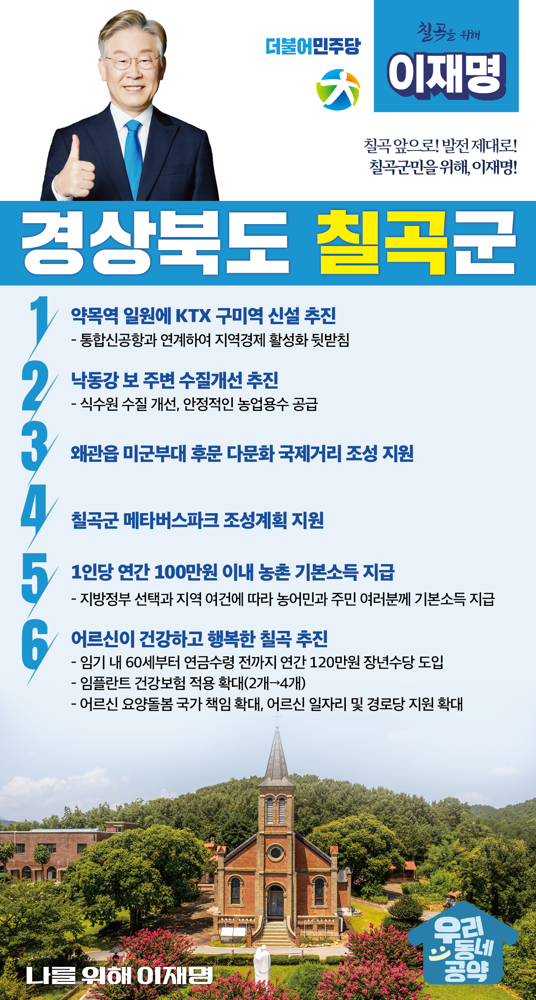

## 경북 지역 공약

# 칠곡군

### 칠곡 앞으로! 발전 제대로!  칠곡군민을 위해, 이재명!
> 2022-02-10

존경하는 칠곡군민 여러분,

 

칠곡은 예로부터 국방의 요충지로 조선시대에는 가산산성을 축성하고 칠곡도호부를 설치하였으며, 한국전쟁 당시에는 다부동전투에서 반격의 기틀을 마련한 호국의 고장입니다.

산업도시와 근교농업도시로 힘차게 발전하고 있는 지역이기도 합니다.

 

칠곡군이 지속적으로 성장 발전할 수 있도록 이재명과 민주당이 함께 하겠습니다.

 

이를 위한 6대 지역공약을 말씀드리겠습니다.

 

첫째, KTX 구미역을 신설을 추진하겠습니다.

칠곡군 약목역 일원에 KTX 구미역을 신설하여 침체된 지역경제가 재도약 할 수 있는 불씨를 마련하고 통합신공항과 연계해 기업들의 항공 수출 길을 활짝 열겠습니다.

 

둘째, 낙동강 보 주변 수질개선을 추진하겠습니다.

해마다 발생하는 낙동강 보 주변의 녹조와 수질유해물질에 대한 철저한 수질환경 조사를 통해 식수원의 수질을 개선하겠습니다.

또한 안정적인 농업용수 공급에도 최선을 다하겠습니다.

 

셋째, 왜관읍 미군부대 후문 다문화 국제거리 조성을 지원하겠습니다.

왜관읍 미군부대 후문은 왜관을 대표하는 명소였으나 유동인구가 줄어들어 지역주민들이 어려움을 겪고 있습니다.

서울 이태원과 같은 다문화 국제거리를 조성하는 칠곡군의 계획을 지원하여 관광명소로 다시 태어날 수 있도록 돕겠습니다.

 

넷째, 칠곡군의 메타버스파크 조성계획을 지원하겠습니다.

칠곡군은 지난해 군 단위 기초지자체 중 처음으로 메타버스 공간을 활용한 대축제를 추진해 눈길을 끌었습니다.

메타버스 활용 기술이 지역경제 활성화의 발판이 되도록 칠곡군이 계획하는 메타버스 파크 조성을 지원하겠습니다. 

 

다섯째, 농어촌에 거주하는 농어민과 주민 여러분께 기본소득을 지급하겠습니다.

지방정부의 선택과 지역의 여건에 따라 1인당 연간 100만원 이내의 농어촌 기본소득을 지급하겠습니다.

농어촌 기본소득 지급으로 농어촌과 도시 간 소득격차를 줄이고 농어촌 소멸을 막겠습니다.

 

여섯째, 어르신이 건강하고 행복한 칠곡을 만들겠습니다.

소득 공백에 놓인 60대 초반을 대상으로 연간 120만원의 장년수당을 지급하겠습니다.

임기 내에 65세 이상 어르신에 대한 임플란트 건강보험 적용 개수도 현행 2개에서 4개까지 확대하여, 칠곡군 어르신들의 건강하고 행복한 노후를 뒷받침하겠습니다. 

 

 

존경하는 칠곡군민 여러분!

이재명은 지킬 수 있는 것만 약속했고 약속했던 것은 지켜왔습니다.

살기 좋은 칠곡군 미래를 위한 약속, 실력과 성과로 입증된 이재명이 반드시 실천하겠습니다.

 

칠곡 앞으로! 발전 제대로! 

칠곡군민을 위해, 이재명! 

						