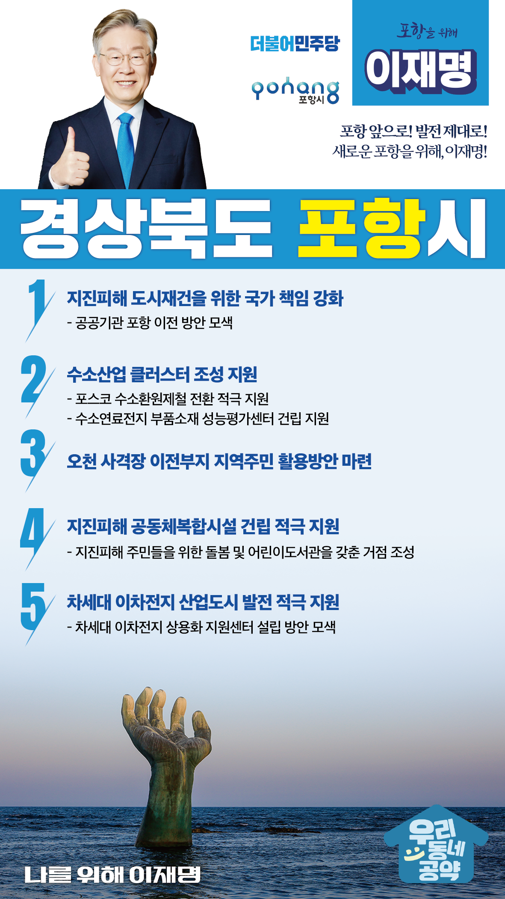

## 경북 지역 공약

# 포항시

### 포항 앞으로! 발전 제대로! 새로운 포항을 위해, 이재명!
> 2022-02-10

존경하는 포항시민 여러분,

 

작은 어촌마을이었던 포항시는 1968년 포스코를 시작으로 포스텍, 4세대 방사광 가속기 등 철강산업 기반으로 세계철강도시로 도약했습니다. 포항시는 2019년 ‘강소연구개발특구’에 이어 ‘배터리 규제자유특구’, ‘영일만관광특구’ 등 ‘3대 국가전략특구’ 지정으로 4차 산업혁명시대의 미래성장동력 확보는 물론 산업구조 다변화의 기반도 다지고 있습니다.

 

그러나 포항시는 11.15 포항지진피해, 급격한 인구감소, 탄소중립시대 산업전환의 지연 등 위기에 직면하고 있습니다. 

 

저 이재명이 담대한 변화로 포항의 위기를 도약의 기회로 전환하겠습니다. 

 

이를 위한 포항시 5대 공약을 말씀드리겠습니다. 

 

 

첫째, 포항의 지진피해 도시재건을 위해 국가의 책임을 높이겠습니다. 

지진피해 도시재건 사업에 대한 포항시민의 만족도나 체감도가 낮습니다. 국가의 책임을 강화하고, 동해권 국토균형발전을 증진하겠습니다. 공공기관의 포항 이전을 적극 검토하겠습니다. 

 

둘째, 수소환원제철소 등 수소산업 클러스터 조성을 지원하겠습니다.

포항 시민들의 대기환경 개선 요구가 높습니다. 포스코의 수소환원제철 전환을 적극 지원하고, 수소연료전지 부품소재 성능평가 센터 건립도 돕겠습니다. 포항의 수소경제를 육성하고 친환경도시로 전환할 수 있도록 뒷받침하겠습니다.

 

셋째, 오천 사격장 이전부지를 주민을 위한 공간이 되도록 지원하겠습니다. 

해병대 오천 사격장이 이전하며 방치된 이전부지를 지역주민들을 위한 공간으로 활용될 수 있는 방안을 돕겠습니다. 

 

넷째, 지진피해 공동체복합시설 건립 사업을 적극 지원하겠습니다.

포항지진 피해 주민들을 위한 돌봄 및 어린이도서관을 갖춘 공동체복합시설의 건립을 적극 지원하겠습니다. 공동체 회복을 위한 거점 공간이 될 수 있게 뒷받침하겠습니다.

 

다섯째, 포항을 차세대 이차전지 산업도시로 발전하도록 적극 지원하겠습니다. 

포항은 배터리 규제자유특구로 지정되어 이차전지 산업을 차세대 먹거리로 키워가고 있습니다. ‘차세대 이차전지 상용화 지원센터’ 설립을 적극 검토하여, 포항이 차세대 이차전지 산업도시로 발전하도록 뒷받침하겠습니다.

 

 

존경하는 포항시민 여러분!

 

저 이재명은 지킬 수 있는 것만 약속했고 약속했던 것은 지켜왔습니다.

살기 좋은 포항시 미래를 위한 약속, 실력과 성과로 입증된 이재명이 반드시 실천하겠습니다. 

 

포항 앞으로! 발전 제대로! 

새로운 포항을 위해, 이재명! 

						