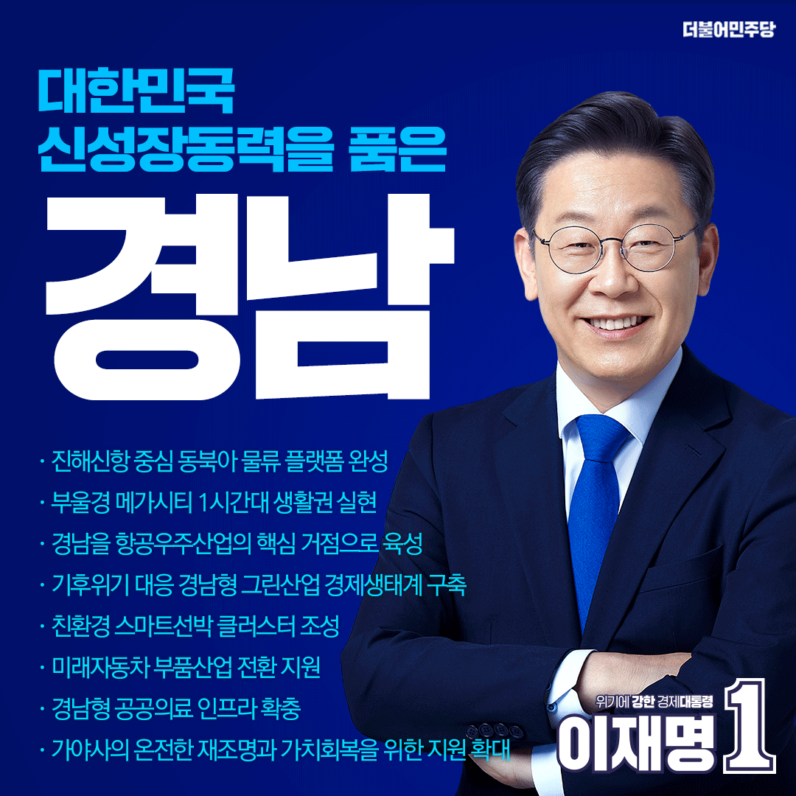

## 지역 공약

# 경상남도

- [거제](./005_016_001/005_016_001.md)
- [거창](./005_016_002/005_016_002.md)
- [고성](./005_016_003/005_016_003.md)
- [김해](./005_016_004/005_016_004.md)
- [남해](./005_016_005/005_016_005.md)
- [밀양](./005_016_006/005_016_006.md)
- [사천](./005_016_007/005_016_007.md)
- [산청](./005_016_008/005_016_008.md)
- [양산](./005_016_009/005_016_009.md)
- [의령](./005_016_010/005_016_010.md)
- [진주](./005_016_011/005_016_011.md)
- [창녕](./005_016_012/005_016_012.md)
- [창원](./005_016_013/005_016_013.md)
- [통영](./005_016_014/005_016_014.md)
- [하동](./005_016_015/005_016_015.md)
- [함안](./005_016_016/005_016_016.md)
- [함양](./005_016_017/005_016_017.md)
- [합천](./005_016_018/005_016_018.md)

### 우주 개척의 전진기지, 대한민국 신성장동력을 품은 “경남”! 이재명은 합니다! 

> 2022-02-15

❍ 이 후보는 2월 5일 “우주 개척의 전진기지, 신성장동력의 산실 경남”을 만들겠다는 비전을 제시하며 이를 실현하기 위한 8대 핵심공약을 이행할 것을 경남도민과 국민 앞에 약속헸다.

❍ 이날 이재명 후보가 “대전환의 시대, 대한민국 산업화의 상징이던 경남의 역할을 다시 세우겠다”는 굳은 각오를 다지며 발표한 경남 8대 핵심공약의 주요 내용은 다음과 같다.

 

❍ 첫째, 진해신항 중심의 동북아 물류 플랫폼을 완성하겠다는 공약이다.

이 후보는 진해신항이 해운물류를 육상과 항공으로 연계하는 동북아 물류플랫폼으로 새롭게 도약해야한다고 강조하며, 이 공약을 이행하기 위해, ▲ 진해신항이 초대형 선박과 초고속 하역능력을 갖춘 메가포트로 개발되도록 지원하고, ▲ 미래형 배후 물류도시 조성, 글로벌 기업 유치, 고부가가치 물류산업 육성을 위한 종합계획을 수립하겠다고 밝혔다.

 

❍ 둘째, 부울경 메가시티 1시간대 생활권을 실현하겠다는 공약이다.

이 후보는 이 공약의 이행을 위해 ▲ 진주에서 울산까지 1시간대 생활권 실현을 위한 준고속열차를 연장 운행과 광역 급행열차 신규 도입하고, ▲ 창원~김해~양산~울산을 연결하는 동남권 순환 광역철도 사업 신속 추진하며, ▲ 부산~양산~울산 광역철도의 재정사업 추진을 적극 지원하겠다고 약속했다.

또한, ▲ 경전선 수서행 고속열차 운행 신설, ▲ 부울경 주요 거점 간 통합환승체계 구축, ▲ 창원에 수소트램 건설 지원, ▲ 남해~여수 해저터널의 조기 완공 적극 지원, ▲ 남부내륙철도의 임기 내 완공을 목표로 차질 없이 진행하겠다는 점을 분명히 밝혔다.

 

❍ 셋째, 경남을 항공우주산업의 핵심 거점지역으로 육성하겠다는 공약이다.

이 후보는 경남이 국내 항공우주산업 생산액의 65% 이상을 차지하는 핵심 거점인 점을 강조하며, 이 공약을 이행하기 위해 경남을 ▲ 항공우주산업의 클러스터로 강력 추진하고, ▲ 항공기 종합정비(MRO)산업과 항공우주산업 경쟁력 강화와 ▲ 항공우주 제조혁신타운 조성으로 항공우주 신산업을 개척하고, 산업인력 일자리를 확대하겠다고 약속했다.

 

❍ 넷째, 기후위기에 대응하는 경남형 그린산업 경제생태계를 구축하겠다는 공약이다.

이 후보는 이 공약의 이행을 위해 ▲ 수소 저장 용기와 액화수소 국산화 기술개발을 위한 경남형 수소특화단지를 조성하고, ▲ 중소기업 주도의 해상풍력설비 특화단지를 구축해 경남을 아시아 해상풍력산업의 허브로 만들고, ▲ 소형모듈원자로 연구개발 및 원전 해체기술이 지역 원전산업에 기여할 수 있도록 적극 지원하겠다고 약속했다.

 

❍ 다섯째, 경남에 친환경 스마트 선박 클러스터를 조성해 조선산업 세계 1위를 지켜나가겠다는 공약이다.

국내 조선산업의 중심인 경남에서 이 후보는 이 공약을 이행하기 위해 ▲ 한국형 스마트야드 핵심기술 개발과 전문인력 양성으로 경쟁력을 강화하고, ▲ 조선산업 관련 기업의 폐업과 노동자 실업이 반복되지 않도록 경쟁력과 안전망을 강화하겠다고 밝혔다.

 

❍ 여섯째, 미래자동차 부품산업 전환 지원으로 새로운 성장 기회를 창출하겠다는 공약이다.

이 후보는 자동차 부품 관련 사업체 수가 전국 2위라는 경남의 특성을 살려 ▲ 미래차 산업으로 신속히 전환해 경남이 자동차 산업 대전환의 중심으로 자리 잡도록 하고, ▲ 배터리 재자원화, 미래 모빌리티 파워모듈 기술고도화로 새로운 성장 기회를 창출하겠다고 약속했다.

 

❍ 일곱째, 경남에 공공의료 인프라를 확충하겠다는 공약이다.

이 후보는 경남이 공공의료원 폐쇄의 아픔을 겪었던 과거를 회상하면서 ▲ 출산‧육아, 요양‧돌봄의 통합적 서비스를 포괄하는 서부경남 의료복지타운 조성을 지원하고, ▲ 진주권의 공공의료원 설립에 차질이 없도록 적극 지원하며, ▲ 부울경 소아전문응급의료센터 지원을 확대해 소아 환자가 안심하고 진료를 받을 수 있도록 하겠다고 천명했다.

 

❍ 여덟째, 가야사가 온전히 재조명받고 가치를 회복하도록 지원하겠다는 약속이다.

이 후보는 이 공약을 이행하기 위해 ▲ 가야사의 국가문화재 지정과 승격을 추진하고, ▲ 박물관 고도화, 문화예술 이음터, 가야 스마트 문화관광권 조성으로 가야 왕성지를 보존관리하는 정비 사업을 차질없이 진행하며, ▲ 가야 고분군이 세계문화유산에 등재될 수 있도록 적극 지원하겠다고 약속했다. 이를 통해 ▲ 정부 차원의 남부권 광역관광개발 사업과 가야사 정비사업으로 가야 문화권을 관광자원화 하겠다는 점도 밝혔다.

 

이재명 후보는 경남 8대 핵심공약 발표를 마무리하면서, “불황의 사슬을 끊고 경남의 전환을 준비해온 문재인 정부의 노력을 단단히 이어받겠다”며, “위기일 때 더욱 큰 능력을 발휘하며 갖은 난관을 돌파해온 이재명이 경남의 위기를 기회로 바꾸어 내겠다”는 각오를 밝히면서 “말이 아닌 실천으로 유능함을 증명해온 이재명에게 맡기면 정말로 국민의 삶이 달라진다는 것을 경남도민 여러분께 보여드리겠다”고 약속했다.  

						