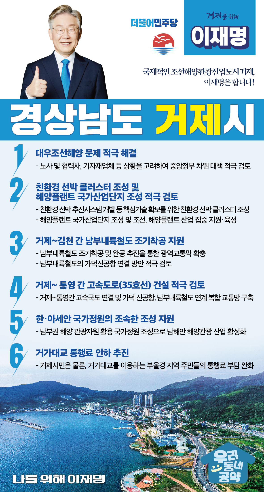

## 경남 지역 공약

# 거제시

### 국제적인 조선해양관광산업도시 거제, 이재명은 합니다!!
> 2022-02-10

존경하는 거제시민 여러분,

 

거제시는 천혜의 자연경관을 가진 한려해상국립공원과 대우조선해양과 삼성중공업 등 세계 제일의 조선산업을 배후로 한 조선해양관광산업도시입니다.

 

조선해양관광산업도시 거제 발전을 위한 이재명의 6대 약속을 말씀드리겠습니다.

 

첫째, 대우조선해양 문제를 적극 해결하겠습니다.

지난 11월 저는 매타버스 첫 일정으로 이 곳 거제를 찾아 대우조선해양 노사와 간담회를 가진 바 있습니다. 현재 현대중공업과 대우조선해양의 합병이 불가능해져서 새로운 해결방안을 찾아야 하는 상황입니다. 대우조선해양 노사는 물론이고 협력사, 기자재업체 상황을 고려하여 대우조선해양 문제를 중앙정부 차원에서 대책을 적극 검토하겠습니다.

 

둘째, 친환경 선박 클러스터를 조성하여 미래 조선해양 선도 도시로 육성하겠습니다.

조선 해양산업의 탄소중립 전환은 피할 수 없는 의무이며 새로운 도전 과제입니다. 친환경 선박의 추진시스템 개발 등 핵심기술 확보를 위해 친환경 선박 클러스터를 조성하겠습니다. 해양플랜트 국가산업단지 조성도 적극 검토하겠습니다. 거제의 조선, 해양플랜트 산업을 집중 지원․육성하겠습니다.

 

셋째, 거제~김천 간 남부내륙철도를 조기착공하고 공역교통망 확충을 지원하겠습니다. 

거제 지역경제 활성화를 위해 남부내륙철도 조기착공과 완공을 추진하겠습니다. 경남 남해안의 동서남북축 연결과 부울경 메가시티 광역교통망 구축을 지원하겠습니다. 남부내륙철도의 가덕신공항 연결 방안도 적극 검토하겠습니다. 거제지역산업과 물류 경쟁력이 강화시킬 뿐만 아니라 거제시를 찾는 관광객 1천만 시대를 앞당기게 될 것입니다. 

 

넷째, 물류비용 절감과 산업경쟁력 제고를 위해 거제~통영간 고속도로 건설을 적극 검토하겠습니다. 

거제~통영간 고속도로 연결은 부울경 메가시티 구축의 주요과제입니다. 거제 통영간 고속도로가 건설된다면 가덕 신공항과 남부내륙철도와 연계되어 물류비용을 절감하고 지역산업 경쟁력을 높일 수 있습니다. 

 

다섯째, 거제에 한‧아세안 국가정원이 조속히 조성되도록 지원하겠습니다. 

2019년 한-아세안 특별정상회에서 한‧아세안 국가정원 조성이 제안되었습니다. 거제는 풍부한 남부권 해양 관광자원을 가지고 있는 만큼, 특색있는 국가정원을 조성할 수 있습니다. 거제를 중심으로 남해안 해양관광 산업이 활성화 될 수 있도록 지원하겠습니다.

 

여섯째, 거가대교 통행료 인하 추진

거제시민뿐만 아니라, 거가대교를 이용하는 부울경 지역 주민들의 통행료 부담을 덜어드리기 위해 거가대교 통행료 인하를 추진하겠습니다. 

 

존경하는 거제시민 여러분! 

 

이재명은 지킬 수 있는 것만 약속했고 약속했던 것은 지켜왔습니다.

살기 좋은 거제시 미래를 위한 약속, 실력과 성과로 입증된 이재명이 반드시 실천하겠습니다.

 

거제 앞으로, 발전 제대로!

거제시민을 위해, 이재명은 합니다! 

						