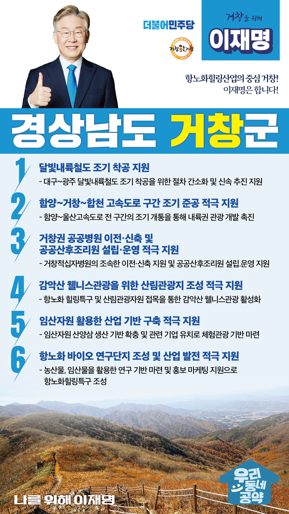

## 경남 지역 공약

# 거창군

### 항노화힐링산업의 중심 거창! 이재명은 합니다!
> 2022-02-10

존경하는 경남 거창군민 여러분,

 

거창은 우리나라 3대 국립공원이 인접한 지역으로 전국 최초로 항노화힐링특구로 지정되었습니다. 2016년도 특구 지정 이후 규제 특례의 활용과 함께 항노화힐링사업, 웰빙산업 등을 중점 추진하고 있습니다. 

 

거창의 미래산업과 교통, 산업, 관광 인프라 확충을 위해 이재명의 ‘거창 도약 6대 공약’을 말씀드리겠습니다.

 

첫째, 대구~광주 간 달빛내륙철도를 조기에 착공하겠습니다. 

대구에서 광주를 연결하는 달빛내륙철도는 영‧호남 상생과 화합의 상징입니다. 달빛내륙철도가 완성되면 영호남 지역간 인적, 물적 교류가 촉진되고 남부내륙지역 광역경제권 구축이 가능해질 것입니다. 

철도소외지 거창에 철길을 놓아 거창의 관광과 산업에 큰 발전을 가져오겠습니다.

 

둘째, 함양~거창~합천 고속도로 구간을 조기 준공하겠습니다. 

함양∼울산간 고속도로 전 구간이 개통되면 함양~거창~합천~의령~창녕~밀양~울산의 관광자원이 연결됩니다. 

함양~울산고속도로 전 구간의 조기 개통을 적극 지원해 내륙권 관광 개발을 촉진하겠습니다.  

셋째, 거창권 공공병원의 이전·신축과 공공산후조리원 설립·운영을 적극 지원하겠습니다.

코로나19 감염병 대응과 거창군민의 건강을 위해 거창적십자병원이 조속히 이전·신축할 수 있도록 지원하겠습니다. 

또한 공공산후조리원 설립과 운영을 지원하여 아이 낳기 좋은 거창을 만들겠습니다.

 

넷째, 감악산 웰니스관광을 위한 산림관광지 조성을 적극 지원하겠습니다.

거창 감악산의 산림 경관을 활용하여 관광자원화 한다면 지역의 새로운 성장동력이 될 것입니다. 

거창의 항노화 힐링특구와 산림관광자원을 접목해 감악산 웰니스관광이 활성화되도록 돕겠습니다. 

다섯째, 거창군의 임산자원 활용한 산업 기반 구축을 적극 지원하겠습니다. 

항노화에 대한 관심이 증가하고 있습니다. 거창의 대표적인 임산자원인 산양삼 생산 기반을 확충하고 종자관리의 효율성을 높이기 위해 관련 산업의 집적이 필요합니다. 관련 기업을 유치하고 체험관광 기반이 마련되도록 적극 지원하겠습니다.

 

여섯째, 거창군의 항노화 바이오 산업이 발전하도록 적극 지원하겠습니다.

지역 농업 경쟁력 강화와 고부가가치화를 위해 항노화 바이오산업 육성이 필요합니다.

거창군의 농산물, 임산물을 활용한 연구 기반 마련과 홍보 마케팅 지원으로 거창이 항노화힐링특구로서 자리매김할 수 있도록 적극 뒷받침하겠습니다.

 

이재명은 지킬 수 있는 것만 약속했고 약속했던 것은 지켜왔습니다.

살기 좋은 거창군 미래를 위한 약속, 실력과 성과로 입증된 이재명이 반드시 실천하겠습니다.

 

거창 앞으로, 발전 제대로!

거창군민을 위해, 이재명은 합니다! 

						