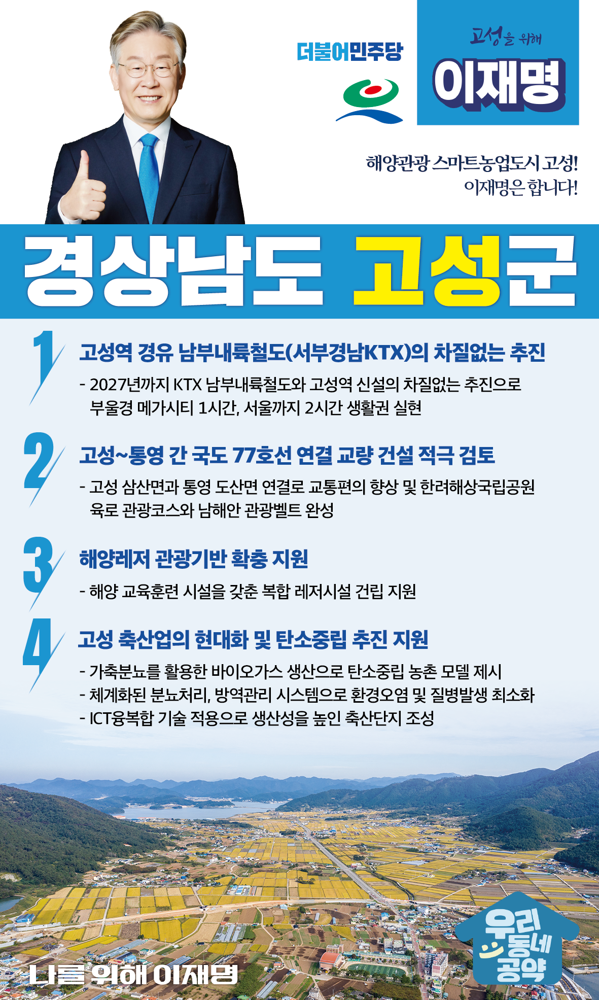

## 경남 지역 공약

# 고성군

### 해양관광 스마트농업도시 고성! 이재명은 합니다!
> 2022-02-10

존경하는 경남 고성군민 여러분,

 

고성군은 해안과 들판이 모두 조성된 친환경 농‧어업의 적지이자 세계 3대 공룡 발자국 화석지로 손꼽히는 한편 송학동 고분군 등 소가야 유적이 살아 숨쉬는 문화관광의 고장이기도 합니다.

 

안정적인 소득 보전으로 농민이 행복한 고성, 남해안 관광산업 발전으로 미래 먹거리를 창출하는 고성을 만들기 위해 이재명의 고성 발전 4대 공약을 말씀드리겠습니다.

 

 

첫째, 고성역을 경유하는 KTX 남부내륙철도를 차질없이 추진하겠습니다. 

경남도민과 고성군민의 숙원사업이던 KTX 남부내륙철도와 고성역 신설이 본격 추진됩니다. 2027년 개통을 목표로 사업을 차질 없이 추진하고 부울경 메가시티 1시간과 서울까지 2시간 생활권을 만들겠습니다.

 

둘째, 고성~통영 간 국도 77호선 연결하는 교량 건설을 적극 검토하겠습니다. 

고성 삼산면과 통영 도산면을 연결하면 부산~거제~통영~여수~목포까지 이어지는 한려해상국립공원 도로가 완성됩니다. 한려해상국립공원 육로 관광코스와 남해안 관광벨트가 완성되어 국가균형발전에 크게 기여하게 될 것입니다.

 

셋째, 고성군의 해양레저 관광기반 확충을 지원하겠습니다.  

고성군의 해양관광 활성화가 필요합니다. 해양 교육훈련 시설을 갖춘 복합 레저시설 건립을 지원하겠습니다. 지역 관광산업에 활력을 불어넣고 고성의 일자리 창출과 지역경제 활성화를 이룰 수 있도록 추진하겠습니다. 

 

넷째, 고성 축산업의 현대화와 탄소중립 추진을 지원하겠습니다. 

고성군의 축사에서 발생하는 악취와 분뇨 문제 해결이 필요합니다. 가축분뇨를 활용한 바이오가스 생산으로 탄소중립 농촌 모델이 되도록 돕겠습니다. 체계화된 분뇨처리와 방역관리 시스템을 구축하여 환경오염과 질병발생을 최소화하고, ICT융복합 기술을 적용해 생산성 높은 축산단지 조성을 확대 추진하겠습니다.

 

 

존경하는 고성군민 여러분!

 

이재명은 지킬 수 있는 것만 약속했고, 약속했던 것은 지켜왔습니다.

살기좋은 고성군의 미래를 위한 약속, 실력과 성과로 입증된 이재명이 반드시 실천하겠습니다.

 

 

고성 앞으로! 발전 제대로!

고성군민을 위해, 이재명! 

						