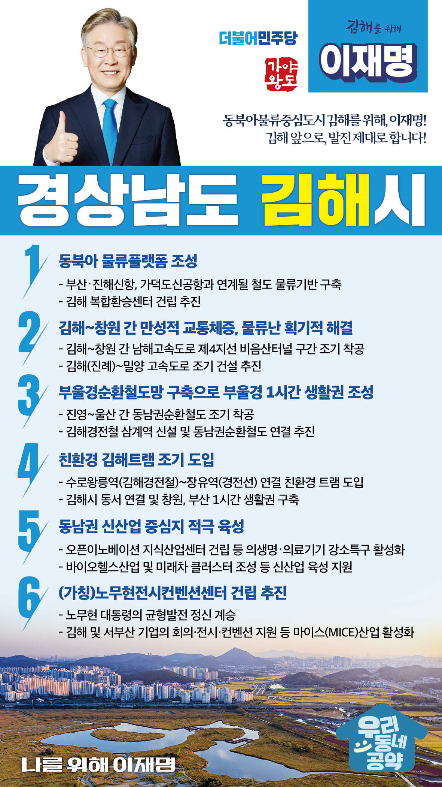

## 경남 지역 공약

# 김해시

### 동북아물류중심도시 김해를 위해, 이재명!
> 2022-02-10

김해시는 2천 년의 가야역사를 품은 가야의 왕도이자, 노무현 대통령의 고향인 봉하마을이 있는 역사문화 관광도시입니다.

 

김해는 34개 산업단지에 자동차, 조선, 기계 금속 등 7,600여개 중소기업이 밀집된 평균연령 39.5세의 젊은 도시입니다. 전국에서 유일하게 의생명·의료기기 분야 강소연구개발특구로 지정된 미래첨단산업이 함께 약동하는 산업도시이며, 지리적으로 부산과 경남을 연결하는 교통중심지입니다.

 

이러한 김해를 자동차, 조선, 기계금속 등 전통 제조산업을 기반으로 바이오헬스케어 신산업의 거점도시로 육성하면서, 부산‧진해신항, 가덕도신공항, 대륙철도 터미널 등 항공, 해운, 철도 물류기반을 구축하여 동북아 국제물류 중심도시로 육성하겠습니다. 

 

또한 부울경 지역주민들이 1시간 내에 왕래할 수 있는 생활공동체 기반 마련을 위해, 친환경 스마트 대중교통 도시로 만들겠습니다.

 

이를 실행하기 위한 구체적인 김해발전 6개 공약은

 

첫째, 부산‧진해신항, 가덕도신공항과 연계될 철도 물류기반을 구축하여 동북아 물류플랫폼 조성하겠습니다. 

2022년 동북아 물류 플랫폼 조성 연구 용역을 시작으로 대륙철도 터미널이 될 김해 복합환승센터 건립을 추진하여 동북아 물류플랫폼 조성을 속도감있게 추진하겠습니다. 

    

둘째, 김해-창원간 남해고속도로 제4지선 비음산터널 구간을 조기 착공하고, 진례에서 밀양 간 고속도로를 조기 건설하여

김해-창원 간 만성적 교통체증과 물류난을 획기적으로 해결하겠습니다.

 

셋째, 진영~울산 간 동남권순환철도 조기 착공과 김해경전철 연결을 추진하겠습니다. 

김해 진영, 한림, 상동과 양산, 울산으로 연결하는 동남권순환철도가 건설되면 부울경 지역을 1시간 내에 이동할 수 있는 부울경순환철도망을 구축하게 됩니다. 여기에 김해경전철에 삼계역을 신설 연결하면 한림, 상동, 삼계 주민들께서 편리하게 철도를 이용하실 수 있게 됩니다.

 

넷째, 친환경 김해트램을 조기 도입하겠습니다. 

김해경전철의 김수로왕릉역과 부전-마산간 경전선의 장유역을 연결하는 친환경 김해트램을 도입하게 되면, 김해 동부지역과 서부지역 간 소통이 원활해질 뿐만 아니라 김해에서 창원, 부산까지 1시간대 대중교통망을 구축하게 됩니다. 대중교통이 부족해서 불편하셨던 김해시민의 이동이 보다 편리하게 됩니다.

 

다섯째, 김해를 동남권 신산업 중심지로 적극 육성하겠습니다.

의료기기 및 자동차부품 등 중소제조업체가 밀집된 김해는 지난 2019년 의생명 의료기기 강소특구로 지정되었습니다. 이를 토대로 바이오헬스산업과 미래차 클러스트를 육성하여 김해의 신성장동력을 마련해야 합니다. 오픈이노베이션 지식산업센터 건립과 생명공학연구원 분원, 바이오헬스 연구소 및 기업 유치 등을 지원하겠습니다.

 

여섯째, 김해 (가칭)노무현전시컨벤션센터 건립을 추진하겠습니다.

지방소멸을 막고 국가균형발전을 몸소 실천하시고자 김해 봉하로 오신 노무현대통령의 뜻을 담아, 7,600여개 김해 중소기업과 서부산지역 기업들의 각종 비즈니스회의와 전시엑스포 등 개최할 수 있도록 마이스산업 활성화를 위해 김해 (가칭)노무현전시컨벤션센터 건립을 조기에 추진하겠습니다.

 

한번 약속하면 반드시 실천하는 이재명.

김해시민 여러분과 함께 하나하나 직접 챙기겠습니다. 