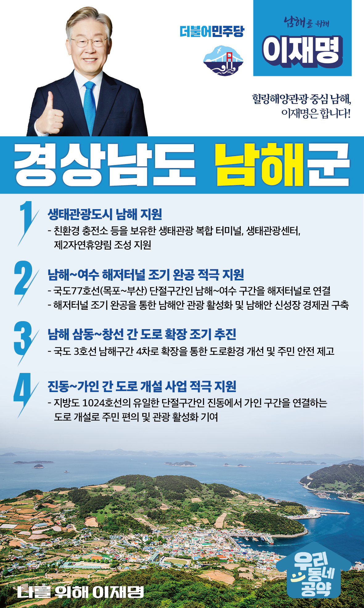

## 경남 지역 공약

# 남해군

### 힐링해양관광 중심 남해, 이재명은 합니다! 
> 2022-02-10

존경하는 남해군민 여러분,

 

남해는 풍부한 어족자원으로 이름난 어업의 고장이자 금산과 보리암을 비롯해 남해대교와 은모래비치가 있는 관광도시입니다. 남해 주민을 비롯해 지역을 찾는 관광객들의 접근성을 높이기 위해 교통 인프라를 개선하고, 생태환경을 개선‧보존해 살기 좋은 남해가 될 수 있도록 다음과 같이 약속드립니다.

 

남해 발전을 위한 4대 공약을 말씀드리겠습니다.

 

첫째, 남해를 ‘생태관광도시’로 재탄생시키겠습니다. 

남해안 광양만권은 제철소와 산단, 화력발전소 등에서 배출하는 대기오염물질로 환경 오염이 심각합니다. 친환경 차량 충전소 등을 보유한 생태관광 복합 터미널, 생태관광센터, 제2자연휴양림을 조성해 남해가 청정 힐링섬, 지속 가능한 생태관광산업의 중심이 될 수 있도록 적극 돕겠습니다. 

 

둘째, 남해~여수 해저터널이 조기완공되도록 적극 지원하겠습니다.

목포와 부산을 잇는 국도77호선의 단절구간인 남해~여수 구간을 해저터널로 연결해 동‧서통합을 완성하겠습니다. 해저터널 개통으로 광역교통축이 형성되면 경남에서 전남까지 남해안 관광을 활성화할 수 있습니다. 해저터널을 조기에 완공하여 상생과 번영의 영호남 통합을 실현하고 남해안 신성장 경제권을 구축하겠습니다.

 

셋째, 남해 삼동~창선 간 도로 확장을 조기에 추진하겠습니다.

국도 3호선 남해구간은 도로가 좁고 굴곡이 많아 교통사고가 자주 발생합니다. 관광객이 늘고 교통량이 증가하면서 주민과 방문객의 불편도 커지고 있습니다. 삼동~창선 간 도로를 4차선으로 조기에 확장해 도로교통 환경을 개선하고 주민의 안전을 지키겠습니다.

 

넷째, 진동~가인 간 도로 개설 사업을 적극 지원하겠습니다.

진동에서 가인 구간은 지방도 1024호선의 유일한 단절구간입니다. 원활한 통행과 지역의 균형발전을 위해 도로 연결이 필요합니다. 두 지역을 연결하는 도로 개설을 적극 지원하여 주민 삶의 질을 높이고 관광객의 이동 편의를 증진시키겠습니다.

 

 

남해군이 남해안 힐링해양관광의 중심지로 자리매김할 수 있도록, 이재명이 남해의 미래를 새롭게 열어가겠습니다.

 

이재명은 지킬 수 있는 것만 약속했고, 약속했던 것은 지켜왔습니다.

살기좋은 남해군 미래를 위한 약속, 실력과 성과로 입증된 이재명이 반드시 실천하겠습니다.

 

남해 앞으로, 발전 제대로!

남해군민을 위해, 이재명은 합니다! 

						