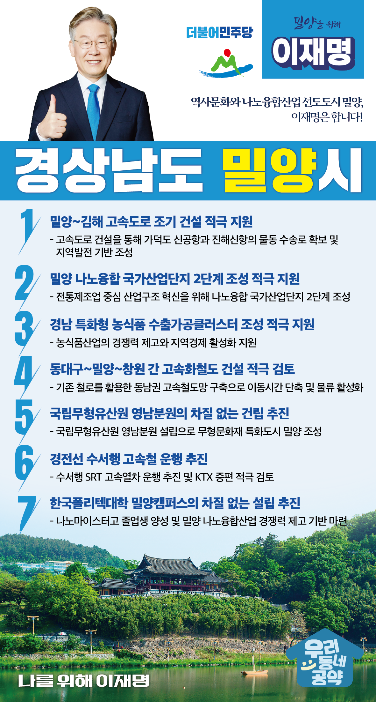

## 경남 지역 공약

# 밀양시

### 역사문화와 나노융합산업 선도도시 밀양 이재명은 합니다!
> 2022-02-10

존경하는 밀양시민 여러분,

 

밀양은 영남루, 표충사 등 우수한 관광자원을 가지고 있으며 경부선‧경전선 철도의 주요 연결 지역 중 하나로 교통 요충지이기도 합니다. 밀양이 경남 동부권 신산업의 중심으로 성장할 수 있도록 만들겠습니다.

 

더불어민주당 대통령선거 후보 이재명의 ‘밀양 발전 7대 공약’을 말씀드리겠습니다.

 

첫째, 밀양~김해 고속도로의 조기 건설을 적극 지원하겠습니다.

가덕도 신공항과 진해신항의 물동 수송로를 확보해 밀양~진례(김해) 간 고속도로 건설사업을 필요합니다. 부산 ‧ 경남의 물류거점과 밀양을 연결하는 도로망 확충으로 지역발전의 기반을 만들겠습니다. 

 

둘째, 밀양 나노융합 국가산업단지 2단계 조성을 적극 지원하겠습니다.

전통제조업 중심인 밀양의 성장 한계를 극복하기 위해 나노융합산업을 육성하여 지역발전의 기반을 마련해야 합니다. 밀양 나노융합 국가산업단지 2단계 조성으로  일자리를 창출하고 지역경제가 발전하도록 적극 돕겠습니다.  

 

셋째, 밀양시가 추진하는 ‘경남 특화형 농식품 수출가공클러스터’ 조성을 적극 지원하겠습니다.

농업인구 감소와 고령화로 인해 농업 경쟁력이 약화되고 있습니다. 밀양시가 추진하는 식품기업과 유관업체, 연구기관이 집적된 농식품 수출가공클러스터 조성을 적극 지원하겠습니다. 밀양의 농식품산업의 경쟁력을 높이고 지역경제도 활성화시키겠습니다.  

 

넷째, 동대구~밀양~창원간 고속화철도 건설을 적극 검토하겠습니다. 

기존 철로를 이용하는 동대구~밀양~창원 철도를 고속화한다면, 여객 이동시간은 단축되고 산업과 경제를 연결하는 물류망은 원활해 질 것입니다. 동남권 고속철도망 구축을 적극 검토하겠습니다.

 

 

다섯째, 국립무형유산원 영남분원 건립을 차질 없이 추진하겠습니다.

밀양은 밀양아리랑, 밀양감내게 줄당기기 등 유네스코 인류무형문화유산과 국가무형문화재인 밀양백중놀이 등을 보유하고 있습니다. 국립무형유산원 영남분원이 성공적으로 건립되어 밀양이 무형문화재 특화도시로 성장하도록 돕겠습니다.  

 

여섯째, 경전선 수서행 고속철 운행을 추진하겠습니다.

밀양을 비롯한 경남에서 서울‧경기행 경전선 이용객이 1,300만 명에 달합니다. 수서행 SRT 고속열차 운행을 추진하고, KTX 증편도 적극 검토하겠습니다.

 

일곱째, 한국폴리텍대학 밀양캠퍼스 설립을 차질 없이 추진하겠습니다. 

밀양 나노융합산업의 경쟁력을 높이려면 인재가 필요합니다. 한국폴리텍대학 밀양캠퍼스 설립을 차질 없이 추진해 필요한 인재를 확보하겠습니다. 나노마이스터고 졸업생을 전문 기술인력으로 양성해 지역인재가 지역경제를 일으키는 선순환구조를 만들겠습니다.

 

 

이재명은 지킬 수 있는 것만 약속했고 약속했던 것은 지켜왔습니다.

살기좋은 밀양시 미래를 위한 약속! 실력과 성과로 입증된 이재명이 반드시 실천하겠습니다.

 

밀양 앞으로, 발전 제대로!

밀양시민을 위해, 이재명은 합니다! 

						