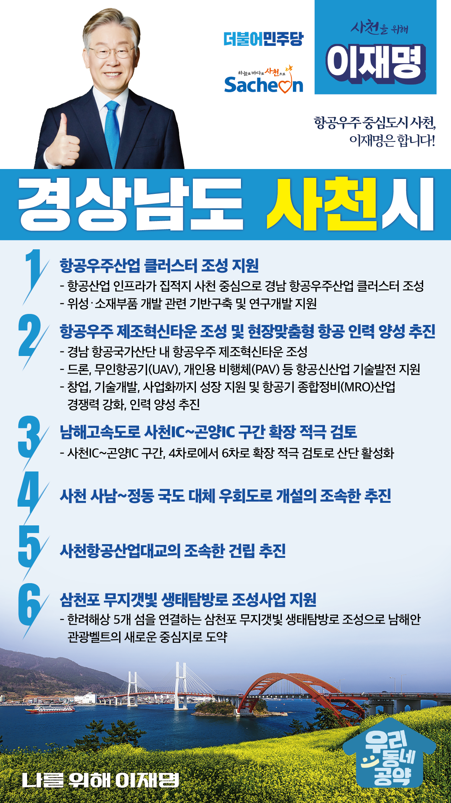

## 경남 지역 공약

# 사천시

### 항공우주 중심도시 사천, 이재명은 합니다!
> 2022-02-10

존경하는 사천시민 여러분,

 

사천은 미래 신성장동력의 핵심인 항공우주산업의 집적지이자, 한려수도의 절경과 백천사, 다솔사 등의 역사유적이 풍부한 관광도시이기도 합니다. 사천의 관광산업이 더욱 활성화될 수 있도록 교통 인프라를 확충하고, 지역 항공산업의 경쟁력 강화를 위해 ‘사천 발전 6대 공약’을 말씀드리겠습니다.

 

첫째, 항공우주산업 클러스터를 조성하겠습니다.

세계7대 항공우주강국 대한민국을 위해서는 집중 투자가 필요합니다. 항공산업 인프라가 집적된 사천을 중심으로 ‘경남 항공우주산업 클러스터’ 조성을 지원하겠습니다. 사천 등 서부경남은 위성‧소재부품 산업의 기반과 연구개발을 지원하겠습니다.

 

둘째, 항공우주 제조혁신타운을 조성하고 현장맞춤형 항공MRO 인력을 양성하겠습니다.

경남 항공국가산단 내에 항공우주 제조혁신타운을 조성하겠습니다. 드론, 무인항공기(UAV), 개인용 비행체(PAV) 등 항공신산업의 기술발전을 지원하겠습니다. 창업에서 기술개발, 사업화까지 성장할 수 있도록 돕겠습니다. 항공기 종합정비(MRO)산업의 경쟁력을 강화하고 인력 양성도 함께 추진하겠습니다.

 

셋째, 남해고속도로 사천IC~곤양IC 구간 확장을 적극 검토하겠습니다.

국가항공산단, 여수국가산단 등 동남권 물동량의 급격히 증가하고 있습니다. 사천IC와 곤양IC 간 구간을 4차로에서 6차로 확장을 적극 검토하여 교통과 물류 수요를 충족하고 산단이 활성화될 수 있도록 하겠습니다.

 

넷째, 사천 사남~정동 국도 대체 우회도로 개설이 조속히 추진하겠습니다.

사천의 도심을 관통하는 국도 3호선은 교통량이 많아 상습정체가 심합니다. 경남항공국가산단이 들어서면 더욱 혼잡해질 것으로 예상됩니다. 사천 사남에서 정동 국도 구간의 대체 우회도로 건설을 적극 지원해 교통 환경을 개선하겠습니다.

 

다섯째, 사천항공산업대교의 조속한 건립을 추진하겠습니다.

장차 들어설 사천 항공산단과 사천 일반산단의 물류개선을 위해 교통망 확충이 필요합니다. 사천항공산업대교를 조속히 건립해 사통팔달 교통망을 구축하겠습니다. 

 

여섯째, 삼천포 무지갯빛 생태탐방로 조성사업을 지원하겠습니다.

사천은 바다케이블카와 아라마루 아쿠아리움 등 해양관광자원이 풍부합니다. 한려해상 5개 섬을 연결하는 ‘삼천포 무지갯빛 생태탐방로’ 조성을 지원해 사천을 남해안 관광벨트의 새로운 중심이 되도록 하겠습니다.

 

 

존경하는 사천시민 여러분!

이재명은 지킬 수 있는 것만 약속했고 약속했던 것은 지켜왔습니다.

살기 좋은 사천시 미래를 위한 약속, 실력과 성과로 입증된 이재명이 반드시 실천하겠습니다. 

 

사천 앞으로! 발전 제대로!

사천시민을 위해, 이재명! 

						