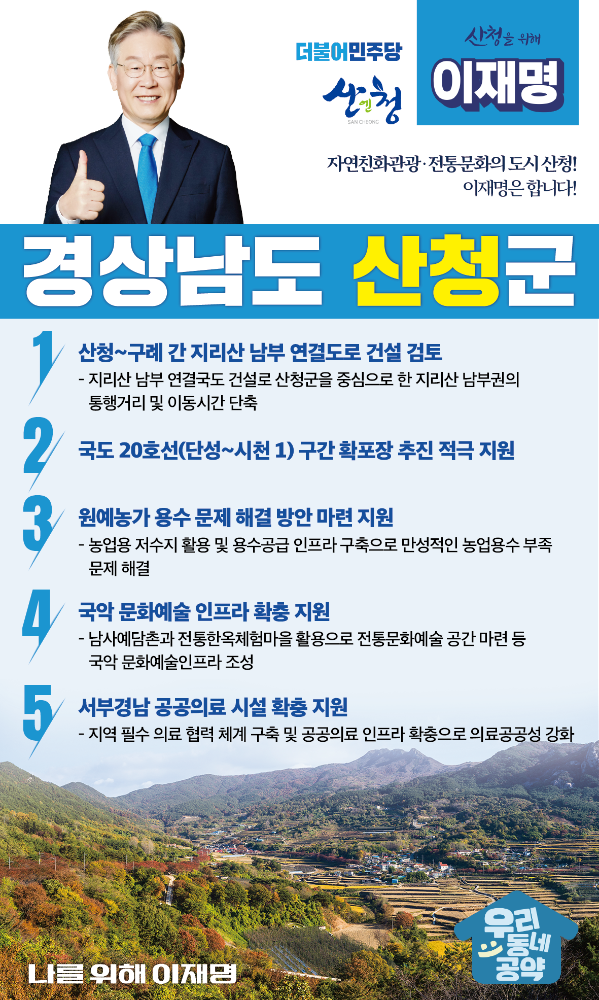

## 경남 지역 공약

# 산청군

### 자연친화관광‧전통문화의 도시 산청! 이재명은 합니다! 
> 2022-02-10

존경하는 경남 산청군민 여러분,

 

산청은 지리산 자락에서 시작된 불교문화와 가야문화가 꽃핀 역사 도시이자 각​종 고품질 농산물의 생산지이기도 합니다. 

산청의 역사적 자원을 활용한 관광산업 활성화에 도움이 될 수 있도록 교통 여건을 개선하고, 안정적인 영농기반을 조성하기 위해 저 이재명의 산청 발전 5대 공약을 말씀드리겠습니다.

 

첫째, 산청~구례 간 지리산 남부를 연결하는 도로 건설을 검토하겠습니다.

지리산을 사이에 둔 경남 산청군과 전남 구례군은 동-서 간 연결도로가 없어 교통에 어려움을 겪고 있습니다. 

산청군을 중심으로 한 지리산 남부권의 통행거리와 이동시간을 단축하는 방안을 모색하겠습니다. 산청군과 구례군을 비롯한 7곳의 영·호남 시‧군의 상생을 돕겠습니다. 

 

둘째, 국도 20호선 단성~시천 1구간 확포장이 원만히 추진되도록 지원하겠습니다. 

국도20호선은 지리산국립공원의 주 진입로지만 도로 폭이 좁고 교통량 증가로 정체와 사고의 위험 높은 상황입니다. 

진척이 없는 국도20호선 단성~시천 1구간 건설이 원만히 착수될 수 있도록 적극 지원하겠습니다. 

 

셋째, 산청의 원예농가 용수 문제 해결 방안 마련을 지원하겠습니다. 

산청군은 딸기를 비롯한 원예작물 생산이 지역경제 큰 비중을 차지하고 있습니다. 그러나 만성적인 농업용수 부족으로 농가가 어려움을 겪고 있습니다. 

농업용 저수지 활용, 용수공급 인프라가 구축되도록 지원하겠습니다.

 

넷째, 산청에 국악 문화예술 인프라가 확충되도록 지원하겠습니다.

산청은 국악계의 큰 스승인 기산 박헌봉 선생의 탄생지입니다. ‘한국에서 가장 아름다운 마을’ 1호로 뽑힌 남사예담촌과 기산국악당이 자리 잡고 있습니다.

국악을 포함한 전통문화 예술의 보존‧육성과 지역의 문화예술 발전을 위한 국악 문화예술인프라 조성을 적극 지원하겠습니다.

 

다섯째, 서부경남 공공의료 시설을 확충을 지원하겠습니다. 

산청군은 공공병원이 없는 의료취약지역입니다. 서부경남 공공의료 인프라 확충으로 의료 서비스의 공백이 없도록 하겠습니다. 

지역 필수 의료 협력 체계를 구축하고 의료공공성을 강화하겠습니다. 

 

존경하는 산청군민 여러분!

이재명은 지킬 수 있는 것만 약속했고 약속했던 것은 지켜왔습니다.

살기좋은 산청군 미래를 위한 약속! 실력과 성과로 입증된 이재명이 반드시 실천하겠습니다.

 

산청 앞으로! 발전 제대로!

산청군민을 위해, 이재명! 

						