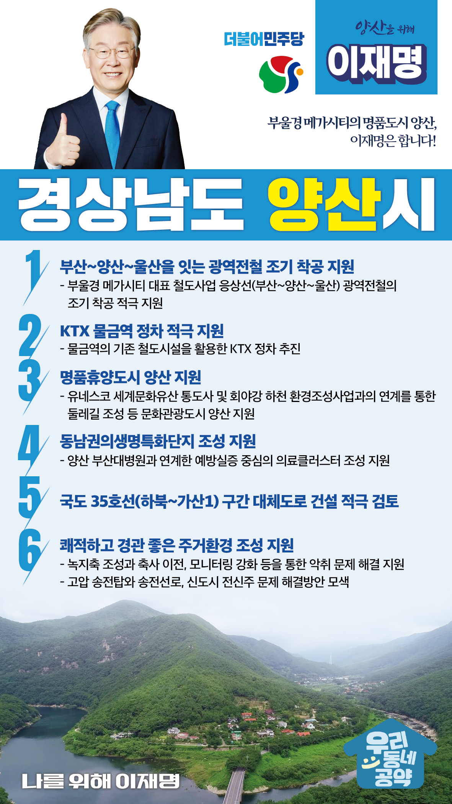

## 경남 지역 공약

# 양산시

### 부울경 메가시티의 명품도시 양산, 이재명은 합니다!  
> 2022-02-10

존경하는 양산시민 여러분,

 

유네스코 세계문화유산에 등재된 통도사가 자리한 양산은 황산공원을 따라 낙동강이 흐르고, 천성산과 대운산 사이로 회야강이 흐르는 천혜의 자연환경을 지키고 있으면서도 대도시와의 접근성이 좋아 경남에서 인구가 유입되고 있는 대표적 도시입니다. 가능성 많은 양산을 문화관광산업 인프라와 교통 인프라를 확충하여 명품도시 양산으로 만들겠습니다.

 

이를 실천하기 위한 6대 지역공약을 말씀드리겠습니다. 

 

첫째, 부산~양산~울산을 잇는 광역전철 조기 착공을 지원하겠습니다.

웅상선 광역전철은 부울경 메가시티를 대표하는 철도사업입니다. 동부양산과 웅상에 엄청난 기회가 될 것입니다. 부산~양산~울산 광역전철이 조기에 착공될 수 있도록 적극 지원하겠습니다. 

 

둘째, KTX를 물금역 정차를 적극 지원하겠습니다.  

물금신도시 조성으로 인구가 증가해 교통 여건 개선이 필요합니다. 물금역의 기존 철도시설을 활용하여 KTX 정차가 가능합니다. 시민들의 교통 편의를 위해 물금역 KTX 정차를 적극 지원하겠습니다. 

 

셋째, 양산이 통도사를 품은 명품휴양도시가 되도록 적극 지원하겠습니다.
양산에는 유네스코 세계문화유산인 통도사와 천성산, 영축산, 대운산 등 역사, 문화 관광자원이 풍부합니다. 회야강 하천 환경조성사업과 연계한 둘레길 조성을 지원해 걷기 좋은 양산, 문화관광도시 양산을 만들겠습니다.

 

넷째, 동남권 의생명특화단지 조성을 지원하겠습니다. 

천연물안전관리원 건립 예산 반영으로 동남권의생명특화단지 조성사업이 가시화되고 있습니다. 부산대 양산병원과 연계해 예방실증 중심의 의료클러스터가 원만히 조성되도록 적극 지원하겠습니다. 양산시가 동남권 의료허브 도시로 발돋움할 수 있도록 돕겠습니다.  

 

다섯째, 국도 35호선 대체도로 건설을 적극 검토하겠습니다.

양산시내를 관통하는 국도 35호선은 만성적인 교통체증을 유발하고 있습니다. 대체도로 건설은 양산 주민의 숙원사업입니다. 국도 35호선 하북~가산1 구간의 대체도로 건설을 적극 검토하여 교통체증 해소와 지역경제의 활성화를 지원하겠습니다. 

 

여섯째, 쾌적하고 경관 좋은 주거환경 조성을 지원하겠습니다. 

축사와 공장에서 나는 악취로 민원이 증가하고 있습니다. 녹지축 조성과 축사 이전, 모니터링 강화로 악취 문제를 해결하도록 돕겠습니다. 시가지를 통과하는 고압 송전탑와 송전선로, 신도시 전신주 문제가 해결될 수 있도록 돕겠습니다.  

 

존경하는 양산시민 여러분!

이재명은 지킬 수 있는 것만 약속했고 약속했던 것은 지켜왔습니다.

살기 좋은 양산시 미래를 위한 약속 실력과 성과로 입증된 이재명이 반드시 실천하겠습니다.

 

양산 앞으로, 발전 제대로!

양산시민을 위해, 이재명은 합니다! 

						