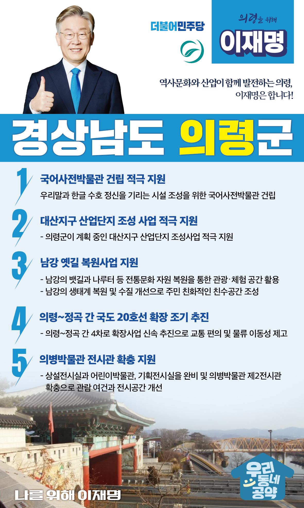

## 경남 지역 공약

# 의령군

### 역사문화와 산업이 함께 발전하는 의령, 이재명은 합니다!   
> 2022-02-10

존경하는 경남 의령군민 여러분,

 

의령군은 낙동강과 남강이 합류하는 지점으로 토지가 비옥해 농업이 발달한 고장입니다. 교통망 개선, 신산업 육성 등을 통해 일자리를 확충하고 각종 인프라 시설을 유치하는 한편 관광산업으로 지역경제가 활성화된 의령군을 만들겠습니다. 이를 위한 이재명의 ‘의령 발전 5대 공약’을 말씀드리겠습니다.

 

첫째, 의령군의 국어사전박물관 건립을 적극 지원하겠습니다.

의령은 일제의 탄압에 맞서 우리 고유의 말과 글을 지켜낸 고장입니다. 조선어학회의 핵심인물들이 나고 자란 의령군에 우리말과 한글 수호 정신을 기리는 시설이 필요합니다. 국어사전박물관이 건립되도록 적극 지원하겠습니다.

 

둘째, 의령군이 계획중인 대산지구 산업단지 조성을 뒷받침하겠습니다.

의령은 경남 중앙에 위치해 도내 교통 접근성과 인근 산업단지와 연계성이 우수한 지역입니다. 의령군이 계획 중인 대산지구 산업단지 조성사업을 적극 지원하겠습니다.  

 

셋째, 의령군의 남강 옛길 복원사업을 지원하겠습니다.

남강의 뱃길과 나루터와 같은 전통문화 자원을 복원하여 관광‧체험 공간으로 활용할 수 있도록 지원하겠습니다. 남강의 생태계를 복원하고 수질을 개선하고 주민 친화적인 친수공간이 조성되도록 돕겠습니다. 

 

넷째, 의령~정곡 간 국도 20호선 확장을 조기 추진하겠습니다.

의령군의 오랜 숙원인 국도 20호선 확장사업 추진이 결정됐습니다. 의령~정곡 간 4차로 확장사업의 신속한 추진을 통해 주민의 교통 편의와 물류 이동성을 제고하여 의령 경제가 활기를 일으키도록 하겠습니다.

 

 

다섯째, 의병박물관 전시관 확충을 지원하겠습니다.  
의병박물관 제2전시관 확충을 통해 관람 여건과 전시공간 개선이 필요합니다. 상설전시실과 어린이박물관, 기획전시실을 완비하고 의병박물관 일대가 의령의 대표 관광지가 되도록 적극 지원하겠습니다. 

 

 

존경하는 의령군민 여러분!

이재명은 지킬 수 있는 것만 약속했고 약속했던 것은 지켜왔습니다.

살기좋은 의령군의 미래를 위한 약속, 실력과 성과로 입증된 이재명이 반드시 실천하겠습니다.

 

의령 앞으로! 발전 제대로!

의령군민을 위해, 이재명! 

						