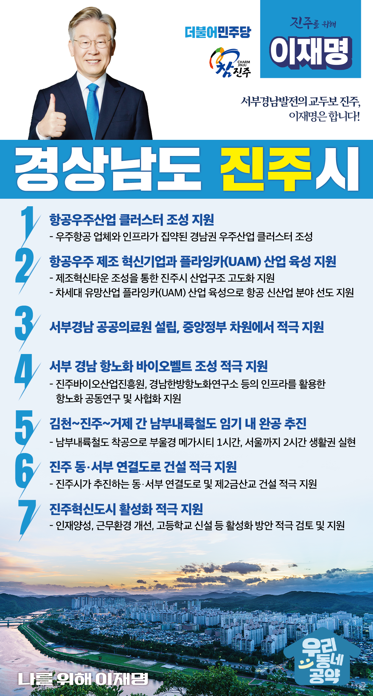

## 경남 지역 공약

# 진주시

### 서부경남발전의 교두보 진주, 이재명은 합니다!   
> 2022-02-10

존경하는 진주시민 여러분!

 

진주는 서부 경남을 대표하는 경남혁신도시입니다.  진주가 항공‧바이오산업과 같은 첨단산업을 육성하고, 살기 좋은 정주환경을 조성해 첨단산업도시로 재탄생할 수 있도록 이재명과 민주당이 지원을 아끼지 않겠습니다. 

 

더불어 발전하는 진주를 위해 7대 공약을 말씀드리겠습니다.

 

첫째, 항공우주산업 클러스터를 조성하겠습니다. 

코로나19 장기화로 침체된 항공산업의 활력을 불어넣기 위해 특단의 조치가 필요합니다. 우주항공 업체와 인프라가 집약된 경남에 우주산업 클러스터 조성을 지원해 진주가 우주산업의 중심지로 거듭나도록 만들겠습니다. 

 

 

둘째, 항공우주 제조 혁신기업과 플라잉카(UAM) 산업을 적극 육성하겠습니다.
지역 인재와 기업이 항공우주 신사업을 창업하고 기술을 발전시켜갈 수 있도록 돕겠습니다. 제조혁신타운 조성으로 산업구조 고도화를 지원시키겠습니다.  차세대 유망산업인 플라잉카(UAM) 산업을 육성해 진주가 항공 신산업 분야를 선도해갈 수 있도록 적극 지원하겠습니다.

 

셋째, 서부경남 공공의료원 설립의 차질 없는 추진을 적극 지원하겠습니다. 

2013년 진주의료원이 강제 폐쇄된 후 진주시민의 공공병원 설립요구가 그치지 않았습니다. 서부경남 의료원이 조속히 설립될 수 있도록 중앙정부 차원에서 적극 지원하겠습니다.

 

넷째, 서부 경남 항노화 바이오벨트 조성을 적극 지원하겠습니다.

서부경남은 진주바이오산업진흥원, 경남한방항노화연구소 등 바이오산업 공공연구기관과 항노화 바이오산업의 인프라가 갖춰져 있습니다. 항노화 공동연구와 사업화를 지원하여 경남 바이오산업의 중심지로 만들겠습니다. 

 

다섯째, 김천~진주~거제 간 남부내륙철도를 임기 내 완공을 목표로 추진하겠습니다.

김천과 거제를 잇는 남부내륙철도는 고속철도 소외지역인 진주에 꼭 필요한 사업입니다. 남부내륙철도 조기 착공으로 조속히 경남 남북축을 연결하겠습니다. 부울경 메가시티 1시간 생활권을 만들고, 2시간대 서울생활권을 만들겠습니다.

 

여섯째, 진주 동‧서부 연결도로 건설을 적극 지원하겠습니다.

진주 원도심이 위치한 서부지역과 신도시인 동부지역은 연결도로가 부족합니다. 진주시가 추진하는 동‧서부 연결도로와 제2금산교 건설을 적극 지원하여 지역 내 접근성을 강화하고 균형발전을 이루겠습니다.

 

일곱째, 진주혁신도시 활성화를 적극 지원하겠습니다.

진주혁신도시가 위축되면서 지역 인재 채용에 어려움을 겪고 있습니다. 혁신도시를 활성화시킬 수 있는 인재양성, 근무환경 개선 등 대책이 마련되도록 돕겠습니다. 더불어 고등학교 신설 등 교육환경 개선도 적극 검토하겠습니다. 

 

 

이재명은 지킬 수 있는 것만 약속했고 약속했던 것은 지켜왔습니다.

 

살기좋은 진주시 미래를 위한 약속 실력과 성과로 입증된 이재명이 반드시 실천하겠습니다.

 

진주 앞으로, 발전 제대로!

진주시민을 위해, 이재명은 합니다! 

						