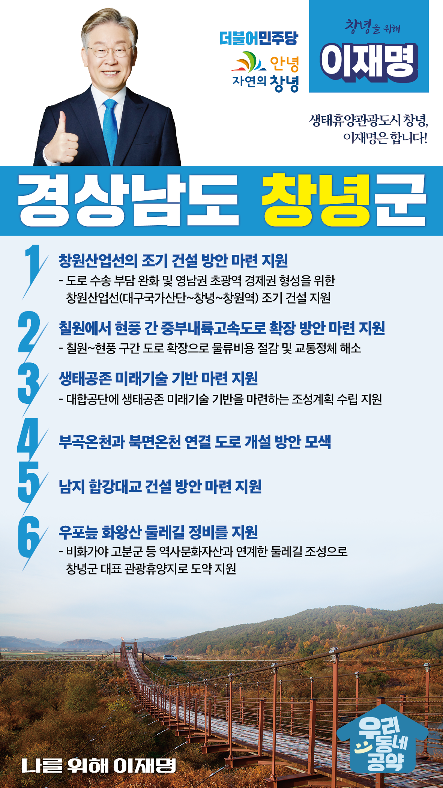

## 경남 지역 공약

# 창녕군

### 생태휴양관광도시 창녕, 이재명은 합니다!  
> 2022-02-10

존경하는 경남 창녕군민 여러분,

 

창녕군은 비화가야의 독자적 역사와 문화를 간직한 고장이자 생태문화자산이 산적한 지역입니다. 황강과 남강이 합수하는 곳으로 중부경남과 영남의 내륙을 잇는 소통과 교류의 중심지이기도 합니다. 창녕의 경상남‧북도 교두보 역할을 강화하는 한편 생태환경자산을 잘 보존해 역사문화 생태휴양관광 지역으로 육성할 수 있도록 이재명의 ‘창녕 발전 6대 공약’을 말씀드리겠습니다.

   

첫째, 창원산업선의 조기 건설 방안 마련을 지원하겠습니다. 

창원과 대구 주변의 산업단지는 물류를 도로교통에 의존하고 있어 중부내륙고속도로의 정체가 빈번합니다. 도로 수송 부담을 완화하고 영남권 초광역 경제권을 형성하기 위해 창원산업선의 조기 건설 방안마련을 적극 지원하겠습니다.  

 

둘째, 칠원에서 현풍 간 중부내륙고속도로 확장 방안 마련을 지원하겠습니다.

함양~울산고속도로 개통과 중부내륙고속도로 교통량 증가로 교통체증이 빈번해지고 있습니다. 또한, 창녕과 대구의 대단위 산업단지의 물동량으로 인해 중부내륙선 확장이 필요합니다. 물류비용 절감과 교통정체 해소를 위해 칠원~현풍 구간을 도로 확장 방안을 모색하겠습니다. 

 

셋째, 창녕에 생태공존 미래기술 기반이 마련될 수 있도록 지원하겠습니다. 

창녕 북부권 대합공단 내에 있는 대합용호습지는 오랫동안 방치되어 왔습니다. 용호습지의 생태적 가치를 살리며 미래산업 기반을 동시에 마련해야 합니다. 대합공단에 생태공존 미래기술 기반을 마련하는 조성계획 수립을 지원하겠습니다. 

 

 

넷째, 부곡온천과 북면온천을 연결하는 도로 개설 방안을 모색하겠습니다.  

창녕 부곡에서 북면을 잇는 도로가 없어 주민과 관광객의 불편이 큽니다. 이 구간의 도로 연결 방안을 찾아 지역 주민들의 통행 불편을 해소하고, 지역경제 활성화도 뒷받침하겠습니다.

 

다섯째, 남지 합강대교 건설 방안 마련을 지원하겠습니다.

창녕과 의령은 남한강을 사이에 두고 인접해 있지만, 연계교통망이 부족합니다. 창녕과 의령의 지역 접근성 향상을 위해  

남지 합강대교 건설 방안이 마련되도록 지원하겠습니다. 두 지역이 도로로 연결되면 인적·물적 교류가 보다 활발해 질 것입니다.

 

여섯째, 우포늪 화왕산 둘레길 정비를 지원하겠습니다.

우포늪 화왕산 둘레길은 토평천, 화왕산 산성길, 목마산성을 지나 비화가야 고분군까지 연결됩니다. 특히 비화가야 고분군은 유네스코 세계문화유산 등재를 준비하고 있습니다. 창녕의 역사문화자산과 연계한 둘레길 조성으로 창녕군이 대표적인 관광휴양지가 되도록 적극 돕겠습니다.  

 

 

 

존경하는 창녕군민 여러분!

이재명은 지킬 수 있는 것만 약속했고 약속했던 것은 지켜왔습니다.

살기 좋은 창녕군 미래를 위한 약속, 실력과 성과로 입증된 이재명이 반드시 실천하겠습니다.

 

창녕 앞으로! 발전 제대로! 

창녕군민을 위해, 이재명! 

						