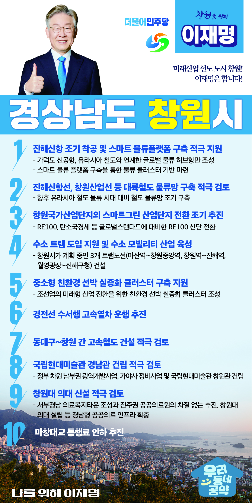

## 경남 지역 공약

# 창원시

### 미래산업 선도 도시 창원! 이재명은 합니다!
> 2022-02-10

존경하는 창원시민 여러분,

 

창원은 대한민국 민주화의 초석이 된 부마민주항쟁의 도시이며, 

대한민국의 경제발전을 견인한 제조산업 중추도시입니다.

올해 1월 13일부터 창원특례시로 거듭난 지방자치 선도 도시입니다.

 

창원특례시를 제조산업도시에서 미래청정에너지 수소특화도시, 

해운물류를 중심으로 한 동북아 스마트 물류 중심도시로 만들겠습니다.

 

이를 실행하기 위한 이재명의 창원발전 10대 공약을 말씀드리겠습니다.

 

첫째, 유라시아 물류 허브 조성을 위해 진해신항을 조기 착공하고, 스마트 물류플랫폼을 구축하겠습니다.

진해신항의 조기 착공을 추진해 가덕도 신공항, 유라시아 철도와 연계해 글로벌 물류 허브항만이 되도록 추진하겠습니다. 

스마트 물류 플랫폼 구축으로 물류 클러스터 기반을 마련하고, 

국가 물류허브의 역할을 할 수 있도록 적극 지원하겠습니다.

 

둘째, 진해신항선, 창원산업선 등 대륙철도 물류망 구축을 적극 검토하겠습니다.
동북아 물류허브항이 진해신항의 물류수송 위해서는   

 

창원역~진해신항을 잇는 진해신항선과 

창원역~창녕~대구산단~서대구를 연결하는 창원산업선 건설이 필요합니다.

향후 유라시아 철도 물류 시대 대비해 철도 물류망의 조기 구축을 적극 추진하겠습니다. 

 

셋째, 창원국가산업단지의 스마트그린 산업단지 전환을 조기에 추진하겠습니다. 

창원국가산단은 기계·철강 등 탄소배출이 많은 기업이 입주해 있습니다. 

최근 글로벌 원청 기업은 RE100 요구하고 있고 EU는 탄소국경세를 도입할 예정입니다.

창원국가산단의 RE100 산단 전환을 적극 지원하겠습니다.  

 

넷째, 수소 트램 도입을 지원하고 수소 모빌리티 산업을 육성하겠습니다.  

창원의 승용차 이용을 줄이기 위해 수소 트램 설치가 중요합니다.

창원시가 추진중인 마산역~창원중앙역, 창원역~진해역, 월영광장~진해구청까지 3개의 트램 노선 건설계획을 적극 지원하겠습니다.

 

다섯째, 중소형 친환경 선박 실증화 클러스터 구축을 지원하겠습니다. 

세계 조선 해운 시장은 화석연료 선박에서 친환경 선박으로 전환하고 있습니다. 

조선업을 미래형 산업으로 전환시키기 위해 

무인선박, 특수선박, 한국형 스마트야드 등 

친환경 선박 실증화 클러스터를 조성이 필요합니다. 

창원의 친환경 선박 경쟁력 강화를 위해 적극 지원하겠습니다. 

 

여섯째, 경전선 수서행 고속열차 운행으로 시민의 교통편의를 제공하겠습니다. 

창원을 비롯한 경남에서 서울‧경기행 경전선 이용객이 연간 약 1,300만 명에 달합니다. 

경전선 수서행 고속열차 운행을 통해 창원시민과 경남도민이 고속철도를 더 쉽게 이용하실 수 있도록 하겠습니다.

 

일곱째, 동대구~창원 간 고속철도 건설을 적극 검토하겠습니다.

창원~동대구 구간은 KTX산천이 운행되고 있지만 시속 120km 내외의 속도밖에 낼 수 없어 고속철도로 보기는 어렵습니다. 부울경 1시간 생활권을 실현하고 접근성을 개선하기 위해 동대구~창원 간 고속철도 신설을 적극 추진하여 서울과 창원 간 이동시간을 3시간대에서 2시간 30분대로 대폭 줄이겠습니다.

 

여덟째, 국립현대미술관 경남관 건립을 적극 검토하겠습니다.

그간 경남도민들은 문화 인프라의 부재로 문화예술 향유 기회가 부족했습니다. 국립현대미술관 창원관 건립으로 수도권과 동등한 문화향유권을 보장하겠습니다. 또한 정부 차원의 남부권 광역개발사업, 가야사 정비사업과 함께 국립현대미술관 창원관 건립이 새로운 관광자원이 되도록 적극 검토하겠습니다.

 

 

아홉째, 창원대 의대 신설을 적극 검토하겠습니다.

창원시는 비수도권 인구 100만 이상 대도시 중 유일하게 의대가 없는 곳입니다. 국가방역체계와 공공의료시스템 강화를 위해 창원대에 의대가 설립될 수 있도록 적극 지원하겠습니다. 또 서부경남 의료복지타운 조성과 진주권 공공의료원의 차질 없는 추진, 창원대 의대 설립 등으로 경남형 공공의료 인프라를 확충하겠습니다. 

 

열번째, 마창대교 통행료 인하를 추진하겠습니다.​

 

창원 앞으로! 발전 제대로!

창원시민을 위해, 이재명! 