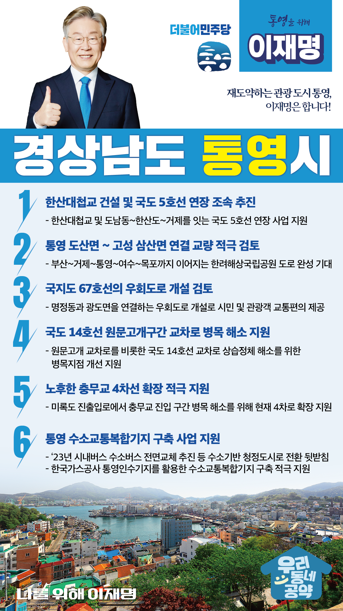

## 경남 지역 공약

# 통영시

### 재도약하는 관광 도시 통영, 이재명은 합니다!
> 2022-02-10

존경하는 통영시민 여러분,

 

동양의 나폴리, 바다의 땅 통영은 이순신 장군의 정신이 살아있는 호국의 성지이자, 수많은 예술인들의 고향이며, 대한민국 수산업과 해양관광 1번지입니다. 이러한 통영을 찾기 쉽고 머물고 싶은 곳으로 만들기 위해서는 남북내륙고속철도 개통과 연계된 부족한 도로 교통망을 정비해야 합니다.

 

이를 위한 이재명의 통영 발전 6대 약속을 말씀드리겠습니다. 

 

첫째, 한산대첩교 건설과 국도 5호선 연장을 조속히 추진하겠습니다. 

남부내륙고속철도 건설로 통영은 관광과 물류가 크게 늘어날 것으로 예상됩니다. 주민의 오랜 숙원인 한산대첩교 건설과 도남동~한산도~거제를 잇는 국도 5호선 연장이 조속히 추진되도록 지원하겠습니다.  

 

둘째, 통영 도산면과 고성 삼산면을 연결하는 교량 건설을 적극 검토하겠습니다. 

통영 도산면과 고성 삼산면을 연결하면 부산~거제~통영~여수~목포까지 이어지는 한려해상국립공원 도로가 완성됩니다. 한려해상국립공원 육로 관광코스와 남해안 관광벨트가 완성되어 국가균형발전에 크게 기여하게 될 것입니다.

 

셋째, 명정동과 광도면을 연결하는 국지도 67호선의 우회도로 개설을 검토하겠습니다.

남부내륙철도 개통과 폐조선소 도시재생 뉴딜사업으로 교통량 증가가 예상됩니다. 시가지를 통과하는 67호선 단일 노선으로는 교통수요 충족이 어렵습니다. 통영시민과 관광객의 교통편의를 위해 67호선 우회도로 개설을 적극 검토하겠습니다.  

 

넷째, 국도 14호선 원문고개구간 교차로 병목 해소 사업을 지원하겠습니다. 

원문고개 교차로를 비롯한 국도 14호선 교차로는 지역주민과 관광객 차량으로 상습 교통정체 구간입니다. 국도 14호선의 만성적 교통체증 해소를 위해 국도 병목지점 개선 사업에 선정되도록 적극 지원하겠습니다.  

 

다섯째, 노후한 충무교의 4차선 확장을 적극 지원하겠습니다.  

충무교는 1967년에 준공된 왕복 2차선 교량입니다. 4차선인 미륵도 진출입로에서 충무교 진입에 병목현상이 심각합니다. 주민의 교통 여건을 개선을 위해 충무교의 4차선 확장을 적극 지원하겠습니다. 

 

여섯째, 기후위기 대응을 위한‘통영 수소교통복합기지’구축 사업을 지원하겠습니다.

통영시는 2023년부터 시내버스를 수소버스로 전면 교체하는 등 수소기반 청정도시로 전환을 추진중입니다. 한국가스공사 통영인수기지를 활용한 수소교통복합기지 구축을 적극 지원하겠습니다. 이를 통해 관련 기업 유치와 일자리를 창출하여  통영이 수소경제로 전환하는데 중심 역할을 하게 될 것입니다.

 

 

존경하는 통영시민 여러분!

이재명은 지킬 수 있는 것만 약속했고, 약속했던 것은 지켜왔습니다.

살기 좋은 통영시 미래를 위한 약속, 실력과 성과로 입증된 이재명이 반드시 실천하겠습니다.

 

통영 앞으로, 발전 제대로!

통영시민을 위해, 이재명은 합니다! 

						