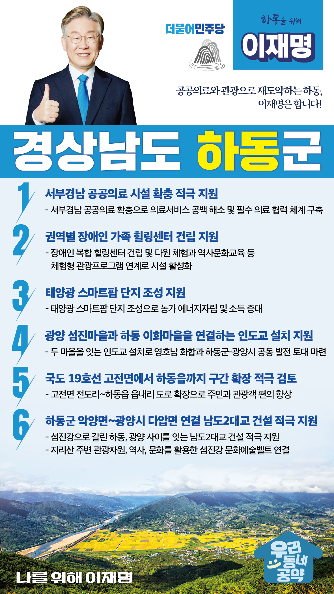

## 경남 지역 공약

# 하동군

### 공공의료와 관광으로 재도약하는 하동, 이재명은 합니다!
> 2022-02-10

존경하는 하동군민 여러분,

 

하동은 지리산과 금오산, 쌍계사 등 관광자원이 풍부한 고장이자 1200년 간 차(茶)를 재배해 온 우리나라의 대표적인 전통차 생산지이기도 합니다. 하동의 역사문화자원을 기반으로 하동군민 여러분의 삶의 질을 높일 수 있도록 ‘하동 발전 6대 공약’을 말씀드리겠습니다.

 

 

첫째, 서부경남 공공의료 시설 확충을 적극 지원하겠습니다.

서부경남에는 공공병원이 없는 의료취약지역입니다. 서부경남 공공의료 확충으로 의료서비스의 공백이 없도록 하겠습니다. 

지역 필수 의료 협력 체계를 구축하고 공공성을 강화하여 하동을 포함한 서부경남의 공공의료를 확충하겠습니다. 

 

둘째, 권역별 장애인 가족 힐링센터 건립을 지원하겠습니다.

하동은 청정한 자연과 문화자원, 다원 체험과 역사문화교육 등 체험형 관광을 즐길 수 있는 휴양지입니다. 하동에 장애인 가족 힐링센터가 건립된다면 장애인 가족들이 맘 편히 함께 즐길 수 있게 될 것입니다. 

 

셋째, 농가소득 증대와 에너지 자립을 위한 태양광 스마트팜 단지 조성을 지원하겠습니다.

첨단 유리온실과 태양광을 설치해 재생에너지를 활용하면 질 좋은 일자리가 창출되고 주민 소득증대에 도움이 될 것입니다. 태양광 스마트팜 단지를 조성해 농가의 에너지자립과 소득 증대를 돕겠습니다. 

 

넷째, 광양 섬진마을과 하동 이화마을을 연결하는 화합의 인도교 설치를 지원하겠습니다.

국도 19호선의 신설과 노선변경으로 하동과 광양 두 지역이 단절되었습니다. 두 마을을 잇는 인도교 설치는 영호남 화합과 하동군-광양시의 공동발전의 토대가 될 것입니다. 

 

다섯째, 국도 19호선 고전면에서 하동읍까지 구간 확장을 적극 검토하겠습니다.

이 도로는 병목현상이 자주 발생하고, 휴가철에는 관광객들로 교통정체가 극심합니다. 주민과 관광객 편의를 위해 하동군 고전면 전도리에서 하동읍 읍내리까지 도로 확장을 적극 검토하겠습니다.  

 

여섯째, 하동군 악양면과 광양시 다압면을 연결하는 남도2대교 건설을 적극 지원하겠습니다. 

하동과 광양은 벚꽃축제, 매화축제, 산수유축제 등 봄 축제철마다 극심한 교통정체로 주민들과 관광객의 불편이 큽니다. 섬진강으로 갈린 하동, 광양 사이를 잇는 남도2대교 건설을 적극 지원하겠습니다. 지리산 주변 천혜의 관광자원, 역사, 문화를 활용한 섬진강 문화예술벨트를 연결하겠습니다. 

 

존경하는 하동군민 여러분!

이재명은 지킬 수 있는 것만 약속했고 약속했던 것은 지켜왔습니다.

살기 좋은 하동군 미래를 위한 약속, 실력과 성과로 입증된 이재명이 반드시 실천하겠습니다.

 

하동군 앞으로! 발전 제대로! 

하동군민을 위해, 이재명! 

						