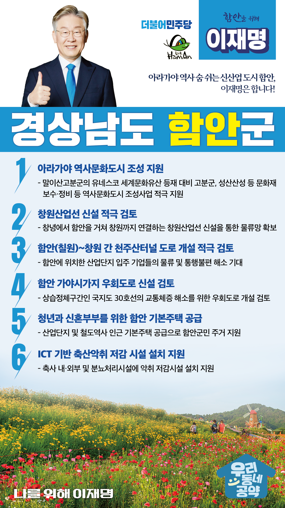

## 경남 지역 공약

# 함안군

### 아라가야 역사 숨쉬는 신산업 도시 함안, 이재명은 합니다!
> 2022-02-10

존경하는 함안군민 여러분,

  

함안군은 철의 왕국 아라가야의 역사를 간직한 역사문화 도시이자 경남의 지리적 중심으로 동‧서부 경남을 잇는 중추적인 도시입니다. 

함안을 지속 가능한 도농 복합 지역으로 키우는 이재명의 6대 공약을 말씀드리겠습니다. 

  

  

첫째, 아라가야 역사문화도시 조성을 뒷받침하겠습니다.

말이산고분군의 유네스코 세계문화유산 등재를 앞두고 고분군, 성산산성 등 문화재 보수정비가 필요합니다. 

아라가야 역사자원을 활용해 지역관광산업의 경쟁력을 높일 수 있도록 역사문화권과 정비구역을 지정하는 역사문화도시 조성사업을 적극 지원하겠습니다.

  

둘째, 창녕에서 함안을 거쳐 창원까지 연결하는 창원산업선 신설을 적극 검토하겠습니다. 

이 철도 노선을 신설하면 함안이 경남 물류 유통산업의 중심이 될 수 있습니다.  

이를 통해 진해신항과 가덕도 신공항으로 연결하는 물류망이 확보될 수 있도록 하겠습니다. 

 

셋째, 함안 칠원~창원 간 천주산터널 도로 개설을 적극 검토하겠습니다.

함안에 위치한 산업단지 입주 기업들의 물류를 원활화하고 통행 불편 해소가 필요합니다.  

함안과 창원의 인적, 물적 교류를 위해 천주산터널 도로 개설을 적극 검토하겠습니다.  

  

넷째, 함안 가야시가지 우회도로 신설을 검토하겠습니다.

가야읍 시가지를 통과하는 국지도 30호선의 정체가 빈번해지고 있습니다. 

특히 2차선인 가야 도심부에서 군북IC까지 교통량이 지속적으로 늘고 있습니다. 

상습 정체구간의 교통 체증을 해소하기 위해 우회도로 개설을 적극 검토하겠습니다.

  

다섯째, 청년과 신혼부부를 위한 함안 기본주택을 공급하겠습니다.

함안은 대규모 산업단지가 입지해 있지만, 주택공급이 충분하지 않아 인근 도시에 출퇴근하는 분들이 많습니다. 

산단 인근과 철도역사 근처에 기본주택을 건설해 함안 젊은이들의 주거 고민을 덜어 드리겠습니다. 

  

 

여섯째, ICT기반 축산악취 저감 시설 설치를 지원하겠습니다.

함안군민들은 축사와 분뇨처리시설의 악취로 인해 오랫동안 불편을 겪고 있습니다. 

축사 내‧외부와 분뇨처리시설에 악취 저감을 위한 시설 설치를 지원하여 함안군민 생활 환경을 개선하겠습니다.

  

  

존경하는 함안군민 여러분!

이재명은 지킬 수 있는 것만 약속했고 약속했던 것은 지켜왔습니다.

살기 좋은 함안군 미래를 위한 약속, 실력과 성과로 입증된 이재명이 반드시 실천하겠습니다.

  

함안 앞으로! 발전 제대로!

함안군민을 위해, 이재명!